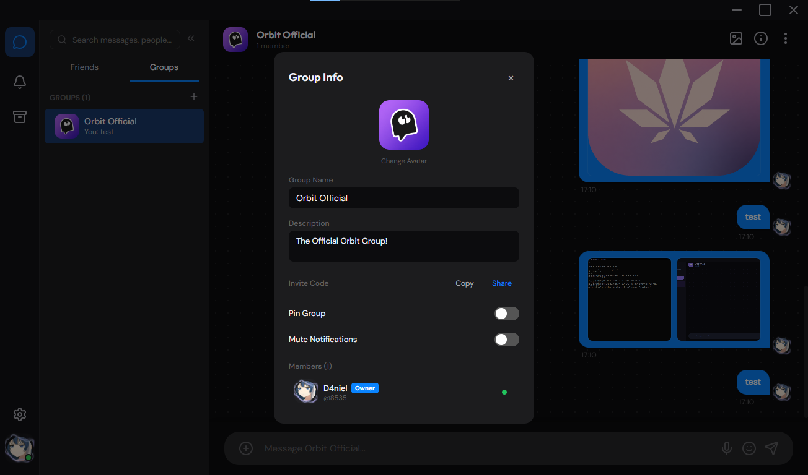
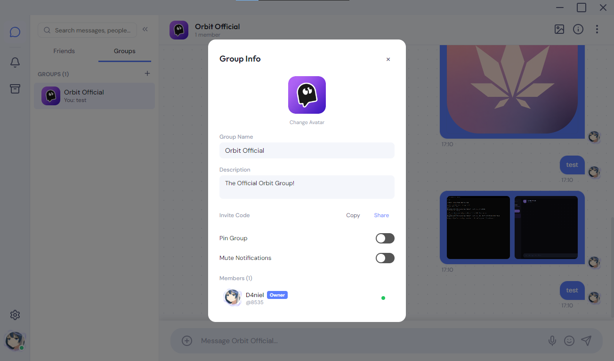

# Orbit Changelog

## v0.1.8.1-beta **(Latest Version)**

> **Note:** This is not a stable release — latest development version with experimental features.

### CRITICAL: P2P Cross-Platform File Transfer Fixes

- **Mobile→Desktop File Transfers Silently Deleted (CRITICAL):** Mobile sent `hash: ''` in every FILE_TRANSFER_START/END packet — desktop's `transfer.js` computed the real SHA-256 and always found a mismatch, deleting the received file immediately after full transfer. Fixed two ways: (1) mobile now computes SHA-256 via `crypto.subtle.digest()` before chunking and sends the real hash; (2) desktop `transfer.js` skips hash check when sender omits the hash (safety net).
- **Mobile FILE_TRANSFER Packets Had Empty `from`/`senderId` (CRITICAL):** `_sendLargeFileToPeer` called `createPacket(type, payload)` with only 2 args — `from` was `''`. Desktop couldn't identify the sender. Fixed: passes `MStore.user.id` as `fromId` and `peerId` as `toId`.
- **Mobile `createPacket` Signature Misaligned with Desktop (CRITICAL):** Mobile: `createPacket(type, payload, senderId)` — Desktop: `createPacket(type, fromId, toId, payload)`. Different arg order + missing `packetId` + missing `to` field. Aligned mobile to desktop's `(type, fromId, toId, payload)` signature with matching return shape. Updated all 28 call sites.
- **Duplicate Messages from Large File Transfers (CRITICAL):** Text MESSAGE and FILE_TRANSFER packets were sent independently — receiver created TWO message bubbles (one text, one file icon). Fixed: sender includes `_fileId` markers in MESSAGE packet attachments; all receive handlers (mobile FILE_TRANSFER_END, desktop `file-received`) search for existing message by `_fileId` and update the attachment in-place before falling back to creating a new entry.

### High-Impact Fixes

- **Missing File Extensions in Mobile File-Type Detection (HIGH):** Mobile's FILE_TRANSFER_END handler was missing many common extensions — videos (`m4v`, `wmv`, `flv`, `f4v`, `ts`, `mts`, `m2ts`), images (`svg`, `tif`/`tiff`, `bmp`, `heic`, `heif`, `avif`), audio (`opus`, `mka`). Added all with correct MIME mappings.

### Critical Bug Fixes (Previous)

- **Media Persistence Fixed (HIGH):** Received files no longer lost after app restart. FILE_TRANSFER_END handler stores `_dataUrl` alongside blob URL — `renderMessages()` reconstructs blob URLs from persisted base64 on restart. Incoming MESSAGE attachments preserve `_dataUrl`.
- **renderMessages No Longer Mutates Store (HIGH):** Data URL → blob URL loop was mutating `MStore.messages[chatId]` in-place, causing subsequent saves to write dead blob URLs. Replaced with non-mutating `_resUrl()` helper.
- **.webm File Misclassification Fixed (HIGH):** `.webm` was in both `audioMatch` and `videoMatch` — `audioMatch` checked first. Removed from `audioMatch`; video checked before audio.
- **Desktop File Received Missing isVideo (MEDIUM):** Added `isVideo` detection with proper MIME mapping.

### Video Player

- **Mobile Video Aspect Ratio Fixed:** Added `object-fit: contain`, `max-height: 50vh`, `background: #000` to `.ovp-video`.

### Technical

- **Version:** v0.1.8.1-beta hotfix release.

## v0.1.8-beta

> **Note:** This is not a stable release — latest development version with experimental features.

### Store Class Ported to Mobile

- **Dedicated Store Class Created:** Inline MStore (~350 lines) extracted into `mobile/src/js/store.js` (760 lines) — a full Store class with property-based access (`MStore.friends`, `MStore.settings.*`) for backward compatibility (532+ mobile references), plus desktop-style `getState()`/`setState()`/`subscribe()` for future cross-platform convergence.
- **Desktop Parity Features:** `subscribe()`/`notify()`, `blockUser()`/`unblockUser()`, `pinMessage()`/`unpinMessage()`, `markAsRead()`, `toggleMute()`, `addGroup()`/`removeGroup()`/`addMemberToGroup()`, `closeDM()`/`togglePinDM()`/`reopenDM()`, E2EE peer key storage, transfer tracking, `addOrUpdatePeer()`.

### Bug Fixes

- **addMessage() Unread Tracking Fixed (HIGH):** Unread tracking block removed from `addMessage()` — mobile manages unreads via `chat.unread` on chat objects, not via Store's internal `unreadCounts`. Every message was previously counted as unread because `this.activeChatId` is never set by mobile (mobile uses local `var activeChatId`).
- **mutedChats Property Misalignment Fixed (HIGH):** `this.mutedChats` now aliases `this.settings.mutedChats` (same object reference) — synced in constructor, `load()`, and `save()`. All mute/unmute operations update the same underlying object that mobile app reads via `MStore.settings.mutedChats`. Added `mutedChats: {}` to settings defaults.
- **setState() currentUser Ignored Fixed (MEDIUM):** `setState()` now explicitly maps `newState.currentUser` to `this.user` — previously this key was silently dropped.

### Technical

- **Architecture:** MStore API fully backward-compatible — `window.MStore = new Store()` declared at end of `store.js`, loaded via `<script src="js/store.js">` before `app.js` in mobile `index.html`.
- **CSP Updates:** Desktop `index.html` updated to allow `https://cdnjs.cloudflare.com` in both `script-src` and `style-src` for Prism.js syntax highlighting.
- **Prism.js Loading Fixed:** Moved Prism JS to load before `app.js` on both desktop and mobile. Added `language-*` class to `<pre>` elements in all 3 copies of `sanitize.js` for immediate CSS theme matching.
- **Version:** Bumped to v0.1.8-beta across all manifests, About tabs, and changelogs.

## v0.1.7-beta

> **Note:** This is not a stable release — latest development version with experimental features.

### Video Playback Fixes

- **PIPELINE_ERROR_DECODE Root Cause Fixed:** Audio packet decode errors in fMP4 files resolved via Content-Type fix in `main.js:contentTypeFromAtt()`. Video files now play continuously without stalling at ~16s.
- **Re-render Guard During Playback:** Store subscription blocks message re-renders while any video is playing (except chat switches). Prevents player destruction during message updates. Handles `notify()` without `changedState` (previously bypassed guard).
- **Decode Error Retry Mechanism:** On `PIPELINE_ERROR_DECODE`, source is reloaded and playback skips forward +2s past the corrupt packet (up to 3 attempts).
- **Removed Forced Seeking:** Eliminated forced `currentTime = 1e10` hack for `orbit-db://` / `orbit-file://` URLs that was causing playback pauses.

### Media Player UX Improvements

- **Larger Video Player:** Video display increased to 720×600 in message bubbles. Full-screen player includes `box-shadow` and theme-matched background (`var(--bg-surface)`) for letterbox areas.
- **Larger Audio Player:** Audio waveform canvas height increased to 200px with full-width containers (720px), matching video layout.
- **Separated Media Layout:** Video and audio removed from the attachment image grid — rendered as standalone blocks with full width. Image grid stays compact at 280px max-width.
- **Fullscreen Theme Integration:** Fullscreen video uses CSS variable `var(--bg-surface)` for letterbox background — blends with active UI theme instead of hard black.

### Technical

- **Version:** Bumped to v0.1.7-beta across all manifests, About tabs, and changelogs.

## v0.1.6-beta

> **Note:** This is not a stable release — latest development version with experimental features.

### P2P Connectivity & Bug Fixes

- **Desktop Auto-Connect Port Fix:** AutoConnect now uses `peer.tcpPort || 46000` instead of hardcoded 46000. Per-peer TCP ports stored in `SocketManager._peerPorts` map from connect and TCP beacon processing. Reconnect uses stored port.
- **Desktop Manual Connect Port Fix:** Connect accepts `port` parameter (defaults 46000) via preload bridge.
- **Desktop P2P Edit Broadcast Loop Fixed:** `store.editMessage` no longer re-broadcasts to group members (caused echo loop). Single broadcast from `chat-panel.js:sendToAll`.
- **Desktop Context Menu "Edit Message" Wired:** No-op log replaced with proper editingMsg flow.
- **Mobile Disconnect Handler Fixed (CRITICAL):** Friend lookup by `connectionId` (native `ip:port`) now works — `connectionId` stored on friend objects from connect and TCP beacon events. Falls back to IP from `connectionId.split(':')`.
- **Mobile TCP Beacon Handler Fixed:** Stores `tcpPort`, `ip`, and `connectionId` on friends in both new-friend and existing-friend paths.
- **Mobile UDP Beacon Handler Fixed:** Stores `tcpPort` from beacon payload on both new-friend and existing-friend paths.
- **Mobile Auto-Reconnect Port Fixed:** Uses peer's `tcpPort` (not own port) for reconnection.
- **Mobile Orbit Echo Stays Online:** Echo friend's status now correctly reset to `'online'` on friend load.

### Message Editing & Reactions

- **Mobile Edit P2P Broadcast:** Edits now broadcast over P2P to both DMs and group members (with `chatId` for group routing).
- **Mobile `edited` Flag:** Incoming MESSAGE_EDIT packets set `msg.edited = true`.
- **Mobile Reaction UI:** Reaction button with `smile-plus` icon, floating reaction picker (👍❤️😂😮😢🙏), click-to-toggle on reaction pills, instant local state + P2P broadcast via REACTION protocol.
- **Desktop Changelog Restored:** v0.1.4-beta content restored (was blank between header and v0.1.3-beta block). v0.1.5-beta added as Latest.

### Android Foreground Service (Background Execution)

- **OrbitForegroundService Created:** Full P2P networking extracted into Android Foreground Service — TCP server, UDP multicast discovery, connection map, thread pool, WakeLock, persistent notification. `START_STICKY` ensures survival after process kill.
- **OrbitP2PPlugin Refactored:** Thin proxy that starts/stops foreground service, forwards plugin calls via Binder, drains event queue every 100ms via Handler.
- **BootReceiver:** Restarts foreground service on `BOOT_COMPLETED`.
- **MainActivity:** Starts foreground service immediately on launch.
- **JS Lifecycle Handlers:** `visibilitychange`, Capacitor `appStateChange`, and `pageshow` listeners re-render UI and restart discovery on foreground.
- **Event Queue Drainer:** 100ms poll of `ConcurrentLinkedQueue` with `notifyListeners` for 4 event types (message, connection, disconnect, peerFound) plus sendFailed/connectFailed.
- **ServiceBinder:** Proper IBinder implementation exposing service instance to plugin.
- **Battery Optimization Exemption:** `REQUEST_IGNORE_BATTERY_OPTIMIZATIONS` permission and JS bridge method for best-effort exemption request.

### Silent Bug Fixes (Foreground Service Audit)

- **sendFailed/connectFailed Events No Longer Dropped:** drainEvents now handles both event types and notifies JS listeners.
- **serverSocket Made Volatile:** Prevents stale null read in stopServer from closing wrong socket.
- **PeerConnection Stale Map Entry Eliminated:** originalPeerId field ensures both original and updated peerId keys are cleaned up on disconnect.
- **Executor Shutdown on Destroy:** `executor.shutdownNow()` called in onDestroy to prevent thread leaks on START_STICKY recreation.
- **Static eventQueue Cleared on Destroy:** Prevents stale events from old instance polluting new plugin.
- **SO_REUSEADDR on MulticastSocket:** Prevents "Address already in use" on discovery restart after network change.
- **joinGroup with Explicit Interface:** Uses `joinGroup(group, ni)` for Android 10+ compatibility.

### Technical

- **Architecture:** P2P networking lives in persistent `OrbitForegroundService` independent of Activity/WebView lifecycle. Plugin proxies calls via Binder with intent-based fallback for calls before bind completes.
- **Event Ordering:** drainHandler starts in `onServiceConnected` (after bind completes) which runs after JS listener registration (same main-thread queue). No events lost before listener registration.
- **Version:** Bumped to v0.1.6-beta across all manifests, About tabs, and changelogs.

## v0.1.5-beta

> **Note:** This is not a stable release — latest development version with experimental features.

### New Features

- **Account Switcher (Experimental):** Right-click avatar → panel to add/switch/logout accounts. Logout quits app (accounts persist in DB). Last active user auto-loaded on launch. Gated behind Experimental Features toggle in Advanced settings.
- **PIN Lock Screen (2FA Experimental):** 4-8 digit numeric PIN with SHA-256 hashing (Node `crypto` on main process). Numpad UI, 5-attempt cooldown (30s), "Forgot PIN" reset (data intact). Only prompted on app launch (never on resume/sleep). Gated behind Experimental Features.
- **Settings Security Tab:** PIN setup, change, disable flows. Full modal re-render when Experimental Features toggled to show/hide tab.
- **Orbit Echo Welcome Sequence:** 4 welcome messages with 5-8s typing indicator delays. Fires only when echo chat is empty. Echo excepted from all offline checks.
- **Per-Account Message Isolation:** Messages stored per-user via `userChatIds` settings map. DB migration v11 adds `accountOwnerId` to friends/groups/group_members. `reloadDataForCurrentUser()` re-reads filtered messages on account switch. Friends and groups remain shared; messages filtered by tracked chat IDs per user.
- **Per-Account Avatar Frames:** v10 migration adds `profileFrame` column to users table. Frame loaded from user record (not shared settings). `getFrameForUser()` reads from `currentUser.profileFrame`. Settings handler syncs frame selection to identity.
- **Avatar Frames in Account Switcher:** Both current account (36px) and other account rows (32px) render profile frame overlay at `top:-16%;left:-17%;width:133%;height:133%`, matching sidebar-left styling.
- **Profile Frame Migration:** Existing settings-based frames migrated to per-account on first boot after v10. Runs after `Identity.init()` so `currentUser` is real (not placeholder). `SidebarLeft.renderAvatar()` called after migration for immediate display.
- **Desktop Beacon Payload Enriched:** Both UDP (`discovery.js`) and TCP (`socket.js`) beacons now transmit `avatar`, `banner`, `bio`, `profileFrame`, `publicKey`. Incoming BEACON handler stores full profile on peers.
- **Friend Status Starts Offline:** Friends load with `lastSeen=0` and `status='offline'` (except `local-echo` which stays online). Offline check threshold reduced to 45s with 15s check interval. Discovery emits `peer-gone` callback → IPC → marks friend offline.
- **Group Avatar Backfill:** Async fetch of `orbit-avatar://` for groups with `avatarPath` but no `avatarDataUrl` on store init + group info open. Non-blocking, errors silently caught.

### Bug Fixes

- **Messages from other accounts no longer leak:** `reloadDataForCurrentUser()` auto-track now only includes friends/groups with `accountOwnerId === uid`. `renderList()` filters displayed DMs by `_userChatIds`. `renderGroups()` only shows groups where current user is a member.
- **Closing DMs doesn't affect other accounts:** `closeDM()` no longer calls `dbDeleteFriend` (was deleting globally). `closedDMs` and `pinnedDMs` stored per-account in settings (`userClosedDMs`, `userPinnedDMs`). Loaded/saved per user on account switch.
- **Leaving groups correctly hides the group:** `removeGroupMember()` untracks chat from `userChatIds` when current user leaves. `renderGroups()` checks membership before showing group. Group removed from current account's list.
- **"User"#0000 placeholder leaking:** `identity.js:getAll()` filters out entries without valid `userId/usertag/username`. Store placeholder changed from `id: null` to `userId: null`. Profile frame migration guarded with `userId` check and moved after `Identity.init()`.
- **Profile frame migration not triggering:** Migration condition changed from `currentUser.profileFrame == null && pf` to `pf && pf !== cur` — handles the case where `Identity.init()`'s `save()` converted `null` to `0` via `dbSaveUser`.
- **SidebarLeft.renderAvatar crash before init:** Added `if (!this.container) return;` guard to prevent TypeError when called before `SidebarLeft.init()`.
- **Store.js syntax error:** Removed trailing commas between class methods that caused "Unexpected token ','".
- **`window.ChatPanel.showChat is not a function`:** Removed premature `ChatPanel.showChat()` call from `reloadDataForCurrentUser()`.
- **`require('crypto')` in renderer:** Changed to `window.crypto` for invite code generation.
- **Migration v11 robustness:** Column-existence checks before `ALTER TABLE`. Guard in `migrations.run()` handles non-transactional `user_version` — if version ≥ 11 but columns missing, resets to 10 and re-runs.

### Technical

- **Identity System:** `Identity.init()` loads from multi-user DB. `getAll()` returns all saved users. `switchTo(userId)` swaps identity and updates last active tracking. `saveUser` stores `profileFrame` with `!= null` guard.
- **Database Schema:** v10: `ALTER TABLE users ADD COLUMN profileFrame INTEGER DEFAULT 0`. v11: `accountOwnerId TEXT` on friends, groups, group_members tables.
- **Per-Account State Storage:** Three settings keys added: `userChatIds` (map of userId → chatId[]), `userClosedDMs` (map of userId → {friendId: true}), `userPinnedDMs` (map of userId → {friendId: true}).
- **Network Restart:** Account switch calls `networkStop` (nullifies all instances) → `Identity.switchTo()` → `networkStart` (re-creates with new identity). All TCP connections drop and re-establish.
- **Migration Rollback Guard:** `db.pragma('user_version')` is non-transactional. Added column-existence check at start of `migrations.run()` to detect partial migration state and recover.

## v0.1.4-beta

### Stability & Core Infrastructure

- **P2P Auto-Connection Stabilization:** PING/PONG keep-alive heartbeat (15s interval, 30s idle → close), 8s connection timeout (disabled after connect — heartbeat now solely manages health), reconnect with exponential backoff (max 5 attempts, capped at 30s), stale peer pruning (180s threshold, 60s check interval), network change detection (10s IP polling → full discovery restart + LAN scan), and auto-connect duplicate protection (checks `connections.has` + `_pendingConnects.has`). Desktop: `socket.js`, `discovery.js`, `main.js`, `preload.js`. Mobile: JS-level PING/PONG via `Orbit.P2P.send()` at `netKeepAlive` interval; inbound PING auto-responds with PONG; tracked consecutive missed pings.
- **Desktop P2P Bugfix Audit (17 fixes):** Desktop socket 8s Node.js idle timeout disabled after connect (heartbeat manages health); write-queue key operator precedence bug (`key + ''` → `'' + key`); reconnect `.catch()` added + reconnect counter resets on data; preload.js forwards reconnect args (`reconnectEnabled`, `reconnectIntervalMs`); PIN/UNPIN use `payload.groupId` not `packet.from`; GROUP_MEMBER_ADDED updates existing member fields; SYSTEM delete uses `payload.chatId`; redundant bulk group persist removed from setState; GROUP_CREATE enriches `publicKey` from friends list; GROUP_CREATE payload includes owner `publicKey`; GROUP_JOIN_REQUEST includes `usertag`/`avatar`/`status`. Files: `socket.js`, `preload.js`, `store.js`, `sidebar-middle.js`.
- **Desktop Syntax Fix:** Missing closing parenthesis in `app.js:777` ternary chain (`'image/jpeg'));` → `'image/jpeg')));`) — the single missing paren crashed the entire renderer, causing a blank window. Restored desktop app startup.
- **Write-Queue Stability:** Per-connection write queue key operator precedence fixed — `key + ''` corrected to `'' + key` to prevent queue key collisions under concurrent writes.
- **Translation Engine Rewrite:** In-memory cache (`window._translationCache` keyed by `text|lang|source`), request deduplication (`window._pendingTranslations` shares one Promise per active request), AbortController for cancelling in-flight requests, inline "Retry" link on failure. File: `chat-panel.js`.
- **Voice Messages Stabilization:** `contentTypeFromAtt()` returns `'audio/webm'` for `type === 'audio'`; audio elements get `onerror="if(window.mediaSrcOnError) window.mediaSrcOnError(this)"` for auto-retry; chunked transfer audio detection in `app.js` sets proper `type: 'audio'` + MIME via `extMap` (webm/mp3/wav/ogg/flac/aac/m4a/wma). Files: `main.js`, `chat-panel.js`, `app.js`.

### Media & Message Experience

- **Image Viewer Quick-Save:** File System Access API `showSaveFilePicker` with `Blob` fallback download — saves images directly from the gallery without right-click.
- **Keyboard Navigation:** ← → arrows for gallery navigation, Escape to close. Swipe between images (mouse drag + touch).
- **Download Fix:** All `orbit-db://` and cross-origin image downloads now go through `fetch()` + `blob()` pipeline to bypass CSP restrictions.
- **Loading Placeholder:** CSS `background: var(--bg-surface)` + `opacity` fade-in on image thumbnails — elimates blank flash on slow loads.

### Performance Mode

- **New Experimental Toggle:** `experimentalPerformanceMode` defaults `false`. Two-step confirmation in Advanced tab. Adds `.performance-mode` CSS class on `<html>` — kills animations, freezes GIFs, skips link preview OG fetch, slows offline checks to 60s, stops connection stats polling and dev overlay rAF.
- **Runtime Guards:** `window._performanceMode` checked in chat-panel (skip reflow-heavy calls) and app.js (skip non-critical intervals). CSS `[data-refreshing] .message-row { animation:none !important }` prevents re-animation on DOM re-render.

### Mobile Full Parity

- **Protocol.js Synced:** 15+ missing types added to `mobile/src/shared/network/protocol.js` — MESSAGE_EDIT, MESSAGE_DELETE, READ, SYSTEM, PIN_MESSAGE, UNPIN_MESSAGE, GROUP_INVITE, CALL_*, PING, PONG, FIND, REQUEST, ACCEPT, FILE_TRANSFER_START/CHUNK/END. Matches canonical `shared/network/protocol.js` (46 types).
- **Chat-Existence Check Fixed:** GROUP_CREATE and GROUP_JOIN_RESPONSE handlers exempted from `if (!chat) return;` guard — these types create the chat, so the check can't exist yet.
- **`name` vs `username` Mismatch Fixed:** All 4 group handlers now check `origin.username || origin.name`. Store objects cloned instead of mutated to prevent reference corruption.
- **Toast Concatenation Fixed:** Added parentheses for correct operator precedence in toast message assembly.
- **Desktop Settings Ported (11 new defaults):** `notifyVolume: 80`, `notifySoundType: 'chime'`, `translateTargetLang: ''`, `autoDetectSource: true`, `netReconnectInterval: 10`, `netKeepAlive: 30`, `webrtcFallback: true`, `logLevel: 'None'`, `netBandwidthLimit: 0`, `experimentalFpsMonitor: false`, `experimentalDevOverlay: false`.
- **Notifications UI Expanded:** `notify-sound` toggle (was missing HTML), volume slider (0-100), sound type select (Chime/Pop/Gentle/Classic) with distinct Web Audio oscillator patterns.
- **Translation Settings Added:** Target language select (30 languages), auto-detect toggle, message translate moved from Appearance to Chat section.
- **Network Settings UI:** Reconnect interval (number), keep-alive select (10/30/60/120s), WebRTC fallback toggle, log level select (None/Error/Info/Debug), bandwidth limit (number).
- **Settings Wiring (Deep Integration):** `debugLog()` filters by `logLevel` (None→silent, Error/Info/Debug); `buildBeacon()`/`initP2P()`/TCP beacon all read `tcpPort` from settings; `initP2P()` passes `udpPort` to native `Orbit.P2P.startDiscovery()`; auto-reconnect reads `netReconnectInterval` + passes `netTimeout` to native Java `connect()`; PING/PONG heartbeat sends PING at `netKeepAlive` interval; `FILE_CHUNK` throttles via `netBandwidthLimit` (setTimeout pacing); `networkMode === 'Custom IP'` skips UDP discovery.
- **`playNotificationSound()` Updated:** Uses `notifyVolume` (gain 0-100) and `notifySoundType` (4 oscillator patterns: chime, pop, gentle, classic).
- **`translateMessage()` Updated:** Reads `translateTargetLang` (falls back to `navigator.language`) and `autoDetectSource` (`langpair=auto|target` or `langpair=en|target`).
- **profileFrame Clean-Up:** TCP beacon new-friend path fixed (`bp.profileFrame !== undefined ? bp.profileFrame : null` so `0` stores as `0` not `null`). `getProfileFrame(source)` helper added — defends against null/undefined/NaN/off-switch. All 7 inline `(source.profileFrame || 0)` patterns replaced.
- **Mobile DB Migration Fixed:** `migrateOldData()` moved to run BEFORE `MStore.load()` (was running after, causing old unprefixed localStorage keys to never be picked up). Added console.log visibility — now shows "Running old data migration..." / "Data migration already completed — skipping" / "Migrated N group(s) — added missing fields".
- **What's New Added to Mobile About:** Full changelog modal covering v0.0.2-beta through v0.1.4-beta, matching desktop's changelog.js.

### Desktop Enhancements

- **Reconnect Settings Bridge:** `preload.js` forwards `reconnectEnabled` and `reconnectIntervalMs` through `networkStart` IPC. User settings now actually affect socket reconnect behavior.
- **Native Java Plugin Changes (Mobile):** `OrbitP2PPlugin.java` — `connect()` uses JS-provided `timeout` (was hardcoded 5000ms); `startDiscovery()` uses JS-provided `discoveryPort` (was hardcoded `DISCOVERY_PORT`).

### Group Sync (store.js)

- GROUP_OWNER_TRANSFER: Updates role to 'owner' for transferred member.
- GROUP_LEAVE: Self-cleanup via `removeGroup()` + clears `activeChatId`.
- GROUP_INVITE: Adds group + initializes messages array.
- GROUP_CREATE: Initializes messages array on group creation.
- GROUP_MEMBER_ADDED: Updates existing member fields rather than inserting duplicate.
- GROUP_CREATE: Enriches all members with `publicKey` from friends list.
- GROUP_JOIN_REQUEST: Includes `usertag`/`avatar`/`status` in join payload.

### Bug Fixes

- **Forward/Edit/Delete routing fixed — group messages no longer arrive in DMs:** `doForward()` was missing `payload.chatId` for group targets; `MESSAGE_EDIT` and `MESSAGE_DELETE` payloads also lacked `chatId`. Receivers routed these to `packet.from` (a user DM) instead of the group. All three now include `chatId` for groups, plus store.js handler falls back to `payload.groupId` for broader compatibility.
- **Duplicate message sending guard:** Added `this._sending` lock in `sendMessage()` to prevent concurrent sends. Added msgId deduplication in `addMessage()` — if a message with the same id already exists, the duplicate is silently dropped.
- **GROUP_MEMBER_ADDED immutable state:** Replaced direct object mutation (which bypassed `setState` and caused stale reads) with proper `setState()` using `map()`.
- **addMemberToGroup avatar enrichment:** New members now have their avatar cross-referenced from the friends list when the incoming packet lacks one (common in cross-platform flows).
- **Group avatar sync (desktop↔mobile):** Desktop avatar upload now stores `avatarDataUrl` alongside `avatarPath`; desktop GROUP_CREATE and GROUP_JOIN_RESPONSE payloads include `groupAvatar`; desktop store.js handlers read `groupAvatar` from incoming packets; mobile GROUP_JOIN_RESPONSE handler now reads `groupAvatar` and stores it; desktop renderers fall back to `avatarDataUrl` when `avatarPath` is not set.
- **Desktop blank window — syntax error:** Missing `)` on line 777 of `app.js` in the MIME type ternary chain (`'image/jpeg'));` → `'image/jpeg')));`). Mismatched parenthesis caused the entire renderer JavaScript to fail silently.
- **Mobile auto-reconnect now reads user settings** (was hardcoded 5s).
- **Mobile PING/PONG heartbeat now uses `netKeepAlive` from settings** (was not implemented).
- **Mobile TCP connection timeout now passed from settings to native Java** (was hardcoded 5000ms).
- **Mobile UDP discovery port now passed from settings to native Java** (was hardcoded `DISCOVERY_PORT`).
- **Mobile `FILE_CHUNK` bandwidth throttling implemented** via setTimeout pacing when `netBandwidthLimit > 0`.
- **Mobile debugLog now respects logLevel** — None suppresses all output, Error only shows errors, etc.
- **Mobile network tab now shows/hides UDP port field based on `networkMode`**.
- **profileFrame value `0` now stored correctly** (TCP beacon was converting `0` → `null` via `||`).
- **Desktop group sync fixes** — GROUP_OWNER_TRANSFER role, GROUP_LEAVE cleanup, GROUP_INVITE init, GROUP_CREATE init, PIN/UNPIN payload routing, SYSTEM delete routing.
- **Desktop write-queue key collision** — fixed `key + ''` to `'' + key` operator precedence.
- **Desktop reconnect promise chain** — added `.catch()` to `connectToPeer()` in _scheduleReconnect.
- **Desktop reconnect counter reset on data** — prevents permanent exponential backoff on healthy connections.
- **Desktop auto-connect duplicate protection** — checks both `connections.has` and `_pendingConnects.has` before initiating new connections.
- **Exponential backoff fixed** — formula `(attempts + 1) * reconnectInterval` capped at 30s, not flat 30s.
- **Network change detection** — IP polling every 10s triggers full discovery restart + LAN scan when IP changes.

### Technical

- **Protocol:** Mobile `protocol.js` synced with canonical — 46 types total, all CALL_*, FILE_TRANSFER_*, PIN, SYSTEM, READ types available on both platforms.
- **P2P Heartbeat:** Desktop `_startHeartbeat`: 15s interval, 30s idle timeout → sends PING, expects PONG within 15s. Mobile: JS-level PING/PONG via `Orbit.P2P.send()` at `netKeepAlive` interval.
- **Reconnect:** Desktop `_scheduleReconnect`: exponential backoff `(attempts+1) * _reconnectInterval` capped at 30s, max 5 attempts. Mobile: delay = `netReconnectInterval * 1000`, calls `Orbit.P2P.connect(ip, tcpPort, friendId, timeoutMs)`.
- **profileFrame Helper:** `getProfileFrame(source)` — returns `Math.max(0, parseInt(val, 10) || 0)`. Returns `0` when experimental toggle is off or source is null/invalid. Used in all 7 render locations.
- **Bandwidth Throttling:** `FILE_CHUNK` calculates minimum inter-chunk interval from `chunkSize / (bwLimit * 1024) * 1000` ms; uses `setTimeout` to pace. Only active when `netBandwidthLimit > 0`.
- **Network Settings 3-Layer Chain:** JS settings → p2p-mobile.js bridge parameters → native Java plugin method args. Settings actually affect socket/discovery behavior.
- **Avatar Data URL Transport:** Group avatar data URLs stored as `avatarDataUrl` alongside file-based `avatarPath`. Desktop GROUP_CREATE/GROUP_JOIN_RESPONSE payloads carry `groupAvatar` field; receivers store as `avatarDataUrl` (desktop) or `avatar` (mobile). Desktop renderers fall back to `avatarDataUrl` when `avatarPath` is unset.

## v0.1.3-beta
- **Native Android System Notifications:** Messages now show as real system notifications when app is backgrounded (requires POST_NOTIFICATIONS permission).
- **Desktop Notification Avatars:** Sender/group avatar now shown as notification icon (previously static Orbit icon).
- **Connection Stats Panel:** Live P2P status — online peers, uptime, sent/received message counters (refreshes every 2s).
- **Video File Support:** Upload, render, and view video files in chat — `<video>` elements with play overlay in message bubbles.
- **Video Preview Modal:** Full-screen video player on desktop and mobile (matching image preview UX).
- **Video Compression:** Large videos (>5MB) auto-compressed to 720p/500kbps via MediaRecorder + captureStream before sending.
- **Performance Mode Toggle:** Experimental setting with two-step confirmation — disables animations, link previews, GIF playback, and background CPU tasks.
- **Group Info UI:** Hardcoded colors replaced with theme CSS variables for consistent dark/light mode appearance.

### Bug Fixes
- **Image Viewer Not Opening on Click:** Root cause — `'friends'` in chat-panel store subscription triggered full DOM re-render on every friend status beacon (10s). If a re-render occurred between mousedown and mouseup on an image thumbnail, the click event targeted the new `message-row` instead of the replaced ``, and `closest('[data-open-image]')` missed. Fixed by removing `'friends'` from subscription and adding hit-test fallback in click handler.
- **Mobile Notifications Overhaul:** Added native Android system notifications via `@capacitor/local-notifications` — shows notification with sender name and message preview when app is backgrounded. Includes POST_NOTIFICATIONS permission, `orbit_messages` and `orbit_general` notification channels, and permission request on startup.
- **Desktop Notification Avatars:** Native Electron notifications now display the sender's avatar as the notification icon (previously used static Orbit app icon). Avatar data URLs are converted to `nativeImage` via `nativeImage.createFromDataURL()`.
- **Sender Avatar in Desktop File Notifications:** File received notifications now include the sender's avatar icon.
- **Working Status Panel:** The experimental "Connection Stats" overlay (Developer Overlay toggle) now shows live data — connection status (online/offline), peer count, uptime (since P2P start), and messages sent/received counters. Refreshes every 2 seconds.
- **Group Info Overlay Polish:** Replaced hardcoded colors (`#22c55e`, `#6b7280`, `#555`) with CSS design tokens (`var(--accent-success)`, `var(--text-muted)`, `var(--bg-active)`). Toggle track backgrounds now use theme-consistent colors.
- **Video File Support:** Added `video/*` file type detection in both file input and drag-and-drop handlers on desktop and mobile. Videos are classified as `type: 'video'` and rendered as `<video>` elements with play overlay icon in message bubbles.
- **Video Preview Modal:** Desktop: `ImageViewer.openVideo()` — opens video in a full-screen player overlay with play/pause controls. Mobile: new `#video-preview-overlay` with `<video controls>` element, matching the image preview UX.
- **Upload Videos Context Menu:** Added "Upload Videos" option to the `+` button context menu on desktop (sets `accept="video/*"`) and the drop-up menu on mobile.
- **Video Compression (Desktop):** `compressVideoFile()` method re-encodes video files larger than 5MB at 720p max resolution via `MediaRecorder` with VP9 codec at 500kbps bitrate. Uses `canvas.captureStream()` at 15fps for frame capture. Compressed video replaces staged file for sending.
- **Video Compression (Mobile):** `compressVideoMobile()` function mirrors the desktop approach for mobile WebView — compresses large videos client-side before sending via the P2P network.
- **Leaked Offline Check Interval:** Removed duplicate `setInterval` at startup — `applySettings()` is now the single source for offline check timing.
- **Mobile HTML Nesting Fixed:** Missing `'
' +` concatenation in Performance Mode toggle row caused broken DOM structure on Android.
- **image-viewer.js Null-Safety:** `openFromMessage()` now guards against null store/messages with fallback URL; `close()` and `openVideo()` wrapped in try/catch for missing DOM elements; `init()` uses `readyState` guard.

### Performance & Polish
- **P2P Discovery Optimization:** Beacon broadcast interval reduced from 5s to 10s (desktop and mobile) — cuts network discovery chatter by 50%. Peer stale threshold increased from 120s to 180s to accommodate the slower beacon rate. Offline status check interval reduced from 30s to 15s for faster detection of stale peers.
- **File Transfer Retry Backoff:** Changed from linear (`500ms × retry`) to exponential (`200ms × 2^retry`, capped at 5s) for more efficient retry behavior.
- **Performance Mode:** New toggle in Experimental settings with two-step confirmation — kills all animations/transitions, freezes GIF playback, skips link preview OG fetch, slows offline check to 60s, stops connection stats polling and dev overlay rAF.
- **Forced Reflow Cascade Eliminated:** ResizeObserver disconnected before every `innerHTML =` in `renderChat()`, reconnected after all DOM changes complete; throttled to 1s to prevent cascade from async image loads.
- **`_positionMessageActions` Suppressed in Performance Mode:** Both `requestAnimationFrame` and `ResizeObserver` callbacks check `window._performanceMode` and return early, eliminating the 170-475ms forced reflow cascade entirely.
- **data-refreshing Animation Guard:** CSS `[data-refreshing] .message-row { animation:none !important }` prevents message entrance animation from re-firing on DOM re-render.
- **Compact Spacing & Swipe-to-Reply:** Moved from Experimental to general chat settings (always available).

## v0.1.2-beta

### Bug Fixes
- **Manual Connect Bug Fix (Critical):** Manual "Add a Friend" IP connect now works — `socket.js` socket remapping no longer blocked by a stale `'manual'` peerId key. `sendMessage()` finds the existing TCP connection instead of creating a new one on every message.
- **Protocol Type Unification:** All hardcoded protocol type strings (`'MESSAGE'`, `'BEACON'`, `'FILE_TRANSFER_START'`, etc.) replaced with `window.Protocol.Types.*` / `Orbit.Protocol.Types.*` constants across both platforms (store.js, mobile/app.js). Prevents silent failures when new types are added.

### Technical
- **Build Pipeline Overhaul (v0.1.2-beta plan):** Android now builds `assembleRelease` instead of `assembleDebug`. SHA256SUMS.txt generated per platform and consolidated at release. Artifact verification step fails the build if any required artifact (`.exe`, `.dmg`, `.AppImage`, `.deb`, `.apk`) is missing. Build metadata (version, commit hash, date) auto-injected into release notes. Asset size table generated dynamically.
- **Protocol Definitions Unified:** `shared/network/protocol.js` and `desktop/src/js/network/protocol.js` now both contain all 47 protocol types (CALL_*, FILE_TRANSFER_*/CHUNK/END/OFFER/ACCEPT, DISCOVERY, E2EE_KEY_EXCHANGE, etc.) — cross-platform type compatibility guaranteed.

## v0.1.1-beta

### New Features
- **Voice & Video Calls (P2P):** Full WebRTC call system — CallManager with peer-to-peer audio/video, incoming call notification, mute/speaker controls, call timer, ICE candidate exchange via P2P network layer
- **Group Calls (Mesh):** Mesh-topology group calls — each participant gets their own RTCPeerConnection; start/join/leave group calls; participant grid with video tiles or avatar circles for audio-only
- **Camera Toggle:** On/off switch during calls with deterministic HSL avatar placeholder when camera is off
- **Message Forwarding:** Forward messages (with attachments) to any chat via chat picker modal — desktop action bar + context menu, mobile long-press
- **Block User:** Block/unblock from context menu (desktop) and profile sidebar; P2P packet filter drops blocked senders; mobile friend context menu toggle
- **Search Within a Chat:** Scoped search with chatId filter, context-aware placeholders, sender filter, date inputs with color-scheme:dark
- **Export Chat History:** JSON or TXT export with timestamped downloads via Data Manager card
- **Save/Load Themes:** Export current theme as `orbit-theme.json`; import via file picker — collapsible section in Appearance tab
- **Message Translate Unlocked:** Removed experimental gate; always-on translate button moved to Appearance tab (default on); mobile integration via MyMemory API

### Bug Fixes
- **Mobile Reply `fromName` Fix (Critical):** Root cause — `fromName` not set on incoming P2P messages; peer ID merge didn't update `from` fields in existing messages. `fromName` now sent in ALL outgoing MESSAGE packets (E2EE and plaintext, DM and group) on both platforms
- **Lucide Icon Null Reference:** All `this.querySelector('i')` calls in button handlers changed to `this.querySelector('svg')` — `lucide.createIcons()` replaces `<i>` with `<svg>`, causing `setAttribute` on null
- **Camera Toggle Placeholder Refactored:** Removed dynamic DOM creation — placeholder pre-rendered in HTML; toggle simply switches `display:none` between video and placeholder
- **Search Modal Text Polish:** Removed `text-transform:uppercase` from header; cleaner filter placeholder; `color-scheme:dark` on date inputs; context-aware empty-state text

### Performance & Polish
- **Online Status Improvements:** `lastSeen` timestamp stored on BEACON receive; 30-second interval checks for stale connections (120s timeout) and marks offline
- **Inline Code Blocks:** CSS styling for `code` and `pre` elements (both platforms)
- **Call Modal UI Fixes:** Proper centering, min-height video area, audio wave bars with `align-items:flex-end`, correctly sized buttons with hover effects, local video as full grid tile in group calls (no PIP)

### Technical
- **WebRTC:** 6 new Protocol types (`CALL_OFFER`, `CALL_ANSWER`, `CALL_ICE_CANDIDATE`, `CALL_END`, `CALL_DECLINE`); `CallManager` with `peerConnections {}` for group mesh; group-aware routing in `app.js` via `packet.payload.groupId` and `packet.from`
- **Camera Placeholder:** Deterministic HSL color from username hash (`_callAvatarColor()`); pre-rendered `#local-placeholder` in both DM PIP and group grid tile
- **Store:** `blockedUsers` array with `blockUser()`/`unblockUser()`/`isUserBlocked()` methods; `messageTranslate` defaults
- **Version:** Bumped to `v0.1.1-beta` across all manifests, About tabs, and changelog

## v0.1.0-beta

### Performance — Up to 5× Faster Startup & Rendering
- **Selective Store Subscriptions (P0):** 8 subscribers (chat-panel, sidebar-middle, sidebar-left, gallery-sidebar, global-gallery, app.js) now check which state keys actually changed before re-rendering. Eliminates cascading renders — e.g., a transfer progress update no longer triggers a full chat re-render.
- **setStateBatch() (P1):** Coalesces rapid state updates (transfer progress, transfer errors) into a single microtask-based `setState` call via `Promise.resolve().then(...)`. `handleTransferProgress` and `handleTransferError` use the batch.
- **insertAdjacentHTML (P2):** Replaced `this.container.innerHTML +=` with `this.container.insertAdjacentHTML('beforeend', ...)` scoped to `chat-input-area`. Avoids serializing and re-parsing the entire chat input container on every render.
- **Event Delegation (P3):** Message bubble context menu, reaction pill toggle, header avatar click, cancel-transfer/dismiss-error buttons, and per-message avatar clicks all moved from per-element `querySelectorAll` + `addEventListener` (re-attached on every render) to persistent delegation in `initDelegatedActions`. Eliminates N DOM queries + N listener attachments per render cycle.
- **freezeGifImages Canvas Cache (P4):** `window._frozenCache` Map keyed by `img.currentSrc` — avoids repeated `canvas.drawImage` + `toDataURL` for the same image URL across renders.
- **Expanded freezeGifImages Selectors:** Added `img[src*="orbit-db://"]` (GIFs served via orbit-db protocol) and `.avatar img` (avatar GIFs) to the freeze selector. Previously only caught direct `.gif` and `data:image/gif` URLs.
- **Global freezeGifImages on Toggle:** `applySettings`/`applyAnimationSettings` now calls `freezeGifImages(document)` when Reduce Motion is enabled — freezes images outside the chat panel (sidebar avatars, header).
- **Mobile Feed Re-render on Toggle:** `renderMessages(activeChatId)` called when Reduce Motion is toggled on mobile, so images are restored when turning OFF and freshly frozen when turning ON.

### Startup Time — ~40% Faster (5s → 3s)
- **Deferred Init Phases (P0 #3):** `DOMContentLoaded` handler split into 3 phases — Phase 1 (immediate) runs only critical UI setup (theme, layout, keyboard shortcuts). Phase 2 (`setTimeout(0)`) defers `Identity.init()`, `networkStart()`, and all view inits to after first paint. Phase 3 (`requestIdleCallback`) defers EmojiPicker, Toast, and CustomThemeModal to browser idle time. The browser can paint the initial UI before any synchronous IPC or DOM heavy work begins.
- **Batch Store IPC (P0 #1):** Store constructor now makes a single `dbGetAllStartupData()` synchronous IPC call instead of 7+ sequential ones (settings, network settings, friends, messages, groups, uiState, mutedChats). Read-state loading was the worst offender — replaced N per-chat `dbGetReadState()` IPC calls with a single `SELECT * FROM read_state` query. All queries wrapped in a SQLite transaction for consistency.
- **Lazy Message Loading (P0 #2):** At startup, only the last 50 messages per chat are loaded from the database (via `ROW_NUMBER() OVER (PARTITION BY chatId)` window function). Full message history for a chat is loaded on-demand via `store.loadFullChatMessages(chatId)` when the user switches to that chat. For users with thousands of messages across many chats, this is the single biggest improvement — reduces IPC payload from potentially 10,000+ messages to ~500.

### Bug Fixes
- **orbit-db://attachment/ 404:** `database.js:addMessage()` now extracts binary data from inline data URLs (base64 decode) in both privacy mode and non-privacy mode paths. Without this, `bufferData` remained `Buffer.alloc(0)` for inline attachments, causing `getMessages()`/`getAllMessagesRaw()` reconstructed URLs to return 404.
- **Selective Subscriber undefined changedState:** 6 subscribers (chat-panel, sidebar-middle, sidebar-left, gallery-sidebar, global-gallery, app.js) now guard against `undefined` `changedState` — `store.notify()` can be called without arguments, which previously caused `k in changedState` to throw.
- **Message Avatar Click Re-attached:** The per-message avatar click handler was using delegation on `this.container` but was registered inside `attachEvents()` — re-attached on every `renderChat()` call. Moved to `initDelegatedActions` so it's registered once.
- **loadFullChatMessages Bug:** Was computing the diff (`allMsgs.filter(m => !existingIds.has(m.id))`) but storing only the diff (`this.state.messages[chatId] = newMsgs`), dropping existing messages. Fixed to store `allMsgs` directly.

### New Feature
- **Data Manager "Load All Stored Data":** Button in Settings → Data Manager that loads all messages, images, and files from the database into memory on demand. Uses a double-confirmation flow — first warning explains the memory impact, second confirmation asks "Are you absolutely sure?" before calling `store.loadAllMessages()` (wraps `dbAllMessagesRaw()`). Status indicator + Toast on completion.

### Technical
- **Database:** Added `getAllStartupData()` (transaction-wrapped batch), `getAllReadStates()` (single query vs N), `getRecentMessagesByChat(limit)` (window function). Added `getAllReadStates` prepared statement.
- **Store:** Added `loadAllMessages()` (force-load all messages from DB), `loadFullChatMessages(chatId)` (on-demand load for a specific chat with lazy loading). Removed N+1 read-state loading. Constructor destructures from single `dbGetAllStartupData()` call.
- **IPC:** Added `db-get-all-startup-data` channel + `dbGetAllStartupData` preload bridge. All startup DB data now flows through a single IPC round-trip.
- **Preload:** Exposed `dbGetAllStartupData` bridge method.
- **Version:** Bumped to `v0.1.0-beta` across all manifests, About tabs, and changelog.

## v0.0.9.3-beta

### Features & Enhancements
- **Group Info Panel Overhaul:** Redesigned with Add Member (friend picker with avatar/frame display), Leave Group (non-owners), Transfer Ownership (owner only), member search bar, created date, online/total count, wider 500px panel. Protocol additions `GROUP_MEMBER_ADDED` and `GROUP_OWNER_TRANSFER` with full cross-platform handlers.
- **Group DM Context Menu:** Desktop right-click on DM rows now mirrors group context menu — Pin/Unpin, Mute, View Profile, Copy ID, danger-styled Close DM. Mobile long-press bottom sheet includes Mute/Unmute, View Profile, Close DM (removes from friends list).
- **Pinned DMs:** `pinnedDMs` state with `togglePinDM()` store method. Sidebar sorts pinned DMs first with pin icon.
- **Close DM Removes Friend:** `closeDM()` calls `dbDeleteFriend(userId)` — permanently removes friend from DB, friends list, messages, pinned/muted/closed state. Auto-reopens on new message. Desktop sidebar filters out `closedDMs`.
- **P2P Diagnostics Panel:** Button in connection stats overlay opens modal showing P2P status, discovery, connected peers, muted/closed/pinned counts, and scrollable log buffer. Desktop console monkey-patch captures last 500 `console.log/warn/error/debug` entries.
- **Global Gallery Type Filters:** New All/Images/Files toggle filters attachments by media type. Non-image files render with type-aware Lucide icons (file-text, archive, music, video, code) instead of broken `` tags. Masonry view groups files separately. Item count in header.
- **Global Gallery View Mode Persistence:** `galleryViewMode` setting stored in DB — survives page reloads.
- **Gallery Sidebar Files Tab Fixed:** `window.Format.bytes` → `window.Format.fileSize` (function didn't exist). `window.open()` replaced with download button using `orbitAPI.downloadFile()`. Extended file extension icon mapping.
- **Create Group Modal Avatars:** Friend list in create group modal now shows actual avatar images with profile frame overlays instead of initial-letter fallback.
- **Mobile DM Enhancements:** Long-press context menu includes View Profile. Close DM removes from `MStore.friends` permanently. Debug log button moved above nav bottom bar.
- **Dev Mode Hides Status:** CSS hides `.friend-status-dot`, `.chat-row-status-dot`, `#chat-header-info`, `.group-member-status` in dev mode.

### Bug Fixes
- **Context Menu `data-action` Broken:** `context-menu.js` looked up `data-action` attribute to find `item.onClick` — no item in the codebase ever set an `action` property. Rewritten to use DOM methods with closure-captured `item.onClick` directly.
- **Context Menu Not Attached:** The only `contextmenu` listener was inside `renderGroups()` — never executed if user never visited Groups tab. Moved to `attachEvents()` which runs at `init()`.
- **P2P Protocol Audit:** Fixed `isPeerConnected()` key mismatch (partial key match), protocol type strings (`MESSAGE_EDIT`/`EDIT_MESSAGE`, `READ`/`READ_RECEIPT`), TCP merge IP comparison (strip port).
- **Gallery Sidebar Files Tab Crash:** `window.Format.bytes(...)` threw TypeError — function is named `fileSize`. Replaced with correct call.
- **Gallery Sidebar `window.open()` for Custom Protocol:** `orbit-db://` URLs can't be opened in a new browser tab. Replaced with download button + `orbitAPI.downloadFile()` with `<a>` fallback.

### Technical
- **Protocol:** Added `GROUP_MEMBER_ADDED` and `GROUP_OWNER_TRANSFER` types to `shared/network/protocol.js`, `desktop/src/js/network/protocol.js`, and mobile copy.
- **Store:** Added `galleryViewMode: 'grid'` setting default. `handleIncomingPacket` handles `GROUP_MEMBER_ADDED` and `GROUP_OWNER_TRANSFER` on desktop and mobile.
- **Database:** Gallery view mode persisted via `dbSetSetting('settings', ...)`.
- **Debug Log Buffer:** Desktop `app.js` monkey-patches `console.log/warn/error/debug` at init, capturing last 500 entries into `window._debugLogBuffer`.
- **Version:** Bumped to `v0.0.9.3-beta`.

## v0.0.9.2-beta

### Changes
- **Mobile initP2P Logging:** Added verbose `debugLog()` calls throughout P2P initialization — server start, beacon build, discovery, incoming connections, message parsing, peer found/disconnected events. All logs feed an in-app scrollable overlay and console.
- **Dev Mode DevTools:** Enabling Developer Mode now dynamically loads [eruda](https://github.com/liriliri/eruda) — an on-device devtools panel with console, elements, network, sources, and more. Also shows a floating "P2P Log" button that opens the debug log overlay. Disabling Dev Mode destroys eruda and removes the button.
- **P2P Bridge Logging:** `p2p-mobile.js` now logs every method call — `getPlugin()`, `startServer()`, `connect()`, `send()`, `startDiscovery()`, `cleanup()` — with parameters and results for easy troubleshooting.
- **Version:** Bumped to `v0.0.9.1-beta` across mobile About tab, desktop Settings About tab, and changelog.
- **Version:** Bumped to `v0.0.9.2-beta` for P2P messaging fixes (Bug #1 and Bug #2).

## v0.0.9-beta

### Features & Enhancements
- **Android P2P Stability (10 fixes):** OrbitP2PPlugin.java — fixed `call.resolve()` moved before while loop (BUG-1), `MulticastLock` acquire/release (BUG-2), split `serverRunning`/`discoveryRunning` flags (BUG-3), `synchronized` sendLock (BUG-4), TCP buffer 64KB→4MB (BUG-5), self-beacon filter via `getLocalIPAddresses()` (BUG-6), 5s beacon interval with `lastBeaconTime` gating (BUG-7), `volatile MulticastSocket` + local copy (BUG-8). JS p2p-mobile.js — outbound connection tracking in `connect()` + `isPeerConnected()` (BUG-JS-1/2), 3s reconnect cooldown via `lastConnectAttempt` map (BUG-JS-3), `cleanup()` calls `removeAllListeners()` before re-init (BUG-JS-4).
- **Desktop P2P Stability (9 fixes):** SocketManager — per-connection write queue (`_enqueueWrite`/`_processQueue`) prevents TCP byte interleaving (BUG-DT-1), 4MB max payload guard (BUG-DT-2), socket error handler (BUG-DT-3), `connectToPeer()` returns Promise (BUG-DT-4). Discovery — self-beacon filter via `os.networkInterfaces()` local IP set (BUG-DT-5), `broadcastBeacon()` try/catch + `_started` guard + socket error handler (BUG-DT-6). TransferManager — `setImmediate` between chunks, `drain` event listener (BUG-DT-7), `readStream.on('error')` cancels transfer (BUG-DT-8). Main process — `network-stop` IPC + `setupNetworkInstances()` extracted for clean restart (BUG-DT-9).
- **Avatar in P2P Beacons:** Mobile `buildBeacon()` includes `avatar: u.avatar || null`; `onPeerFound` passes to new and existing friends. Desktop discovery.js includes `avatar` field for cross-platform parity.
- **Mobile Group Info Panel:** Full group management panel — avatar display with owner "Change" button (file picker → dataURL), editable group name (owner only), editable description, invite code with Copy/Share buttons, Pin/Mute toggles, pinned messages section, member list with role badges (Owner/Admin) + join dates, promote/demote buttons (owner), remove button (owner/admin). Leave/Delete broadcast GROUP_LEAVE. All via event delegation on `members-content`.
- **Cross-Platform Group Sync:** Group creation broadcasts `GROUP_CREATE` to each member with compatible payload. Messages broadcast via `_broadcastToGroupMembers()`. `onMessage` handler processes GROUP_CREATE (creates group + chat) and GROUP_LEAVE (removes member or self-deletes). Payloads compatible with desktop store.js handler.
- **Pinned Messages (Phase 3a):** `pinnedMessages: []` field added to group defaults, migration, and GROUP_CREATE handler. Pin/unpin button in message action bar (groups only). Toggle updates local store and broadcasts `PIN_MESSAGE`/`UNPIN_MESSAGE` with `msgId`, `groupId`, `text`, `pinnedAt`. P2P receiver handles both types. Desktop store.js now sends `groupId` in pin/unpin payloads. Pinned messages section renders in group info with scroll-to-message on click.
- **Message Search (Phase 3c):** Search icon button in mobile chat header. Toggles a search bar that filters messages in real-time by text content.
- **Member Join Dates (Phase 3b):** Group member list shows "Joined Jan 15, 2026" date under each member name.
- **Share Button:** `#btn-group-share-invite` button in invite code row. Auto-generates invite code if missing, sends invite text as chat message in current chat, broadcasts to group members. Desktop sidebar-middle share button fixed.
- **Enhanced Message FX:** Bubble bounce animation with glow shadow + inline confetti particle system (circles, burst directions, staggered delays, auto-clean after 1.2s). Desktop and mobile both updated. Uses safe CSS: `rgba()` instead of `color-mix()`, no `overflow:hidden` on feed, no `clip-path` particles.
- **Mobile Settings Added:** Font Size (Small/Medium/Large → `data-font-size` on `<html>` resizes bubbles, input, member names, chat rows). Message Animation (Slide/Fade → `data-msg-anim` on each row). Auto-Reconnect toggle. Connection Timeout (5/10/30/60s). All wired with defaults, UI rendering, and event bindings.
- **Add Friend on Android Fixed:** `isAvailable()` gating removed from `confirmAddFriend()` — no more "P2P Preview" blocking message. `getPlugin()` retry mechanism added for resilient plugin acquisition. `android:usesCleartextTraffic="true"` added to AndroidManifest.xml (required for TCP sockets on Android 9+).

### Bug Fixes
- **Mobile DB Identity Corruption:** `_migrateGroups()` was called before `this.user` was loaded from localStorage — calling `this.save()` there wrote `undefined` for the user key, regenerating user ID on every restart. Fixed by moving migration after `this.user = this.get('user', null)` in `load()`.
- **Desktop `require('crypto')` Error:** `require('crypto')` is undefined in Electron renderer process. Replaced with `window.crypto.getRandomValues()` in sidebar-middle.js.
- **Desktop PIN_MESSAGE Without groupId:** Desktop store.js `pinMessage()`/`unpinMessage()` was missing `groupId` in the pin/unpin payload. Added `groupId` field for cross-platform routing.
- **Message FX CSS Compatibility:** `color-mix()` CSS function unsupported on older Android WebViews — replaced with `rgba()`. `overflow:hidden` on message feed caused layout lockup — removed. `clip-path` star shapes replaced with simpler sparkle approach.

### Mobile
- **Mobile DB Migration:** `_migrateGroups()` upgrades existing groups adding `ownerId`, `description`, `inviteCode`, `pinned`, `notificationMuted`, `pinnedMessages`, and converts `members` from `string[]` to `{userId,role,joinedAt}[]` objects.
- **All `crypto.getRandomValues()` → `window.crypto.getRandomValues()`** for Android WebView compatibility.
- **New Settings UI:** Added `renderSectionHtml`/`bindSectionEvents` for Font Size (Appearance), Message Animation (Chat), Auto-Reconnect + Timeout (Network).

### Technical
- **OrbitP2PPlugin.java:** `acquireMulticastLock()`/`releaseMulticastLock()` — without this Android drops all multicast UDP at WiFi hardware level. TCP framing uses 4-byte length prefix + JSON, compatible with desktop's Node.js Buffer approach.
- **Desktop SocketManager:** Per-connection write queues (`_enqueueWrite`/`_processQueue`) — prevents byte interleaving on length-prefixed TCP stream when multiple writes happen in quick succession.
- **Protocol:** `shared/network/protocol.js` updated with `PIN_MESSAGE` and `UNPIN_MESSAGE` message types.
- **Android Manifest:** Added `android:usesCleartextTraffic="true"` — required for `new Socket().connect()` on Android 9+.
- **Version:** Bumped to `0.0.9-beta` across mobile About tab, desktop Settings About tab, and all manifests.

## v0.0.8-beta

### Features & Enhancements
- **Link Previews v2:** Rich preview cards now fetch Open Graph metadata (title, description, image) from shared URLs via Electron IPC. Cards auto-expand to message bubble width, with colored left accent bar, hover/active link color states (white → dark blue → green), and CSS-class-based styling. New "Link Previews" toggle in Chat settings. Mobile link previews added with styled cards and clickable URL text.
- **Message Link Styling:** URLs in message text now render as actual `<a>` tags with hover (dark blue `#1a3a6b`) and active (green `#2d7a2d`) color states. Own messages show links in white by default. Mobile received the same `linkifyText()` treatment.
- **Cross-Platform P2P Connectivity:** Desktop and Android now discover each other via LAN multicast beacons and establish TCP connections. Mobile `initP2P()` rewritten with beacon build/discovery, auto-adds friends, auto-creates chats, and handles TYPING/REACTION packets.
- **Desktop Protocol Compatibility:** `shared/network/protocol.js` (and mobile copy) unified with `BEACON` type and `from` field. Desktop `discovery.js` and `socket.js` accept `packet.from || packet.senderId` for self-filtering and peer registration.
- **QR Code Generation Fix (Both Platforms):** Root cause was `window.QRCode` not being properly exposed — desktop unpkg `qrcode.js` set global `qrcode` but not `window.QRCode`; mobile library called `qrcode()` (instance) instead of `qrcode` (constructor). Both fixed with proper direct `QRCode(0, 'M')` call.
- **Mobile QR Code Relocated:** Removed from profile overlay, added as "My QR" tab in Add Friend modal. QR renders on first tab switch.
- **QR Scanner Performance:** Added `{ willReadFrequently: true }` to `getContext('2d')` in `scanFrame()` — eliminates repeated `getImageData` console violation.
- **Desktop Settings Tabs:** Notifications (volume slider 0–100%, sound type select, test button), Network (restyled collapsibles + timeout/keep-alive/auto-reconnect/bandwidth), About (version/electron/node info, GitHub link, report-issue link).
- **Chat Background Patterns:** Added Diagonal Stripes, Crosshatch, Circles. Diagonal Stripes fixed by removing conflicting `background-size`.
- **Empty State Icons:** Added `wifi-off` to "No friends online", `user-x` to "No friends available", `radio` to "No peers online" (Network tab).
- **Mobile Toast Overhaul:** Type-based left accent bar, lucide icons per type (info/success/error/warning), slide-in animation, progress bar that shrinks over duration.
- **Mobile Modal Tabs:** Add Friend modal now has "Add Friend" and "My QR" tabs. Create Group hides tabs and uses the Add Friend tab content.
- **Mobile Settings Wired:** All settings now have real behavior — `timeFormat24` (12h/24h toggle), `showChatAvatars` (hide chat list avatars), `showImagePreviews` (toggle inline image rendering), `notifyDnd`/`notifyPreview`/`notifySound`/`notifyGroupMentions` (notification controls), `showMessageIds` (message IDs in bubbles), `devMode`/`debugDisplay`/`showConnectionStats` (debug overlay), `logNetworkPackets` (console P2P logging), `maxFileSize` (file size enforcement), `experimentalCompactSpacing` (CSS data attribute), `deleteAttachmentsAfter` (auto-cleanup timer), `networkMode` (show/hide port fields), experimental toggles (CSS data-* attributes).
- **Mobile Notification Sound:** Plays a short 660Hz beep via Web Audio API on incoming P2P messages when `notifySound` is enabled.
- **Clear Network Cache Button:** Now calls `window.orbitAPI.networkStart(user)` to reset discovery/socket connections.

### Bug Fixes
- **Desktop `positionCard()` brace mismatch** — Fixed syntax error in card layout logic.
- **Desktop `contentTypeFromAtt()` MIME mapping** — Added proper MIME types for 6 protocol handler paths, fixing Chromium rejection of custom-protocol image loads.
- **Desktop `cacheHeaders()`** — Added `Cache-Control: no-cache, no-store, must-revalidate` on all `orbit-db://` responses to prevent stale cached error responses.
- **Desktop `handleMediaError`** — Added auto-retry for media load failures.
- **Desktop `sendMessage()`** — Now always uses `orbit-db://` URLs with `path: file.path || file.name` fallback; removed blob URL fallback to avoid `ERR_FILE_NOT_FOUND`.
- **Add Friend Modal + Create Group Modal** — `showCreateGroup()` hides tab bar and shows Add Friend content; `resetModalToAddFriend()` restores tab state. Removed duplicate `modalInput.onkeydown` assignments.
- **Diagonal Stripes Pattern** — Removed conflicting `background-size` that created visible tile boundaries.
- **Mobile Create Group Modal** — Fixed bug where modal showed with wrong tabs/corrupted state.

### Technical
- **OG Metadata Fetch:** Added `ipcMain.handle('fetch-og')` in `main.js` — fetches page HTML via Electron `net.fetch`, parses `<title>`, `og:title`, `og:description`, `og:image` with 5s abort timeout. Results cached in `window._linkPreviewCache`.
- **Message Link Sanitization:** Desktop `sanitize.js` URL regex now uses class `msg-link` instead of inline styles. Mobile added `linkifyText()` helper for the same purpose.
- **Mobile `initP2P()`:** Full rewrite with `buildBeacon()`, LAN discovery, desktop-compatible beacon parsing, auto-add friend + create chat, auto TCP connect, handles both `from`/`senderId` fields, TYPING/REACTION support, friend status update on disconnect.
- **Mobile Beacon Format:** Passed as JS object to Java plugin — `call.getObject("beacon", ...)` required for correct deserialization.
- **TCP Framing:** 4-byte length prefix + JSON encoding is compatible between desktop (Node.js `Buffer`) and mobile (Java `DataInputStream`/`DataOutputStream`).
- **Store Defaults:** Added `showLinkPreviews: true` to both desktop and mobile default settings.
- **Version:** Bumped to `0.0.8-beta` across all manifests and About tabs.

## v0.0.7-beta

### Features & Enhancements
- **First-Time User Tutorial:** An 8-page Welcome Tour introduces new users to Orbit's core concepts — chats, file sharing, LAN/Wi-Fi modes, groups, search, privacy, and settings. Skippable at any time, replayable from Settings → About → Welcome Tour. Tutorial state (`tutorialCompleted`, `tutorialSkipped`, `showTutorialOnStartup`) persists across restarts.
- **Link Previews:** URLs in chat messages are automatically detected and rendered as rich preview cards below the message bubble, showing the domain name and a styled placeholder. Cards adapt to the user's bubble theme.
- **Activity Center Overhaul:** Transformed from a basic grouped-chat modal into a unified notification timeline with four tabs — All (chronological stream of all messages), Mentions (`@username` and `@everyone`), Files (shared attachments), and System (peer connect/disconnect events). Includes "Clear All" dismissal that sets a timestamp marker without deleting actual data. Clicking an event card navigates directly to the message in chat.
- **Shared Media Gallery:** The right-side Image Gallery panel has been completely rewritten into a tabbed "Shared Media" hub with three views — Images (grid with hover overlays showing sender name and zoom action), Files (list with type-aware icons for audio/video/document), and Links (extracted URLs with domain parsing). All content is grouped chronologically with sticky date headers (Today, Yesterday, Month Year).
- **Privacy Mode Overhaul:** `saveAttachment()` now correctly passes `localPath` to the database for backup restore compatibility. Gallery sidebar thumbnail URL generation fixed for `orbit-file://` URLs. Thumbnail generation added for privacy mode via `sharp`. Privacy mode indicator badge added to the chat header.
- **Android Port Architecture:** Project restructured into `desktop/`, `mobile/`, and `shared/` directories. Cross-platform abstraction layer built — `shared/core/env.js` (runtime detection), `shared/database/` (factory + SQLite implementations), `shared/network/protocol.js` (packet definitions), `shared/crypto/e2ee-desktop.js` (E2EE wrapper), `shared/utils/` (format, sanitize). Mobile UI shell created with Capacitor Android build pipeline (`npx cap sync android` succeeds).
- **System Activity Log:** New `addSystemLog()` method on the store tracks peer connections, disconnections, and discoveries with timestamped entries. Displayed in the Activity Center's System tab.
- **Version Info in About Tab:** Electron and Node.js versions are now correctly exposed via the preload bridge (`orbitAPI.electronVersion`, `orbitAPI.nodeVersion`) and displayed in Settings → About.

### Bug Fixes
- **Attachment 404 on New Images:** Fixed empty buffer being stored in DB — attachment data now properly passes through the `addMessage` pipeline with `localPath` fallback.
- **Privacy Mode File Loading:** Strengthened `localPath` → `orbit-file://` fallback chain for reliable image loading when DB blob is empty.
- **Autofill.enable DevTools Error:** Suppressed Electron 32 DevTools protocol quirk.
- **orbit-avatar:// Blocked by CSP:** Added `orbit-avatar:` to `img-src` and `media-src` CSP directives.
- **Search Modal Autofocus Blocked:** Deferred `.focus()` call with `setTimeout` to avoid focus contention.
- **Join Group Tab UI Issues:** Fixed Lucide icon not rendering on tab switch, cramped button layout, short content area, and tab text clipping.
- **self.showAddFriendModal Not a Function:** Added missing `var self = this;` closure in sidebar-middle.js.
- **msg.id.substring Not a Function:** Coerced `msg.id` to string before calling `.substring()`.
- **Settings Account Tab Crash:** Fixed `s is undefined` error when reading `experimentalProfileFrames` (missing `self` reference).
- **Chat Wallpaper Pattern Bug:** Removing a custom wallpaper image now correctly falls back to the selected background pattern without requiring a full app restart. Settings updates now route through `window.App.applySettings()` as a single source of truth.

### Technical
- **Preload Bridge:** Added `electronVersion` and `nodeVersion` to `orbitAPI` exposure. Updated fallback version string to `0.0.7-beta`.
- **Store:** Added `addSystemLog(type, message)` method with 100-entry rolling buffer. `addOrUpdatePeer()` now emits system logs on peer status changes (connect/disconnect/discover). Added `activityClearedAt` and `systemLogClearedAt` state fields for Activity Center dismissal.
- **Settings Modal:** Refactored `updateSettings` to trigger `window.App.applySettings()` globally, ensuring consistent CSS variable application. Removed redundant inline DOM manipulation from button listeners.
- **Changelog Component:** Added v0.0.7-beta entry as latest; demoted v0.0.6-beta.

## v0.0.6-beta

### Features & Enhancements
- **Custom Themes:** New "True Dark" theme (neutral grays + blue accent) replaces the old dark theme. Old dark renamed to "Dark Purple". Added pre-made themes: Midnight, Sunset, and Nord. Seasonal theme auto-rotates by meteorological season (4 CSS files).
- **Custom Colors Modal:** Live preview color editor for all UI color categories — backgrounds, surfaces, text, accents, borders, status, and shadows. Integrated with theme system.
- **Dev Mode Master Gate:** Developer Tools and Experimental Features are now separate collapsible sections in the Advanced tab. Dev Mode must be enabled first — it acts as the master gate controlling visibility of both sections.
- **Profile Frames:** 12 decorative frame overlays (PNGs) on avatars in the chat feed. New "Profile Frame" collapsible section in Account tab between "Profile" and "Avatar & Banner". Frame picker uses actual frame previews. Frame sync is broadcast via discovery.js and persisted to user identity. (Experimental)
- **Animated Avatars:** Subtle pulse animation applied to all avatars in the chat feed. (Experimental)
- **Enhanced Message FX:** Sparkle/stars animation on sent messages with CSS keyframes. (Experimental)
- **Message Translate:** Translate button appears on message hover — opens an inline translation panel using the MyMemory API. Source/target language auto-detection. (Experimental)
- **Compact Spacing:** Tighter message layout via a CSS class that reduces padding, margins, font sizes, and bubble gaps. (Experimental)
- **App Zoom:** Slider with a mini UI preview mockup that scales in real time. Zoom no longer applies dynamically (was breaking UI) — instead saves the value and shows a toast asking the user to restart. Applies on next launch via `webFrame.setZoomLevel()`.
- **Chat Input Shadow:** Theme-adaptive `box-shadow` on the chat input area (`0 -4px 12px rgba(0,0,0,0.06), var(--shadow-md)`).
- **Chat Settings:** Three new toggles in Appearance → Chat: Enter to Send (send on Enter instead of Shift+Enter), Show Avatars (toggle avatars in chat feed), Image Previews (toggle inline image rendering).
- **Orbit Echo Bot:** The "Orbit Echo" test account is now always inserted into the database on initialization — guaranteed to appear even when other friends exist. It remains unloginable and serves as a local echo channel for testing.
- **Toast Notification Types:** `Window.Toast.show()` third parameter now accepts a type string (`"info"`, `"success"`, `"warning"`, `"error"`) which renders the corresponding Lucide icon (info, check-circle, alert-triangle, alert-circle).

### Bug Fixes
- **Settings Account Tab Crash:** Fixed `s is undefined` error when interacting with collapsible sections or frame picker in the Account tab (missing `self` reference in settings-modal.js:145).
- **Profile Frame Positioning:** Fixed spacing bug in frame picker where frames were positioned incorrectly. Fixed `position:relative` on the avatar container overriding the frame's `position:absolute` layout.
- **Frame 1 Missing:** Frame file `ProfileFrame_1.png` doesn't exist — frame picker skips index 1 and loops from 2 to 13.

### Technical
- **Profile Frames:** Added `Window.Frames` helper object in `app.js` with `getList()`, `getFrameUrl(index)`, `getApplied()`, `apply()` methods. Frame data broadcast in discovery beacon as `frames` field. Frame index synced to `currentUser.frame` in store and saved to identity.
- **Settings Restructure:** Advanced tab split into "Developer Tools" and "Experimental Features" collapsible sections. Dev Mode toggle controls visibility of both sections via `display: block / none`. Experimental toggles display yellow "EXPERIMENTAL" pill badges.
- **Changelog:** In-app changelog (`src/js/components/changelog.js`) updated with all v0.0.6-beta entries.
- **README:** Updated with v0.0.6-beta version, new feature listings, and roadmap additions.

## v0.0.5-beta — **Stable Release**

### Features & Enhancements
- **Transfer Resilience:** File transfers now include retry logic (3 retries with exponential backoff), transfer timeout (60s stale cleanup), cancel buttons on progress bars, and error toasts for failed sends/receives.
- **Disk Space Check:** Receiving peers now check available disk space before accepting a transfer — rejects with `FILE_TRANSFER_REJECT` if insufficient space.
- **Transfer Cancellation:** New `FILE_TRANSFER_CANCEL` protocol message and IPC handler — users can cancel in-progress transfers via X button on progress bars.
- **Transfer Error UI:** Errors now surface as Toast notifications and inline error banners (with dismiss) instead of silent console logs.
- **File Size Enforcement:** User's `maxFileSize` setting (default 500MB) is now enforced at send time — oversized files are skipped with a Toast warning.
- **Transfer Timeout:** Active receive transfers that are inactive for 60+ seconds are automatically cleaned up (temp files deleted, memory freed).
- **Storage Validation & Repair:** New "Repair Database" feature in Settings > Data Manager that rebuilds indexes, removes orphaned records (messages, attachments, group members), and fixes journal mode.
- **Data Manager Tab:** Merged "Privacy & Storage" into the renamed "Data Manager" tab — Privacy Mode toggle, auto-delete attachments, clear attachments, backup/restore, health check, and repair all in one place.
- **Group Roles:** Introduced `role` column in `group_members` (owner/member). Owners get an "Owner" badge in the Group Info panel. Only the owner can delete the group and remove members.
- **Group Context Menu Rework:** Replaced inline `oncontextmenu` with proper event delegation. Features: Pin/Unpin, Group Info, Copy Invite Code, Leave Group (with network notification), and Delete Group (owner only, with network notification).
- **Remove Member (Owner):** Owners can remove non-owner members via an ✕ button next to each member in Group Info. Removed members receive a `GROUP_LEAVE` notification.
- **Leave Group Notification:** When a member leaves a group, a `GROUP_LEAVE` packet is broadcast to remaining members so they see a "Member Left" Toast.
- **Delete Group Notification:** When the owner deletes a group, all members receive a `GROUP_LEAVE` notification.
- **Join Request Toast:** When someone requests to join a group via invite code, the owner now sees a Toast notification with the requester's name.
- **Role Badges:** Member list in Group Info now shows "Owner" badge next to the group owner's name.
- **Join Request Accept/Deny Modal:** Group owners now see a ConfirmModal with Accept/Deny when someone requests to join — no longer auto-accepts silently.
- **Clickable Invite Codes in Chat:** Known invite codes appearing in chat messages are rendered as inline clickable chips with a "Join" button — opens the Join modal pre-filled with the code.
- **Share Invite in Chat:** New "Share" button in Group Info copies the invite code into the current chat as a formatted message.
- **Pre-filled Join Tab:** Clicking an invite code in chat automatically opens the Create/Join modal on the Join tab with the code pre-filled.
- **Group Row Polish:** Last message preview in the sidebar now shows sender name ("You: ..." or "Username: ..."). Online member count is displayed (e.g., "3 online, 10 members").

### Database
- **v7 Migration:** Added `role TEXT DEFAULT 'member'` column to `group_members`. Backfills owner roles from `groups.ownerId`.
- **repairDatabase():** New method on OrbitDatabase that runs VACUUM + REINDEX, fixes orphaned group_members/messages/attachments, and ensures WAL journal mode.

### Bug Fixes
- **Duplicate `addMemberToGroup`:** Fixed duplicate method definition in `store.js` (second definition overwrote first, causing double IPC calls).

### Technical
- **IPC Layer:** Added `cancel-transfer`, `check-disk-space`, `db-repair` IPC handlers and corresponding preload API methods. Added `transfer-error` event for renderer-side error display.
- **Protocol:** Added `FILE_TRANSFER_CANCEL`, `FILE_TRANSFER_REJECT`, and `GROUP_LEAVE` message types.
- **TransferManager:** Added `destroy()`, `cancelReceive()`, `cancelSend()`, `_cleanupStale()`, `_hasDiskSpace()` methods. Chunk sends now retry up to 3 times with backoff. `onError` callback propagates failures to renderer.
- **Store:** Added `transferErrors` state and `handleTransferError()` helper with auto-dismiss after 10s. `handleIncomingPacket` now processes `GROUP_LEAVE`. Fixed duplicate `addMemberToGroup`.
- **Settings Sidebar:** Removed standalone "Privacy & Storage" tab; renamed "Data" to "Data Manager".
- **sidebar-middle.js:** Group context menu uses programmatic event handler with proper object references instead of fragile inline HTML strings.

## v0.0.4-beta

### Features & Enhancements
- **Advanced Settings Tab:** New "Advanced" tab with 6 toggles — Developer Mode, Debug Display (hover-to-inspect overlays on all UI), Show Message IDs, Log Network Packets, Show Connection Stats, and Experimental Features.
- **Debug Display Overlays:** All UI elements (messages, reactions, replies, search results, friend/group list rows) now carry `data-debug` attributes — when Debug Display is enabled, hover any element to reveal a polished tooltip with its internal state, IDs, and metadata.
- **Connection Stats Overlay:** Live debug panel showing connection status, peer count, uptime, and bytes sent/received.
- **Group Avatar Real-Time Updates:** Uploading a group avatar now updates the sidebar, chat header, and group info panel instantly without restart — uses `avatarUpdatedAt` timestamp for cache busting.
- **Modernized Create/Join Group Modal:** Restyled with pill-style segmented tabs, icon headers, proper breathing room padding (40px sides), and separated footer with consistent button sizing.
- **Modernized Add Friend Modal:** Extracted into a dedicated `showAddFriendModal()` with icon header, descriptive subtitle, proper padding, and consistent footer layout.
- **Search Modal Focus Polish:** Removed jarring purple box-shadow on focus — replaced with a subtle animated underline accent.

### Bug Fixes
- **Add Friend Button Not Working:** `prompt()` is blocked in Electron 32 sandbox — replaced with a custom inline modal overlay. Added `orbitAPI.connect` IPC through preload.js and a `network-connect` handler in main.js.
- **Create Group Button Out of Place:** Minimized `+` icon is now inline with the "Groups" header label, matching the DMs "Add Friend" button style exactly.
- **Group Avatar Not Updating in Real-Time:** Images were cached by the browser — added `?t=<avatarUpdatedAt>` cache buster to all `orbit-avatar://` URLs, and `save-avatar` IPC now updates the timestamp in DB.
- **`self.showAddFriendModal` Not a Function:** `renderList()` was missing `var self = this;` — added it.
- **Debug List Row Badge Clipped by Left Sidebar:** Moved debug badge from `left:-1px` to `right:-1px` with higher z-index to avoid panel overflow clipping.

### Database
- **v6 Migration:** Added `avatarUpdatedAt INTEGER` column to `groups` table for real-time avatar cache busting.

### Technical
- **IPC Layer:** Added `network-connect` IPC handler calling `socketInstance.connectToPeer()`. Added `avatarUpdatedAt` field to `saveGroup` prepared statement.
- **CSS Debug Display System:** Comprehensive `.debug-display` class system — hover-reveal tooltips using `::after`/`::before` pseudo-elements with app design tokens (`--bg-surface`, `--border-subtle`, `--accent-primary`), smooth opacity transitions, and element-specific positioning.
- **Settings Toggles:** 6 new settings (`devMode`, `debugDisplay`, `showMessageIds`, `logNetworkPackets`, `showConnectionStats`, `enableExperimental`) with CSS class toggles on `<html>` via `applySettings()`.
- **Cross-Platform Builds:** Added `build:mac`, `build:linux`, `build:all` npm scripts. Updated `electron-builder.yml` with macOS DMG (x64 + arm64), Linux AppImage + `.deb` targets, platform-specific metadata, and file exclusion rules.
- **GitHub Actions CI/CD:** New `.github/workflows/build.yml` — builds Windows, macOS, and Linux in parallel on tag push (`v*`), then creates a GitHub Release with all platform artifacts automatically.

## v0.0.3-beta

### Features & Enhancements
- **Group Chat:** Full multi-peer group messaging with database persistence — create groups with a friend picker modal, broadcast messages to all members, and view group-aware chat headers with member counts and overlapping avatars.
- **Group Info Panel:** Right-click any group in the sidebar to view/edit group name, description, invite code, pin status, notification mute, member list, and avatar.
- **Group Avatar Upload:** Upload custom group avatars via file picker — stored as file path references and rendered via `orbit-avatar://` protocol.
- **Pinned Groups:** Pin important groups to the top of the sidebar with a pin badge indicator.
- **Profile Sidebar:** Click any message avatar or friend avatar to open a dedicated right-side profile panel showing banner, avatar, username, tag, online status, bio, and user ID.
- **System Theme Option:** New "System" theme setting that follows the OS dark/light mode preference with live `matchMedia` listener.
- **Settings — Notifications Tab:** Toggles for notification sound, message preview, @mentions-only mode, and Do Not Disturb.
- **Settings — About Tab:** App name, version, user stats, and app icon.
- **Notification Sounds:** Short pleasant chime generated via Web Audio API (no audio files needed) — plays on incoming messages when sound is enabled and DND is off.
- **Toggleable Middle Sidebar:** Collapse the friend/group sidebar with a toggle button; floating re-open button appears on the right panel edge when hidden. CSS transition animation on grid layout.
- **Message Timestamp Position:** Timestamps now appear below the message bubble instead of above — left-aligned for sender, right-aligned for receiver.
- **Sender Bubble Layout:** Removed "You" label from group sender messages; avatar wrapper uses `padding-bottom` to offset bubble below avatar.
- **Message Reactions:** Added emoji reactions to messages — hover to reveal the reaction button, pick from 8 common emojis, and see reaction counts below each message.
- **Drag-and-Drop Uploads:** Drag files and images directly into the chat panel — the input area dims to indicate drop zone, and staged files appear in the preview bar.
- **Enhanced Markdown:** Extended markdown support with `###`/`####` headings, `~~strikethrough~~`, `>` blockquotes, `-` unordered lists, `1.` ordered lists, and fenced code blocks.
- **Privacy Mode Temp Storage:** Attachments in privacy mode are now saved to `{userData}/temp/` and served via `orbit-file://` protocol, with automatic cleanup on app exit.
- **Persistent Mode Reliability:** Attachments in persistent mode now include proper error handling around file reads, ensuring data isn't silently lost if temp files are removed.

  
   
  <em>Group chat</em>

  
   
  <em>Group info panel</em>

### Bug Fixes
- **Empty Buffer Truthy Bug:** Protocol handlers (`orbit-db://`) no longer treat `Buffer.alloc(0)` as valid data — added `.length > 0` checks to both attachment and thumbnail handlers, returning proper `404` for empty blobs.
- **Privacy Mode File Loading:** Fixed `orbit-db://` protocol to fall back to `att.localPath` filesystem path when the database blob is empty, enabling reliable image loading in privacy mode.
- **Windows Path Resolution:** Fixed `orbit-file://` protocol handler to convert backslashes to forward slashes on Windows, resolving `file:///C:\...` → `file:///C:/...` format.
- **Cleanup Timer Default:** Changed attachment cleanup default from 525,600 minutes (365 days) to `0` (Never), preventing unexpected data loss when `deleteAttachmentsAfter` isn't explicitly set.
- **Received File Size:** File size is no longer hardcoded to `0` — the actual file size now passes through the transfer pipeline via `onComplete(fileSize)` callback and `file-received` event.
- **Sender Attachment ID:** Local sender messages now include a stable `id` field on attachment objects, ensuring database inserts use consistent primary keys.
- **Image Forwarding:** Forwarding images via the gallery viewer now preserves attachment `id` and `path`, preventing data loss on the forwarded copy.
- **URL Selection:** `getMessages()` and `getAllMessagesRaw()` now return `orbit-file://` URLs for attachments with `localPath` set, matching the correct storage mode.
- **Bio Persistence on Migration:** The v2 identity migration now preserves the existing `bio` field (`identity.bio || ''`) instead of hardcoding an empty string.
- **CSP for Avatar Protocol:** Added `orbit-avatar:` to `img-src` and `media-src` Content Security Policy to allow custom group avatar rendering.
- **Profile Sidebar Close:** Fixed `self` variable scoping where `self.close()` in the render function resolved to `window.self.close()` (closing the whole Electron window) instead of the ProfileSidebar method.

### Database
- **v3 Migration:** Added `groups` and `group_members` tables for group chat persistence.
- **v4 Migration:** Added `localPath TEXT` column to `attachments` table for privacy mode temp file references.
- **v5 Migration:** Added `avatarPath TEXT`, `description TEXT`, `pinned INTEGER DEFAULT 0`, `notificationMuted INTEGER DEFAULT 0`, and `inviteCode TEXT` columns to `groups` table.

### Technical
- **IPC Layer:** Added 6 new group CRUD IPC handlers (`db-get-groups`, `db-save-group`, `db-add-group-member`, `db-remove-group-member`, `db-get-group`, `db-get-group-members`) and corresponding preload API methods.
- **Socket Manager:** Added `broadcastToGroup()` method for sending packets to multiple group members simultaneously.
- **Store:** Added `addGroup()`, `removeGroup()`, `addMemberToGroup()`, `getGroupMembers()`, `sendReaction()`, `updateGroupField()`, `removeGroupMember()` methods; `GROUP_CREATE` and `REACTION` packet routing.
- **Notification Sound:** Added `window.NotificationSound` Web Audio API utility — generates a two-tone chime oscillator without external audio files.

## v0.0.2-beta

### Features & Enhancements
- **Persistent Storage:** Replaced ephemeral JSON storage with a robust `better-sqlite3` database for scalable, permanent message and media archiving.
- **Privacy Mode:** Added an Attachment Storage toggle in Settings. When enabled, attachments are kept in temporary storage and deleted upon closing the app, while messages and profile data remain intact.
- **Storage Management:** Added a "Clear All Saved Attachments" button in Settings to permanently delete attachment BLOBs.
- **Large File Support (250MB):** Replaced legacy JSON serialization with chunked TCP streaming, drastically reducing RAM spikes and allowing files up to 250MB to transfer flawlessly.
- **Data Integrity:** Implemented SHA-256 hash generation and validation during file transfers to prevent file corruption.
- **WebP Compression & Caching:** Added `sharp` to automatically generate highly compressed WebP thumbnails of image attachments on ingestion for vastly improved Gallery Sidebar performance.
- **Offline Reliability:** Direct P2P files now ingest straight into the SQLite database and are served securely to the UI via custom `orbit-db://` protocol handlers.

### Bug Fixes
- Resolved critical bug where received images would result in a "Not Found" error upon refreshing the page.
- Fixed duplicate author metadata in `package.json` that warned during compilation.
- Resized application icons to `256x256` to pass strict Electron-Builder validations.

## v0.0.1-beta *(Original Release)*

### Initial Release
- Core P2P chat functionality using raw sockets.
- File and image sharing capabilities.
- Local network Auto-Discovery.
- Customizable user profiles, avatars, and UI themes.
- Initial ephemeral JSON storage backend.
