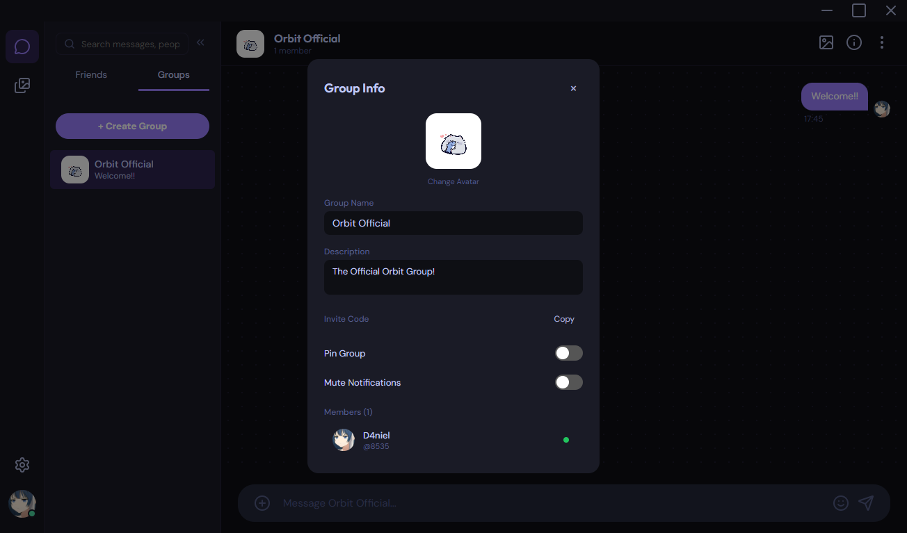
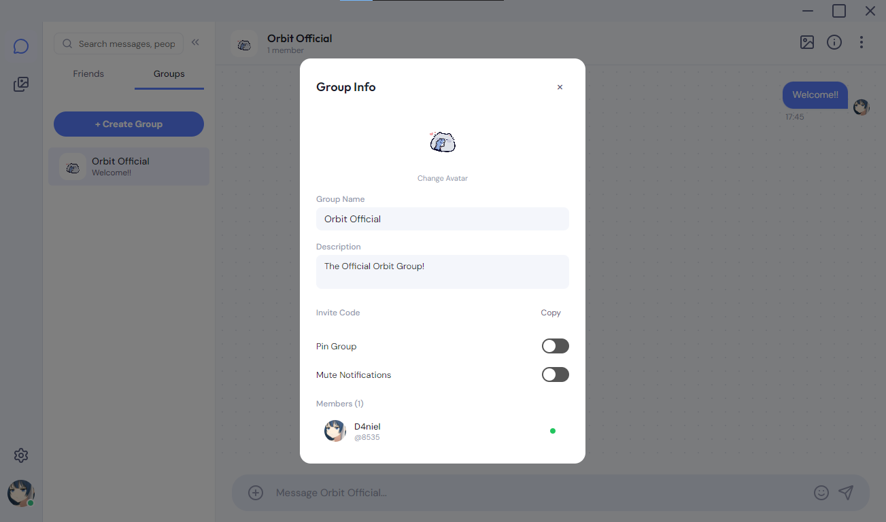

# Orbit Changelog

## v0.0.4-beta *(Current Version)*

### Features & Enhancements
- **Advanced Settings Tab:** New "Advanced" tab with 6 toggles — Developer Mode, Debug Display (hover-to-inspect overlays on all UI), Show Message IDs, Log Network Packets, Show Connection Stats, and Experimental Features.
- **Debug Display Overlays:** All UI elements (messages, reactions, replies, search results, friend/group list rows) now carry `data-debug` attributes — when Debug Display is enabled, hover any element to reveal a polished tooltip with its internal state, IDs, and metadata.
- **Connection Stats Overlay:** Live debug panel showing connection status, peer count, uptime, and bytes sent/received.
- **Group Avatar Real-Time Updates:** Uploading a group avatar now updates the sidebar, chat header, and group info panel instantly without restart — uses `avatarUpdatedAt` timestamp for cache busting.
- **Modernized Create/Join Group Modal:** Restyled with pill-style segmented tabs, icon headers, proper breathing room padding (40px sides), and separated footer with consistent button sizing.
- **Modernized Add Friend Modal:** Extracted into a dedicated `showAddFriendModal()` with icon header, descriptive subtitle, proper padding, and consistent footer layout.
- **Search Modal Focus Polish:** Removed jarring purple box-shadow on focus — replaced with a subtle animated underline accent.

### Bug Fixes
- **Add Friend Button Not Working:** `prompt()` is blocked in Electron 32 sandbox — replaced with a custom inline modal overlay. Added `orbitAPI.connect` IPC through preload.js and a `network-connect` handler in main.js.
- **Create Group Button Out of Place:** Minimized `+` icon is now inline with the "Groups" header label, matching the DMs "Add Friend" button style exactly.
- **Group Avatar Not Updating in Real-Time:** Images were cached by the browser — added `?t=<avatarUpdatedAt>` cache buster to all `orbit-avatar://` URLs, and `save-avatar` IPC now updates the timestamp in DB.
- **`self.showAddFriendModal` Not a Function:** `renderList()` was missing `var self = this;` — added it.
- **Debug List Row Badge Clipped by Left Sidebar:** Moved debug badge from `left:-1px` to `right:-1px` with higher z-index to avoid panel overflow clipping.

### Database
- **v6 Migration:** Added `avatarUpdatedAt INTEGER` column to `groups` table for real-time avatar cache busting.

### Technical
- **IPC Layer:** Added `network-connect` IPC handler calling `socketInstance.connectToPeer()`. Added `avatarUpdatedAt` field to `saveGroup` prepared statement.
- **CSS Debug Display System:** Comprehensive `.debug-display` class system — hover-reveal tooltips using `::after`/`::before` pseudo-elements with app design tokens (`--bg-surface`, `--border-subtle`, `--accent-primary`), smooth opacity transitions, and element-specific positioning.
- **Settings Toggles:** 6 new settings (`devMode`, `debugDisplay`, `showMessageIds`, `logNetworkPackets`, `showConnectionStats`, `enableExperimental`) with CSS class toggles on `<html>` via `applySettings()`.

## v0.0.3-beta

### Features & Enhancements
- **Group Chat:** Full multi-peer group messaging with database persistence — create groups with a friend picker modal, broadcast messages to all members, and view group-aware chat headers with member counts and overlapping avatars.
- **Group Info Panel:** Right-click any group in the sidebar to view/edit group name, description, invite code, pin status, notification mute, member list, and avatar.
- **Group Avatar Upload:** Upload custom group avatars via file picker — stored as file path references and rendered via `orbit-avatar://` protocol.
- **Pinned Groups:** Pin important groups to the top of the sidebar with a pin badge indicator.
- **Profile Sidebar:** Click any message avatar or friend avatar to open a dedicated right-side profile panel showing banner, avatar, username, tag, online status, bio, and user ID.
- **System Theme Option:** New "System" theme setting that follows the OS dark/light mode preference with live `matchMedia` listener.
- **Settings — Notifications Tab:** Toggles for notification sound, message preview, @mentions-only mode, and Do Not Disturb.
- **Settings — About Tab:** App name, version, user stats, and app icon.
- **Notification Sounds:** Short pleasant chime generated via Web Audio API (no audio files needed) — plays on incoming messages when sound is enabled and DND is off.
- **Toggleable Middle Sidebar:** Collapse the friend/group sidebar with a toggle button; floating re-open button appears on the right panel edge when hidden. CSS transition animation on grid layout.
- **Message Timestamp Position:** Timestamps now appear below the message bubble instead of above — left-aligned for sender, right-aligned for receiver.
- **Sender Bubble Layout:** Removed "You" label from group sender messages; avatar wrapper uses `padding-bottom` to offset bubble below avatar.
- **Message Reactions:** Added emoji reactions to messages — hover to reveal the reaction button, pick from 8 common emojis, and see reaction counts below each message.
- **Drag-and-Drop Uploads:** Drag files and images directly into the chat panel — the input area dims to indicate drop zone, and staged files appear in the preview bar.
- **Enhanced Markdown:** Extended markdown support with `###`/`####` headings, `~~strikethrough~~`, `>` blockquotes, `-` unordered lists, `1.` ordered lists, and fenced code blocks.
- **Privacy Mode Temp Storage:** Attachments in privacy mode are now saved to `{userData}/temp/` and served via `orbit-file://` protocol, with automatic cleanup on app exit.
- **Persistent Mode Reliability:** Attachments in persistent mode now include proper error handling around file reads, ensuring data isn't silently lost if temp files are removed.

  
   
  <em>Group chat</em>

  
   
  <em>Group info panel</em>

### Bug Fixes
- **Empty Buffer Truthy Bug:** Protocol handlers (`orbit-db://`) no longer treat `Buffer.alloc(0)` as valid data — added `.length > 0` checks to both attachment and thumbnail handlers, returning proper `404` for empty blobs.
- **Privacy Mode File Loading:** Fixed `orbit-db://` protocol to fall back to `att.localPath` filesystem path when the database blob is empty, enabling reliable image loading in privacy mode.
- **Windows Path Resolution:** Fixed `orbit-file://` protocol handler to convert backslashes to forward slashes on Windows, resolving `file:///C:\...` → `file:///C:/...` format.
- **Cleanup Timer Default:** Changed attachment cleanup default from 525,600 minutes (365 days) to `0` (Never), preventing unexpected data loss when `deleteAttachmentsAfter` isn't explicitly set.
- **Received File Size:** File size is no longer hardcoded to `0` — the actual file size now passes through the transfer pipeline via `onComplete(fileSize)` callback and `file-received` event.
- **Sender Attachment ID:** Local sender messages now include a stable `id` field on attachment objects, ensuring database inserts use consistent primary keys.
- **Image Forwarding:** Forwarding images via the gallery viewer now preserves attachment `id` and `path`, preventing data loss on the forwarded copy.
- **URL Selection:** `getMessages()` and `getAllMessagesRaw()` now return `orbit-file://` URLs for attachments with `localPath` set, matching the correct storage mode.
- **Bio Persistence on Migration:** The v2 identity migration now preserves the existing `bio` field (`identity.bio || ''`) instead of hardcoding an empty string.
- **CSP for Avatar Protocol:** Added `orbit-avatar:` to `img-src` and `media-src` Content Security Policy to allow custom group avatar rendering.
- **Profile Sidebar Close:** Fixed `self` variable scoping where `self.close()` in the render function resolved to `window.self.close()` (closing the whole Electron window) instead of the ProfileSidebar method.

### Database
- **v3 Migration:** Added `groups` and `group_members` tables for group chat persistence.
- **v4 Migration:** Added `localPath TEXT` column to `attachments` table for privacy mode temp file references.
- **v5 Migration:** Added `avatarPath TEXT`, `description TEXT`, `pinned INTEGER DEFAULT 0`, `notificationMuted INTEGER DEFAULT 0`, and `inviteCode TEXT` columns to `groups` table.

### Technical
- **IPC Layer:** Added 6 new group CRUD IPC handlers (`db-get-groups`, `db-save-group`, `db-add-group-member`, `db-remove-group-member`, `db-get-group`, `db-get-group-members`) and corresponding preload API methods.
- **Socket Manager:** Added `broadcastToGroup()` method for sending packets to multiple group members simultaneously.
- **Store:** Added `addGroup()`, `removeGroup()`, `addMemberToGroup()`, `getGroupMembers()`, `sendReaction()`, `updateGroupField()`, `removeGroupMember()` methods; `GROUP_CREATE` and `REACTION` packet routing.
- **Notification Sound:** Added `window.NotificationSound` Web Audio API utility — generates a two-tone chime oscillator without external audio files.

## v0.0.2-beta

### Features & Enhancements
- **Persistent Storage:** Replaced ephemeral JSON storage with a robust `better-sqlite3` database for scalable, permanent message and media archiving.
- **Privacy Mode:** Added an Attachment Storage toggle in Settings. When enabled, attachments are kept in temporary storage and deleted upon closing the app, while messages and profile data remain intact.
- **Storage Management:** Added a "Clear All Saved Attachments" button in Settings to permanently delete attachment BLOBs.
- **Large File Support (250MB):** Replaced legacy JSON serialization with chunked TCP streaming, drastically reducing RAM spikes and allowing files up to 250MB to transfer flawlessly.
- **Data Integrity:** Implemented SHA-256 hash generation and validation during file transfers to prevent file corruption.
- **WebP Compression & Caching:** Added `sharp` to automatically generate highly compressed WebP thumbnails of image attachments on ingestion for vastly improved Gallery Sidebar performance.
- **Offline Reliability:** Direct P2P files now ingest straight into the SQLite database and are served securely to the UI via custom `orbit-db://` protocol handlers.

### Bug Fixes
- Resolved critical bug where received images would result in a "Not Found" error upon refreshing the page.
- Fixed duplicate author metadata in `package.json` that warned during compilation.
- Resized application icons to `256x256` to pass strict Electron-Builder validations.

## v0.0.1-beta *(Original Release)*

### Initial Release
- Core P2P chat functionality using raw sockets.
- File and image sharing capabilities.
- Local network Auto-Discovery.
- Customizable user profiles, avatars, and UI themes.
- Initial ephemeral JSON storage backend.
