<p align="center">
  
</p>

<h1 align="center">Orbit</h1>

<p align="center">
  Modern chat without mandatory cloud infrastructure.<br>
  Built for local-first communication on your LAN.
</p>

<p align="center">
  Peer-to-peer messaging, files, and images — no central server required.
</p>

<p align="center">
  <strong>Current version:</strong> <a href="CHANGELOG.md#v017-beta-latest-version">v0.1.7-beta</a>
</p>

<p align="center">
  
  
  
  
</p>

## Release Status

| Channel | Version | Status |
|---------|---------|--------|
| *Development* | v0.1.7-beta | Latest build (unstable) |
| **Stable** | v0.1.1-beta | Stable release |
| Previous **Stable** | v0.0.5-beta | Legacy stable release |

See [CHANGELOG.md](CHANGELOG.md) for detailed release notes.

## Windows Preview (Old)

<p align="center">
  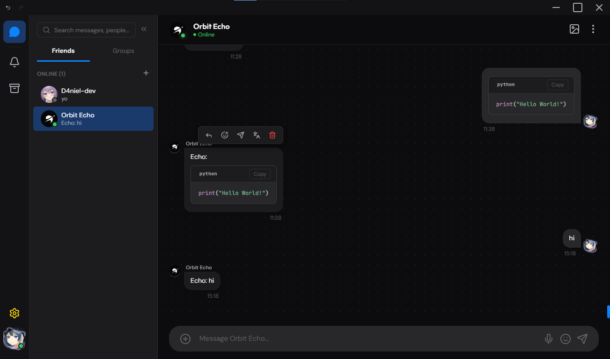<br>
  <em>Dark mode</em>
</p>

<p align="center">
  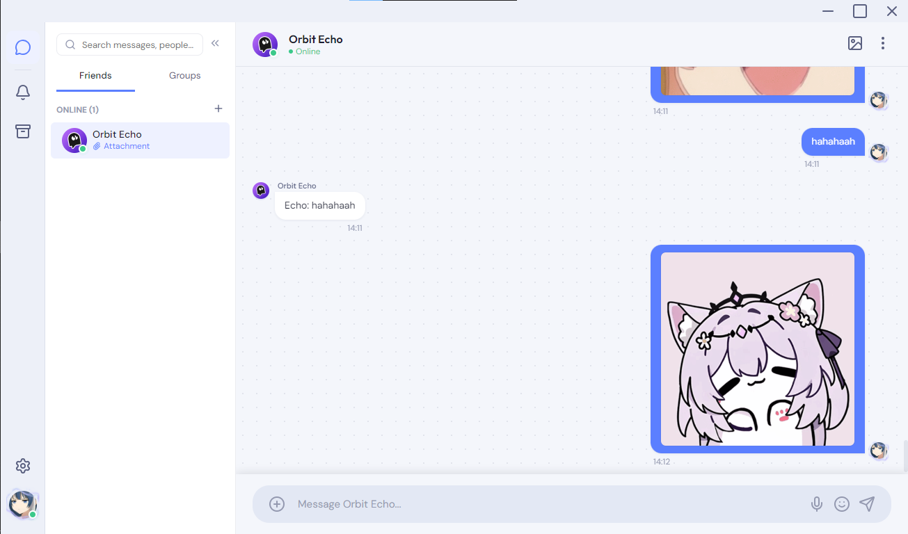<br>
  <em>Light mode</em>
</p>

<p align="center">
  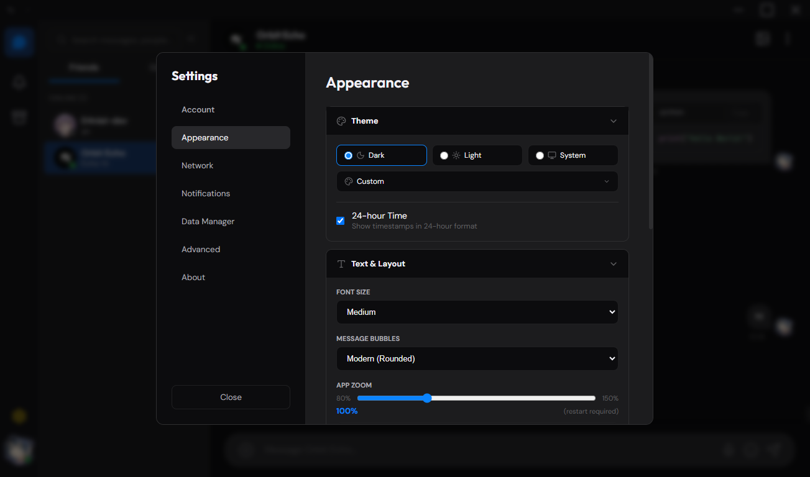
  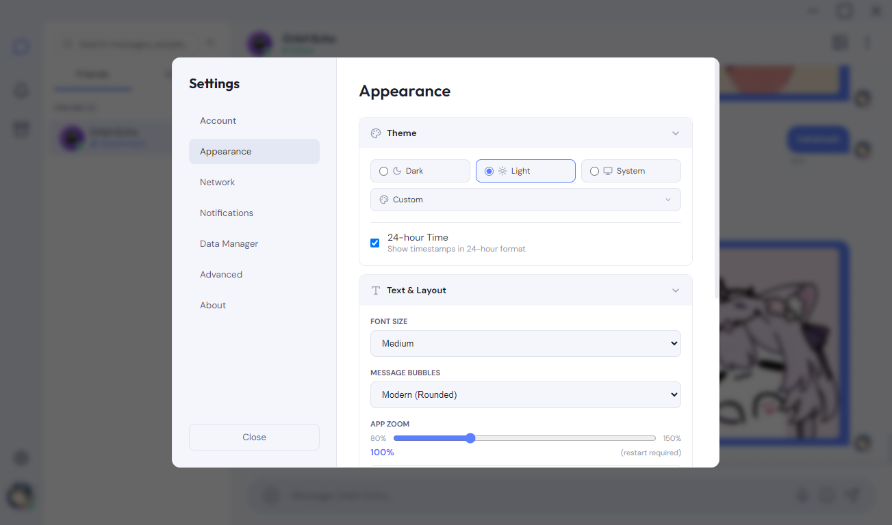<br>
  <em>Settings</em>
</p>

<p align="center">
  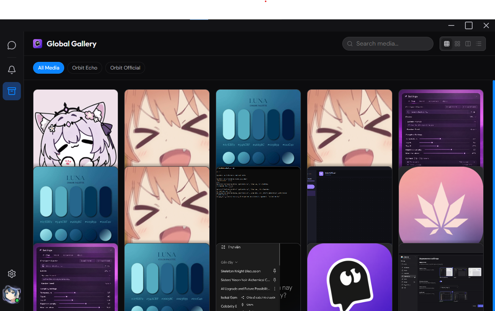
  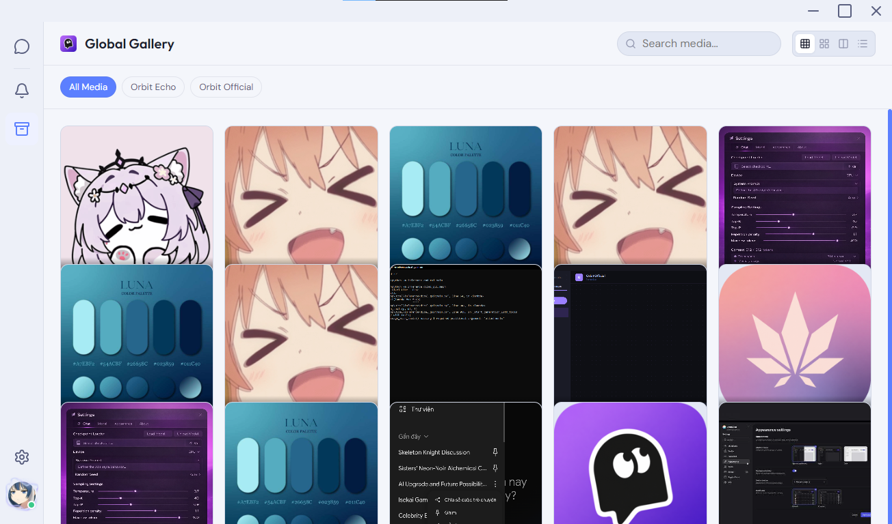<br>
  <em>Gallery &amp; file sharing</em>
</p>

<p align="center">
  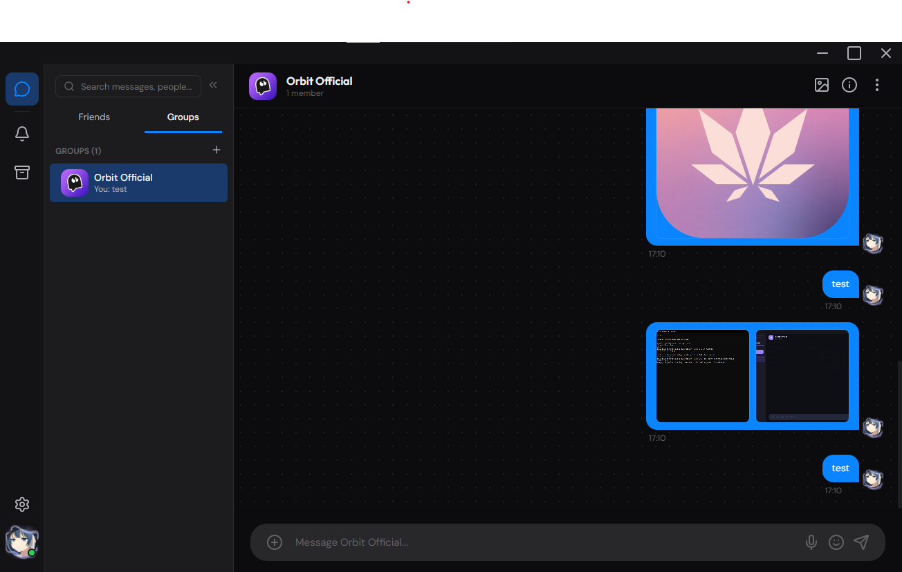
  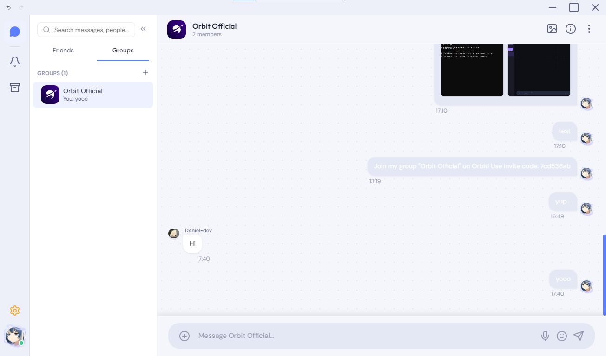<br>
  <em>Group chat</em>
</p>

## Mobile Preview (Old)

<p align="center">
  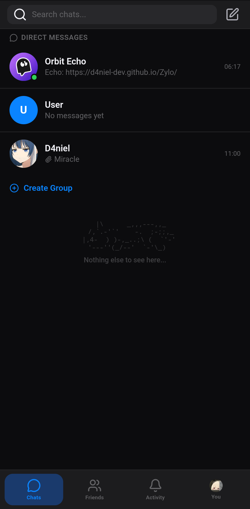
  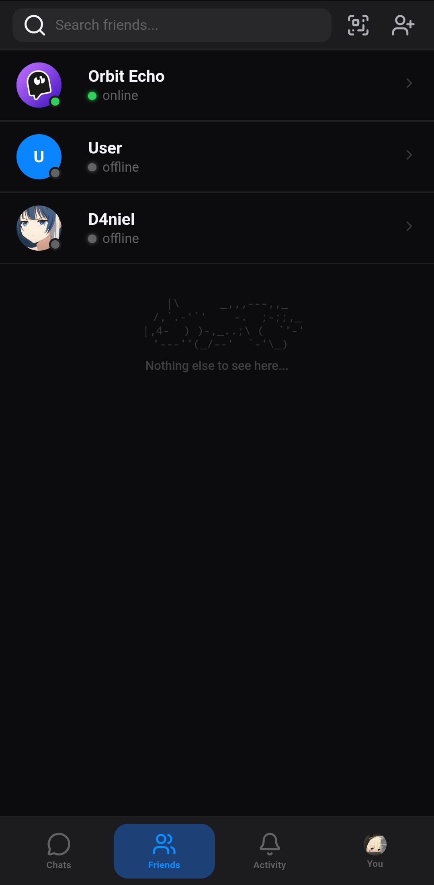
  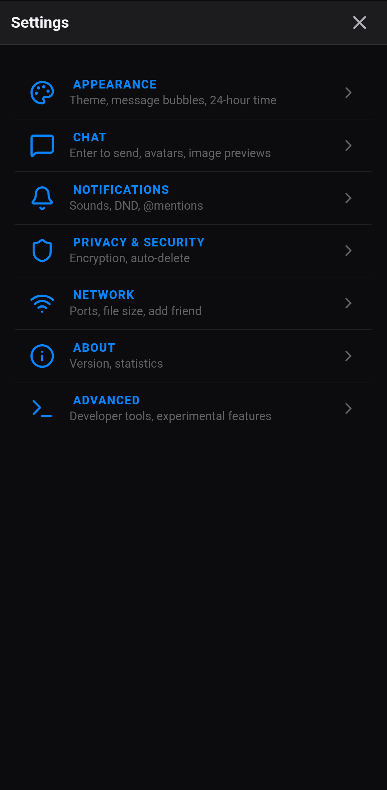
  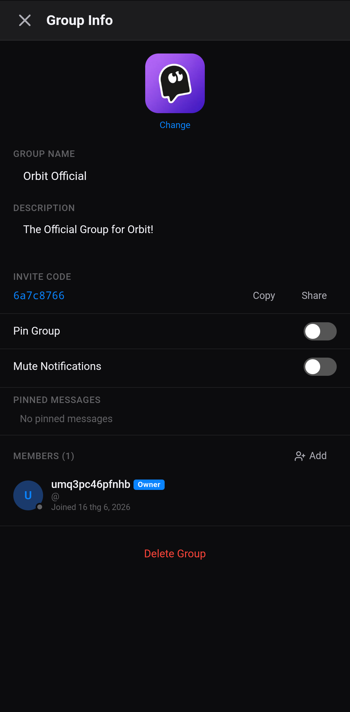<br>
  <em>Android app — chat, friends, settings, group info</em>
</p>

## Why Orbit?

Orbit exists for people who want **real-time communication without handing their conversations to a cloud vendor**.

Whether you are sharing files at home, coordinating in a small office, or experimenting with local-first software as a developer, Orbit keeps traffic **on your network** — peer-to-peer, discoverable, and under your control.

| Principle | What it means |
|-----------|----------------|
| **Local-first** | Messages and media stay on devices you own, not a remote account you rent. |
| **Peer-to-peer** | Clients talk directly over LAN sockets — no mandatory relay or signup server. |
| **LAN-first** | Auto-discovery finds nearby Orbit clients on the same network. |
| **No cloud lock-in** | No required SaaS backend, no vendor account, no subscription gate. |
| **Open & approachable** | MIT-licensed, readable stack (Electron + SQLite), built for transparency. |

Orbit is a **beta-stage desktop app** aimed at trusted private networks — not a replacement for hardened internet-scale messengers yet, but a serious step toward practical local messaging.

## Highlights (v0.1.7-beta)

- **fMP4 Video Playback Fixed:** PIPELINE_ERROR_DECODE root cause found and fixed — Content-Type serving in `main.js:contentTypeFromAtt()` now correctly serves video files. Videos play continuously without stalling at ~16s.
- **Re-render Guard:** Store subscription blocks message re-renders during video playback (except chat switches). Prevents player destruction from `container.innerHTML` re-renders.
- **Decode Error Retry:** On audio packet decode failure, source reloads and skips forward +2s past the corrupt packet (up to 3 attempts).
- **Larger Media Players:** Video increased to 720×600, audio waveform canvas to 200px — both rendered outside the image grid as standalone blocks at full width.
- **Fullscreen Theme Blend:** Letterbox background now uses `var(--bg-surface)` — matches active UI theme instead of hard black.

## Version History
<details>
<summary>v0.0.1-beta</summary>

- **P2P messaging** — Direct socket-based chat on your local network
- **File & image sharing** — Send attachments peer-to-peer (configurable limit, default **500 MB**)
- **Auto-discovery** — Find other Orbit clients on the LAN without manual IP entry
- **Profiles & themes** — Custom display name, avatar, light/dark/system UI
- **Gallery** — Browse shared images with WebP thumbnails for fast scrolling
- **System tray** — Minimize to tray instead of quitting
</details>
<details>
<summary>v0.0.2-beta</summary>

- **Persistent storage** — Messages and media archived in SQLite (`better-sqlite3`)
- **Privacy mode** — Optional session-only attachment storage
- **Integrity checks** — SHA-256 validation on file transfers
</details>
<details>
<summary>v0.0.3-beta</summary>

- **Group chat** — Multi-peer group messaging with member management, roles (Owner/Admin/Member), avatars, and invite codes
- **Message reactions** — Emoji reactions on messages
- **Markdown formatting** — Rich message formatting with headings, lists, code blocks, and more
- **Drag-and-drop uploads** — Drop files and images directly into the chat panel
- **Notification sounds** — Web Audio notification chime with per-user mute settings
- **Profile sidebar** — Click any avatar to view a detailed profile panel
</details>
<details>
<summary>v0.0.4-beta</summary>

- See [CHANGELOG.md](https://github.com/D4niel-dev/Orbit-beta/blob/main/CHANGELOG.md#v004-beta), section 4.
</details>
<details open>
<summary>v0.0.5-beta (Stable)</summary>

- **End-to-end encryption** — ECDH key exchange + AES-256-GCM message encryption for DMs. Toggle in Settings → Data Manager.
- **Backup & Restore** — Export/import full database as .orzip or .zip archives
- **Unread Badges & Read Receipts** — Per-chat unread counts, @mention badges, and read indicators
- **Activity Center** — Unified view of recent messages across all chats
- **Customizable Sidebar** — Show/hide Activity Center, Gallery, and Storage buttons in the left sidebar
</details>
<details>
<summary>v0.0.6-beta</summary>

- **Custom Themes** — True Dark, Dark Purple, Midnight, Sunset, Nord, Seasonal auto-rotating themes
- **Custom Colors** — Live preview color editor for all UI categories
- **Profile Frames** *(experimental)* — 12 decorative frame overlays on avatars
- **Animated Avatars** *(experimental)* — Subtle pulse animation on avatars
- **Message Translate** *(experimental)* — Translate messages via MyMemory API
- **Compact Spacing** *(experimental)* — Tighter message layout option
- **App Zoom** — Zoom slider with preview and restart notification
- **Chat Settings** — Enter to Send, Show Avatars, Image Preview toggles
</details>
<details>
<summary>v0.0.7-beta</summary>

- **Project restructured** — Desktop and mobile code separated into `desktop/` and `mobile/`
- **Cross-platform abstraction** — `shared/` modules for database, network, protocol, crypto
- **Privacy mode fixed** — Thumbnails now generated, gallery sidebar works, backup/restore preserves temp files
- **Android build pipeline** — GitHub Actions builds `.apk` via Capacitor alongside desktop builds
- **Mobile UI shell** — Touch-friendly layout with bottom navigation bar
</details>
<details>
<summary>v0.0.8-beta</summary>

- **Rich Link Previews** — Open Graph metadata (title, description, image) fetched via Electron IPC; styled cards with left accent bar, hover/active link colors
- **Message Link Styling** — URLs in chat text now clickable with hover (dark blue) and active (green) states on both desktop and mobile
- **Cross-platform P2P** — Desktop ↔ Android LAN discovery and messaging via TCP/UDP
- **QR Code Fixes** — Both desktop and mobile QR generation fixed; mobile QR moved to Add Friend modal
- **Mobile Settings Wired** — All toggles now have real behavior (time format, avatars, images, notifications, debug tools, file size, auto-delete, experimental features)
- **Mobile Toast Overhaul** — Type-based accent bar, icons, slide-in animation, progress bar
- **Mobile Notification Sound** — Web Audio beep on incoming messages
- **Desktop Settings Tabs** — Notifications (volume/sound/test), Network (collapsibles), About (version info)
- **Chat Background Patterns** — Diagonal Stripes, Crosshatch, Circles
- **Desktop Bug Fixes** — MIME mapping, cache headers, media retry, attachment URLs
</details>
<details>
<summary>v0.0.9-beta</summary>

- **Android P2P Stability** — 8 Java plugin fixes (multicast lock, beacon gating, TCP buffer, connection tracking) + 4 JS bridge fixes for reliable Android discovery and messaging
- **Desktop P2P Stability** — 9 fixes including per-connection write queue, oversized frame guard, socket error handlers, self-beacon IP filter, transfer backpressure, and clean restart support
- **Mobile Group Info Panel** — Full panel: edit group name/description, change avatar, invite code with Copy/Share, pin/mute toggles, member list with roles (Owner/Admin) + join dates, promote/demote/remove members, leave/delete group
- **Cross-Platform Group Sync** — Group creation (GROUP_CREATE) and leave (GROUP_LEAVE) broadcast compatible between mobile and desktop
- **Pinned Messages** — Pin/unpin in message action bar; pinned messages section in group info; cross-platform sync via PIN_MESSAGE/UNPIN_MESSAGE protocol
- **Message Search** — Search bar filters messages in real-time on mobile chat header
- **Enhanced Message FX** — Particle confetti system on sent messages (both platforms); safe CSS for Android WebView compatibility
- **Mobile Settings Added** — Font Size (Small/Medium/Large), Message Animation (Slide/Fade), Auto-Reconnect toggle, Connection Timeout (5/10/30/60s)
- **Mobile DB Fix** — Critical fix: migration now runs after user data loads to prevent identity corruption on restart
- **Add Friend on Android** — No more "P2P Preview" gating; `android:usesCleartextTraffic` flag; plugin retry mechanism for reliable friend addition
</details>
<details>
<summary>v0.0.9.2-beta</summary>

- **Mobile initP2P Logging** — Detailed debug logs throughout P2P initialization and lifecycle
- **Dev Mode DevTools** — Toggling Developer Mode loads eruda on-device inspector panel
- **Debug Log Buffer** — Scrollable log overlay when dev mode is active
</details>
<details>
<summary>v0.0.9.3-beta</summary>

- **Group Info Panel Overhaul** — Redesigned with Add Member (friend picker), Leave Group, Transfer Ownership, member search bar, created date, online/total count
- **GROUP_MEMBER_ADDED / GROUP_OWNER_TRANSFER** — New protocol types with cross-platform handlers
- **DM Context Menus** — Desktop right-click and mobile long-press: Pin/Unpin, Mute, View Profile, Copy ID, Close DM
- **Pinned DMs** — Pinned state sorted first in sidebar with pin icon
- **Close DM Removes Friend** — Full cleanup from DB; persists closedDMs; auto-reopens on new message
- **P2P Diagnostics Panel** — Modal with P2P status, discovery, connected peers, log buffer
- **Global Gallery Type Filters** — All/Images/Files toggle; non-image files render with Lucide icons
- **Gallery Sidebar Files Tab Fix** — Format.bytes→fileSize; download button replaces window.open
- **Create Group Modal Avatars** — Friend list shows actual avatars with profile frames
- **Context Menu & P2P Fixes** — data-action rewrite, protocol type audit, TCP merge IP strip
</details>
<details>
<summary>v0.1.0-beta</summary>

- **Performance: Up to 5× Faster Startup & Rendering** — Selective store subscriptions, setStateBatch microtask coalescing, insertAdjacentHTML, event delegation for all message actions
- **Startup: ~40% Faster (5s → 3s)** — Deferred init phases (setTimeout(0) + requestIdleCallback), batched store IPC (7+ calls → 1), lazy message loading (last 50 per chat, load on demand)
- **freezeGifImages** — Canvas cache via _frozenCache Map; expanded selectors; global call on Reduce Motion toggle
- **Data Manager "Load All Stored Data"** — Double-confirmation button loads all messages from DB into memory on demand
- **Bug Fixes** — orbit-db://attachment/ 404, selective subscriber undefined changedState, message avatar click re-attached, loadFullChatMessages dropping existing messages
</details>
<details open>
<summary>v0.1.1-beta (Latest Stable)</summary>

- **Voice & Video Calls (P2P WebRTC)** — Full call system with incoming notification, mute/speaker controls, timer, ICE candidate exchange over P2P network layer
- **Group Calls (Mesh)** — Each participant gets their own RTCPeerConnection; video grid or avatar circles for audio-only; start/join/leave group calls
- **Camera Toggle** — On/off during calls with deterministic HSL avatar placeholder when camera is off
- **Message Forwarding** — Forward messages with attachments to any chat via chat picker modal (desktop + mobile)
- **Block User** — Block/unblock from context menu and profile sidebar; P2P filter drops blocked packets
- **Search Within a Chat** — Scoped search with chatId filter, sender filter, date inputs, context-aware placeholders
- **Export Chat History** — JSON or TXT export with timestamped downloads via Data Manager
- **Save/Load Themes** — Export current theme as JSON; import via file picker in Appearance tab
- **Message Translate Unlocked** — Always-on translate button (no experimental gate), default enabled in Appearance tab
- **Mobile Reply fromName Fix** — fromName now set on ALL outgoing MESSAGE packets for cross-platform reply consistency
- **Lucide Icon Null Fix** — All querySelector('i') changed to querySelector('svg') after createIcons replaces i tags with svg
- **Online Status Improvements** — lastSeen on BEACON; 30s interval checks for stale connections (120s timeout)
- **Inline Code Blocks** — CSS styling for code and pre elements (both platforms)
- **Call Modal UI Polish** — Proper centering, audio wave bars, hover button effects, local video as full grid tile in groups
</details>
<details>
<summary>v0.1.2-beta</summary>

- **Manual Connect Bug Fixed** — Manual "Add a Friend" IP connect now correctly remaps the TCP socket to the peer's real userId; messages reuse the existing connection instead of creating a new one
- **Protocol Type Unification** — All 47 protocol types unified between `shared/` and `desktop/` protocol.js; cross-platform call, file transfer, and group compatibility guaranteed
- **Build Pipeline Overhaul** — Android `assembleRelease` replaces `assembleDebug`; `SHA256SUMS.txt` per platform; artifact verification fails on missing builds; build metadata (version, commit, date) and asset size table auto-injected into release notes
</details>
<details>
<summary>v0.1.3-beta</summary>

- **Performance Mode** — New Experimental toggle with two-step confirmation; kills all animations/transitions, freezes GIFs, skips link preview OG fetch, slows offline check to 60s, stops connection stats and dev overlay polling
- **Image Viewer Fix** — Clicking image thumbnails now reliably opens viewer after restart; hit-test fallback for DOM recreated mid-click; removed `'friends'` from store subscription to stop re-renders on friend status beacons
- **Forced Reflow Cascade Eliminated** — ResizeObserver disconnected before `innerHTML` in `renderChat`, reconnected after all DOM changes; throttled to 1s to prevent cascade from async image loads
- **Native Android Notifications** — Messages show as real system notifications when app is backgrounded via `@capacitor/local-notifications`
- **Desktop Notification Avatars** — Sender/group avatar shown as notification icon (previously static Orbit icon)
- **Connection Stats Panel** — Live P2P status overlay with peer count, uptime, sent/received counters
- **Video File Support** — Upload, render, and view video files in chat with play overlay and full-screen preview modal
- **Video Compression** — Large videos (>5MB) auto-compressed to 720p/500kbps before sending
- **P2P Discovery Optimized** — Beacon interval 5s→10s, stale threshold 120s→180s, exponential chunk retry backoff
- **image-viewer.js Null-Safety** — `openFromMessage` checks null store/messages with fallback; `close()` and `openVideo()` wrapped in try/catch; `init()` uses `readyState` guard
- **Compact Spacing & Swipe-to-Reply** — Moved from Experimental to general chat settings
</details>
<details>
<summary>v0.1.4-beta</summary>

- **P2P Auto-Connection Stabilization** — PING/PONG keep-alive heartbeat, 8s connection timeout, exponential backoff reconnect (max 5 attempts), stale peer pruning (180s), network IP change detection, auto-connect duplicate protection
- **Desktop P2P Bugfix Audit (17 fixes)** — Socket 8s timeout disabled after connect, write-queue key collision fixed, reconnect .catch() + counter reset, GROUP_CREATE publicKey enrichment, GROUP_JOIN_REQUEST fields, PIN/UNPIN/SYSTEM routing
- **Translation Engine Rewrite** — In-memory cache, request dedup, AbortController, inline retry link
- **Image Viewer Overhaul** — Quick-save button (File System Access API), keyboard navigation, swipe, download fix for custom protocol URLs, loading placeholder CSS
- **Voice Messages Stabilization** — Content-Type fix, onerror auto-retry, chunked transfer detection with MIME mapping
- **Performance Mode** — Two-step confirmation, CSS class on `<html>`, runtime guards in chat-panel and app.js
- **Mobile Protocol.js Synced** — 15+ missing types added (46 total, matching desktop)
- **Mobile Settings Parity** — 11 desktop defaults ported; logLevel filters debugLog; tcpPort/udpPort in beacon/P2P; netReconnectInterval in reconnect; netKeepAlive in heartbeat; netBandwidthLimit throttles FILE_CHUNK
- **Mobile DB Migration Fixed** — Runs before MStore.load(); visible console output; reload safety net
- **Mobile profileFrame Clean-Up** — Helper function defends all 7 render locations; TCP beacon stores 0 correctly
- **Mobile Changelog** — What's New modal in About tab (v0.0.2 through v0.1.4)
- **Desktop group sync fixes** — GROUP_OWNER_TRANSFER, GROUP_LEAVE cleanup, GROUP_INVITE init
- **Desktop reconnect settings bridge** — preload forwards reconnectEnabled/reconnectIntervalMs to main process
</details>
<details>
<summary>v0.1.5-beta</summary>

- **Account Switcher (Experimental):** Right-click avatar → panel to add/switch/logout accounts. Logout quits app (accounts persist in DB). Last active user auto-loaded on launch. Gated behind Experimental Features toggle in Advanced settings.
- **PIN Lock Screen (2FA Experimental):** 4-8 digit numeric PIN with SHA-256 hashing (Node `crypto` on main process). Numpad UI, 5-attempt cooldown (30s), "Forgot PIN" reset (data intact). Only prompted on app launch (never on resume/sleep). Gated behind Experimental Features.
- **Settings Security Tab:** PIN setup, change, disable flows. Full modal re-render when Experimental Features toggled to show/hide tab.
- **Orbit Echo Welcome Sequence:** 4 welcome messages with 5-8s typing indicator delays. Fires only when echo chat is empty. Echo excepted from all offline checks.
- **Group Avatar Backfill:** Async fetch of `orbit-avatar://` for groups with `avatarPath` but no `avatarDataUrl` on store init + group info open. Non-blocking, errors silently caught.
- **SidebarLeft.renderAvatar crash before init:** Added `if (!this.container) return;` guard to prevent TypeError when called before `SidebarLeft.init()`.
- **Store.js syntax error:** Removed trailing commas between class methods that caused "Unexpected token ','".
- **`window.ChatPanel.showChat is not a function`:** Removed premature `ChatPanel.showChat()` call from `reloadDataForCurrentUser()`.
- **`require('crypto')` in renderer:** Changed to `window.crypto` for invite code generation.
- **Migration v11 robustness:** Column-existence checks before `ALTER TABLE`. Guard in `migrations.run()` handles non-transactional `user_version` — if version ≥ 11 but columns missing, resets to 10 and re-runs.
- **Identity System:** `Identity.init()` loads from multi-user DB. `getAll()` returns all saved users. `switchTo(userId)` swaps identity and updates last active tracking. `saveUser` stores `profileFrame` with `!= null` guard.
- **Database Schema:** v10: `ALTER TABLE users ADD COLUMN profileFrame INTEGER DEFAULT 0`. v11: `accountOwnerId TEXT` on friends, groups, group_members tables.
- **Network Restart:** Account switch calls `networkStop` (nullifies all instances) → `Identity.switchTo()` → `networkStart` (re-creates with new identity). All TCP connections drop and re-establish.
- **Migration Rollback Guard:** `db.pragma('user_version')` is non-transactional. Added column-existence check at start of `migrations.run()` to detect partial migration state and recover.
</details>
<details>
<summary>v0.1.6-beta</summary>

- **Android Foreground Service (Background Execution):** P2P networking extracted into persistent Foreground Service with notification, WakeLock, START_STICKY. BootReceiver restarts on device boot. Service survives Activity/WebView destruction.
- **P2P Connectivity Fixes:** Desktop auto-connect port fixed (was hardcoded 46000); reconnect now uses per-peer stored TCP port; mobile disconnect handler fixed (connectionId→friend lookup); mobile beacon handlers store tcpPort/connectionId/ip; mobile auto-reconnect uses peer's port.
- **Message Editing & Reactions:** Desktop edit broadcast loop eliminated; mobile edits broadcast over P2P to DMs and groups; mobile reaction UI (6 emojis, toggle, P2P broadcast).
- **OrbitForegroundService:** Full P2P engine (TCP server, UDP multicast, connection map, thread pool) as Android Service. Plugin proxies via Binder. Event queue drained every 100ms.
- **Silent Bug Fixes:** 7 fixes from service audit — sendFailed/connectFailed events, serverSocket volatile, PeerConnection map leak, executor shutdown, eventQueue clear, SO_REUSEADDR, Android 10+ joinGroup fix.
</details>
<details open>
<summary>v0.1.7-beta</summary>

- **fMP4 Video Playback Fixed:** PIPELINE_ERROR_DECODE root cause fixed — Content-Type serving in main.js now correctly serves video files. Videos play continuously.
- **Re-render Guard:** Message re-renders blocked during video playback (except chat switches). Prevents player destruction from innerHTML re-renders.
- **Decode Error Retry:** On audio packet decode failure, source reloads and skips forward +2s (up to 3 attempts).
- **Larger Media Players:** Video 720×600, audio waveform 200px — rendered outside image grid as standalone blocks at full width.
- **Fullscreen Theme Blend:** Letterbox uses `var(--bg-surface)` — matches active UI theme.
</details>

See [CHANGELOG.md](CHANGELOG.md) for the full version history.

## Quick Start

### Download (recommended)

Pre-built Windows installers are published on [GitHub Releases](https://github.com/D4niel-dev/Orbit-beta/releases).

| Release | Platform | Notes |
|---------|----------|--------|
| [Latest](https://github.com/D4niel-dev/Orbit-beta/releases/latest) | Win / Mac / Linux / Android | Most recent build |
| [v0.0.2-beta](https://github.com/D4niel-dev/Orbit-beta/releases/tag/v0.0.2-beta) | Windows | SQLite storage, privacy mode, large file transfers |
| [v0.0.1-beta](https://github.com/D4niel-dev/Orbit-beta/releases/tag/v0.0.1-beta) | Windows | Original release |

> Windows may show SmartScreen for unsigned builds. Choose **More info → Run anyway** if you trust the source.
> macOS users may need to right-click → **Open** on first launch for unsigned apps.

### Run from source

**Requirements:** [Node.js](https://nodejs.org/) 18+ (LTS recommended), npm.

#### Desktop (Electron)

```bash
git clone https://github.com/D4niel-dev/Orbit-beta.git
cd Orbit-beta-main
cd desktop
npm install
npm start
```

Peers on the same LAN are discovered automatically. Open Orbit on another machine to start chatting.

#### Android

```bash
# From repo root
cd mobile
npm install
npm run shared:sync    # copy cross-platform shared modules
npx cap sync android   # sync Capacitor Android project
npx cap open android   # open in Android Studio for building
```

Or let GitHub Actions build it automatically — push a `v*` tag or trigger the workflow manually.

## Tech Stack

| Layer | Technology |
|-------|------------|
| Desktop shell | [Electron](https://www.electronjs.org/) 32 |
| Mobile shell | [Capacitor](https://capacitorjs.com/) 8 (Android) |
| Runtime | [Node.js](https://nodejs.org/) (desktop), WebView (mobile) |
| UI | HTML, CSS, JavaScript |
| Storage | [better-sqlite3](https://github.com/WiseLibs/better-sqlite3) (desktop), `@capacitor-community/sqlite` (mobile) |
| Networking | Raw TCP P2P sockets, LAN multicast discovery |
| Media | [sharp](https://sharp.pixelplumbing.com/) (WebP thumbnails) |
| Desktop packaging | [electron-builder](https://www.electron.build/) (Windows NSIS, macOS DMG, Linux AppImage/deb) |
| Mobile packaging | [Gradle](https://gradle.org/) (Android APK/AAB) |

## How it works

```
  	    Desktop Orbit             Android Orbit
       	      │                         │
       	      │         TCP P2P         │
       	      ├─────────────────────────┤
       	      │                         │
       	      │      UDP Discovery      │
       	      │     (LAN multicast)     │
       	      │                         │
       	      └────  Local  Network   ──┘
```

Orbit runs on two platforms with a shared cross-platform core:

| Layer | Desktop | Mobile |
|-------|---------|--------|
| **Main process** | Electron (`main.js`) — owns networking, DB, E2EE, IPC | N/A (runs in WebView) |
| **Preload** | Context-bridge (`preload.js`) — typed IPC surface | N/A (uses Web APIs instead) |
| **Renderer** | `desktop/src/` — HTML/CSS/JS chat UI via `<script>` tags | `mobile/src/` — same UI adapted for touch |
| **Shared core** | `shared/` — env detection, database factory, protocol, crypto | Same `shared/` modules, mobile backends |

Security defaults (desktop): `nodeIntegration: false`, `contextIsolation: true`.

```
Orbit-beta/
├── desktop/                	# Electron desktop app
│   ├── main.js             	# Electron main process
│   ├── preload.js          	# Context-isolated IPC bridge
│   ├── electron-builder.yml
│   ├── src/
│   │   ├── index.html      	# App shell
│   │   ├── js/             	# UI, network, database
│   │   ├── styles/         	# Themes and layout
│   │   └── icons/          	# App icons & screenshots
│   └── package.json
├── mobile/                 	# Capacitor Android app
│   ├── src/                	# Mobile web UI
│   ├── android/            	# Android project (Gradle)
│   ├── build-android.ps1   	# Build script
│   └── package.json
├── shared/                 	# Cross-platform modules
│   ├── core/env.js         	# Runtime detection
│   ├── database/           	# DB abstraction factory
│   ├── network/protocol.js 	# Packet definitions
│   ├── crypto/             	# E2EE abstraction
│   └── utils/              	# Format, sanitize
├── CHANGELOG.md
└── README.md
```

### Custom protocols

Orbit serves **local resources** through privileged custom schemes instead of exposing raw filesystem paths to the renderer:

| Protocol | Purpose |
|----------|---------|
| `orbit-db://` | Serves attachment BLOBs and thumbnails from SQLite through the main process — stable URLs that survive app restarts. |
| `orbit-file://` | Serves ephemeral files (e.g. privacy-mode temp storage or in-flight transfers) without granting the UI direct disk access. |

This keeps the renderer sandboxed while still allowing rich media in chat and the gallery sidebar.

## Configuration

Orbit stores settings and the database under your OS user data directory (Electron `userData`). There is no `.env` required for normal use.

Notable settings (in-app **Settings**):

| Setting | Description |
|---------|-------------|
| **Attachment storage** | Persistent (default) or privacy mode (temp files cleared on exit) |
| **Clear saved attachments** | Remove attachment BLOBs from the database |
| **Theme / profile** | Display name, avatar, light or dark theme |
| **Sidebar buttons** | Choose which buttons appear in the left sidebar (Appearance → Text & Layout) |

## Known Limitations

Transparency matters in beta. Current constraints include:

| Limitation | Details |
|------------|---------|
| **LAN-focused** | Peers must be reachable on the local network. NAT traversal is not implemented. |
| **E2EE cross-platform mismatch** | Desktop uses SHA-256 for key derivation; mobile uses HKDF with zero salt. Keys are not interchangeable between platforms. |
| **Unsigned builds** | Installers are not code-signed; Windows SmartScreen warnings are expected. |
| **No iOS support** | Android is the only mobile platform — iOS/iPadOS is not planned. |

## Known Issues

- Large file transfers between Desktop and Android are under active development
- Mobile UI redesign planned
- E2EE key derivation incompatible between desktop (SHA-256) and mobile (HKDF)
- Discovery reliability depends on local network configuration
- Beta stability: occasional UI quirks and forced reflow warnings in DevTools

## Roadmap

### Shipped (v0.1.6-beta)

- **Android Foreground Service (Background Execution):** P2P networking extracted into persistent Foreground Service with notification, WakeLock, START_STICKY. BootReceiver restarts on device boot. Service survives Activity/WebView destruction.
- **P2P Connectivity Fixes:** Desktop auto-connect port fixed (was hardcoded 46000); reconnect now uses per-peer stored TCP port; mobile disconnect handler fixed (connectionId→friend lookup); mobile beacon handlers store tcpPort/connectionId/ip; mobile auto-reconnect uses peer's port.
- **Message Editing & Reactions:** Desktop edit broadcast loop eliminated; mobile edits broadcast over P2P to DMs and groups; mobile reaction UI (6 emojis, toggle, P2P broadcast).
- **OrbitForegroundService:** Full P2P engine (TCP server, UDP multicast, connection map, thread pool) as Android Service. Plugin proxies via Binder. Event queue drained every 100ms.
- **Silent Bug Fixes:** 7 fixes from service audit — sendFailed/connectFailed events, serverSocket volatile, PeerConnection map leak, executor shutdown, eventQueue clear, SO_REUSEADDR, Android 10+ joinGroup fix.

### In Progress / Planned

- **Mobile Account Switcher** — Multi-account support on Android (desktop done in v0.1.5-beta)
- **E2EE cross-platform unification** — Align key derivation (SHA-256 vs HKDF) so desktop and mobile can exchange encrypted DMs and group messages
- **Group E2EE** — Extend end-to-end encryption to group chats (currently DM-only)
- **Mobile UI redesign** — Modernized touch interface
- **Large file transfer stability** — Cross-platform transfer hardening
- **Resumable file transfers** — Pause and resume across sessions
- **Voice messages** — Record and send voice clips
- **Message threads** — Reply chains and threaded conversations
- **Custom notification sounds** — Per-chat and per-contact sound profiles
- **Message effects & rich embeds** — Link previews, inline media, text formatting toolbar

### Experimental

- **WebRTC fallback** — Partial connectivity path for difficult network conditions
- **WebRTC-based NAT traversal** — Connect across subnets
- **Plugin system** — Community extensions API

> Roadmap items are intentions, not commitments. See [GitHub Issues](https://github.com/D4niel-dev/Orbit-beta/issues) for tracking and discussion.

## Development

### Desktop (Electron)

```bash
# In the app folder
cd desktop
npm install		  # Install requirements
npm start                 # Launch Electron
npm run build:win         # Build Windows installer
npm run build:mac         # Build macOS .dmg (macOS host required)
npm run build:linux       # Build Linux .AppImage + .deb
```

### Android (Capacitor)

```bash
# In the app folder
cd mobile
npm install		  # Install requirements
npm run shared:sync       # Copy shared modules into mobile/src/
npx cap sync android      # Sync Capacitor Android project
npx cap open android      # Open in Android Studio
```

Or use the pre-made build script:

```bash
# In the app folder
cd mobile
powershell -File build-android.ps1   # Full build → APK
```

### From repo root

| Command | Description |
|---------|-------------|
| `npm start` | Launch desktop Electron app |
| `npm run desktop:build:win` | Build Windows installer |
| `npm run desktop:build:mac` | Build macOS .dmg |
| `npm run desktop:build:linux` | Build Linux packages |
| `npm run mobile:sync` | Sync Android project |
| `npm run mobile:build` | Build Android APK |

Desktop build configuration lives in `desktop/electron-builder.yml`.
Mobile build configuration lives in `mobile/android/` (Gradle).
Built artifacts (`desktop/dist/`, `mobile/android/app/build/`) are gitignored — attach them to [GitHub Releases](https://github.com/D4niel-dev/Orbit-beta/releases) instead of committing binaries.

## Contributing

1. Fork the repository
2. Create a feature branch (`git checkout -b feature/my-change`)
3. Commit your changes and open a pull request!

Bug *reports* and *feature ideas* are welcome via [GitHub Issues](https://github.com/D4niel-dev/Orbit-beta/issues).

## License

[MIT](LICENSE) — Copyright (c) 2026 [D4niel-dev](https://github.com/D4niel-dev) & Orbit Team. See [LICENSE](LICENSE) for the full text.

---

<p align="center">
  <strong>Orbit Team</strong> · Lead developer <a href="https://github.com/D4niel-dev">D4niel-dev</a><br>
  Local-first communication for private networks
</p>
