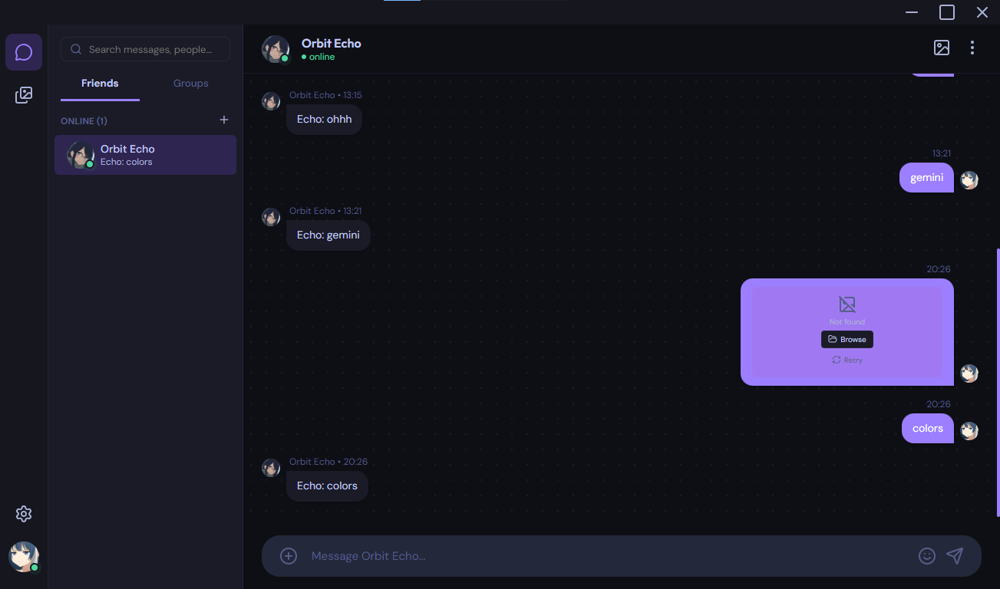

<p align="center">
  
</p>

<h1 align="center">Orbit</h1>

<p align="center">
  Modern chat without mandatory cloud infrastructure.<br>
  Built for local-first communication on your LAN.
</p>

<p align="center">
  Peer-to-peer messaging, files, and images — no central server required.
</p>

<p align="center">
  <strong>Current version:</strong> <a href="CHANGELOG.md#v002-beta-current-version">v0.0.2-beta</a>
</p>

<p align="center">
  
  
  
  
</p>

## Preview

<p align="center">
  <br>
  <em>Dark mode</em>
</p>

<p align="center">
  <br>
  <em>Light mode</em>
</p>

<p align="center">
  
  <br>
  <em>Settings</em>
</p>

<p align="center">
  
  <br>
  <em>Gallery &amp; file sharing</em>
</p>

## Why Orbit?

Orbit exists for people who want **real-time communication without handing their conversations to a cloud vendor**.

Whether you are sharing files at home, coordinating in a small office, or experimenting with local-first software as a developer, Orbit keeps traffic **on your network** — peer-to-peer, discoverable, and under your control.

| Principle | What it means |
|-----------|----------------|
| **Local-first** | Messages and media stay on devices you own, not a remote account you rent. |
| **Peer-to-peer** | Clients talk directly over LAN sockets — no mandatory relay or signup server. |
| **LAN-first** | Auto-discovery finds nearby Orbit clients on the same network. |
| **No cloud lock-in** | No required SaaS backend, no vendor account, no subscription gate. |
| **Open & approachable** | MIT-licensed, readable stack (Electron + SQLite), built for transparency. |

Orbit is a **beta-stage desktop app** aimed at trusted private networks — not a replacement for hardened internet-scale messengers yet, but a serious step toward practical local messaging.

## Features

- **P2P messaging** — Direct socket-based chat on your local network
- **File & image sharing** — Send attachments peer-to-peer (up to **250 MB** in v0.0.2+)
- **Auto-discovery** — Find other Orbit clients on the LAN without manual IP entry
- **Profiles & themes** — Custom display name, avatar, and light/dark UI
- **Persistent storage** *(v0.0.2+)* — Messages and media archived in SQLite (`better-sqlite3`)
- **Privacy mode** *(v0.0.2+)* — Optional session-only attachment storage *(known issues — see [Known Limitations](#known-limitations))*
- **Integrity checks** *(v0.0.2+)* — SHA-256 validation on file transfers
- **Gallery** — Browse shared images with WebP thumbnails for fast scrolling
- **System tray** — Minimize to tray instead of quitting

See [CHANGELOG.md](CHANGELOG.md) for the full version history.

## Quick Start

### Download (recommended)

Pre-built Windows installers are published on [GitHub Releases](https://github.com/D4niel-dev/Orbit-beta/releases).

| Release | Notes |
|---------|--------|
| [Latest](https://github.com/D4niel-dev/Orbit-beta/releases/latest) | Most recent build |
| [v0.0.2-beta](https://github.com/D4niel-dev/Orbit-beta/releases/tag/v0.0.2-beta) | SQLite storage, privacy mode, large file transfers |
| [v0.0.1-beta](https://github.com/D4niel-dev/Orbit-beta/releases/tag/v0.0.1-beta) | Original release |

> Windows may show SmartScreen for unsigned builds. Choose **More info → Run anyway** if you trust the source.

### Run from source

**Requirements:** [Node.js](https://nodejs.org/) 18+ (LTS recommended), npm, Windows for production builds (macOS/Linux packaging planned).

```bash
git clone https://github.com/D4niel-dev/Orbit-beta.git
cd Orbit-beta-main
npm install  # Installs the app modules
npm start    # Start the app (might take a few seconds)
```

Peers on the same LAN are discovered automatically. Open Orbit on another machine to start chatting.

## Tech Stack

| Layer | Technology |
|-------|------------|
| Desktop shell | [Electron](https://www.electronjs.org/) 32 |
| Runtime | [Node.js](https://nodejs.org/) |
| UI | HTML, CSS, JavaScript |
| Storage | [better-sqlite3](https://github.com/WiseLibs/better-sqlite3) |
| Networking | Raw TCP P2P sockets, LAN multicast discovery |
| Media | [sharp](https://sharp.pixelplumbing.com/) (WebP thumbnails) |
| Packaging | [electron-builder](https://www.electron.build/) (Windows NSIS) |
| Mobile *(experimental)* | [Capacitor](https://capacitorjs.com/) Android shell |

## How it works

Orbit follows the standard Electron process model with strict context isolation:

| Layer | Role |
|-------|------|
| **Main process** (`main.js`) | Owns network discovery, TCP sockets, chunked file transfers, SQLite persistence, system tray, and custom protocol handlers. |
| **Preload** (`preload.js`) | Exposes a minimal, typed IPC surface to the renderer via `contextBridge` — no direct Node access in the UI. |
| **Renderer** (`src/`) | HTML/CSS/JS chat interface; all privileged work is delegated to the main process. |

Security defaults: `nodeIntegration: false`, `contextIsolation: true`.

```
Orbit-beta/
├── main.js                 # Electron main process
├── preload.js              # Context-isolated IPC bridge
├── electron-builder.yml    # Windows/macOS/Linux packaging
├── src/
│   ├── index.html          # App shell
│   ├── js/                 # UI, network, database
│   ├── styles/             # Themes and layout
│   └── icons/              # App icons & screenshots
├── android/                # Capacitor Android shell (experimental)
└── CHANGELOG.md
```

### Custom protocols

Orbit serves local resources through privileged custom schemes instead of exposing raw filesystem paths to the renderer:

| Protocol | Purpose |
|----------|---------|
| `orbit-db://` | Serves attachment BLOBs and thumbnails from SQLite through the main process — stable URLs that survive app restarts. |
| `orbit-file://` | Serves ephemeral files (e.g. privacy-mode temp storage or in-flight transfers) without granting the UI direct disk access. |

This keeps the renderer sandboxed while still allowing rich media in chat and the gallery sidebar.

## Configuration

Orbit stores settings and the database under your OS user data directory (Electron `userData`). There is no `.env` required for normal use.

Notable settings (in-app **Settings**):

| Setting | Description |
|---------|-------------|
| **Attachment storage** | Persistent (default) or privacy mode (temp files cleared on exit) |
| **Clear saved attachments** | Remove attachment BLOBs from the database |
| **Theme / profile** | Display name, avatar, light or dark theme |

## Security

Orbit is designed for **trusted private networks** — home LANs, lab environments, or small teams on the same subnet.

- **Not for public internet exposure** — There is no hardened perimeter model for routing Orbit across the open internet yet. Do not port-forward or expose Orbit directly to untrusted networks.
- **No end-to-end encryption** — Messages and files traverse the LAN in plaintext at the application layer today. Treat the network as part of your trust boundary.
- **Evolving hardening** — Context isolation, protocol handlers, and transfer checksums are in place; broader security work (E2EE, authentication, threat modeling) is ongoing.

Use Orbit where you would trust other devices on the same network.

## Known Limitations

Transparency matters in beta. Current constraints include:

| Limitation | Details |
|------------|---------|
| **Windows-first** | Production builds target Windows today. macOS and Linux builds are planned but not yet validated. |
| **LAN-focused** | Peers must be reachable on the local network. NAT traversal is not implemented. |
| **Unstable Wi-Fi** | Large transfers and discovery can degrade on flaky wireless links. |
| **No E2EE** | End-to-end encryption is not implemented. |
| **Privacy mode bugs** | Privacy mode is intended to store sent/received attachments in a `temp/` folder and purge them on exit, but images and files may fail to load reliably in this mode today. |
| **Group chat UI only** | Group creation exists in the sidebar, but multi-peer group messaging is not functional until **v0.0.3-beta**. |
| **Mobile experimental** | The Capacitor Android shell is early-stage and not a supported release target yet. |
| **Unsigned builds** | Installers are not code-signed; Windows SmartScreen warnings are expected. |

## Roadmap

### Planned

- **v0.0.3-beta — Group chat** — Functional multi-peer group messaging
- **Privacy mode fix** — Reliable temp storage and attachment loading in privacy mode
- **Message reactions**
- **Drag-and-drop uploads**
- **Resumable file transfers**
- **Markdown message formatting**
- **Media compression improvements**
- **Voice messages**
- **macOS / Linux build validation**

### Experimental

- **WebRTC fallback** — Partial connectivity path for difficult network conditions; not production-ready
- **End-to-end encryption (E2EE)**
- **Capacitor Android client**
- **WebRTC-based NAT traversal**

> Roadmap items are intentions, not commitments. See [GitHub Issues](https://github.com/D4niel-dev/Orbit-beta/issues) for tracking and discussion.

## Development

| Command | Description |
|---------|-------------|
| `npm start` | Launch Electron in development |
| `npm run build:win` | Build Windows installer (output in `dist/`) |

Build configuration lives in [electron-builder.yml](electron-builder.yml). Built artifacts (`dist/`, `release/`) are gitignored — attach them to [GitHub Releases](https://github.com/D4niel-dev/Orbit-beta/releases) instead of committing binaries.

### Building for Windows

```bash
npm install
npm run build:win
```

The NSIS installer and `.exe` are written to `dist/`.

## Contributing

1. Fork the repository
2. Create a feature branch (`git checkout -b feature/my-change`)
3. Commit your changes and open a pull request

Bug reports and feature ideas are welcome via [GitHub Issues](https://github.com/D4niel-dev/Orbit-beta/issues).

## License

[MIT](LICENSE) — Copyright (c) 2026 [D4niel-dev](https://github.com/D4niel-dev) & Orbit Team. See [LICENSE](LICENSE) for the full text.

---

<p align="center">
  <strong>Orbit Team</strong> · Lead developer <a href="https://github.com/D4niel-dev">D4niel-dev</a><br>
  P2P chat without the cloud
</p>
