<p align="center">
  
</p>

<h1 align="center">Orbit</h1>

<p align="center">
  Modern chat without mandatory cloud infrastructure.<br>
  Built for local-first communication on your LAN.
</p>

<p align="center">
  Peer-to-peer messaging, files, and images — no central server required.
</p>

<p align="center">
  <strong>Current version:</strong> <a href="CHANGELOG.md#v052-beta">v0.5.2-beta</a>
</p>

<p align="center">
  
  
  
  
</p>

## Release Status

|Channel|Version|Status|
|-|-|-|
|**Latest**|v0.5.2-beta|Security \& platform release — cross-platform E2EE, QR pairing v2, update notifications|
|Previous|v0.5.1-beta|Bugfix release|
|**Stable**|v0.5.0-beta|Stable release|
|Earlier **Stable**|v0.4.0-beta|Stable release|
|Legacy **Stable**|v0.1.1-beta|Legacy stable release|

See [CHANGELOG.md](CHANGELOG.md) for detailed release notes.

## Windows Preview

<p align="center">
  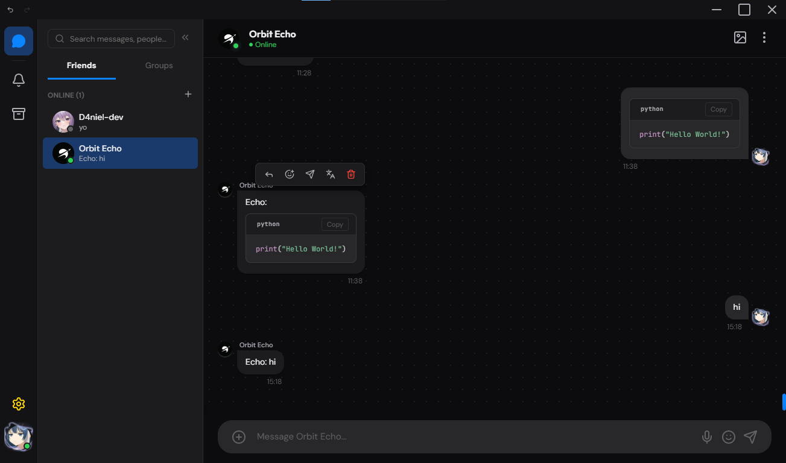<br>
  <em>Dark mode</em>
</p>

<p align="center">
  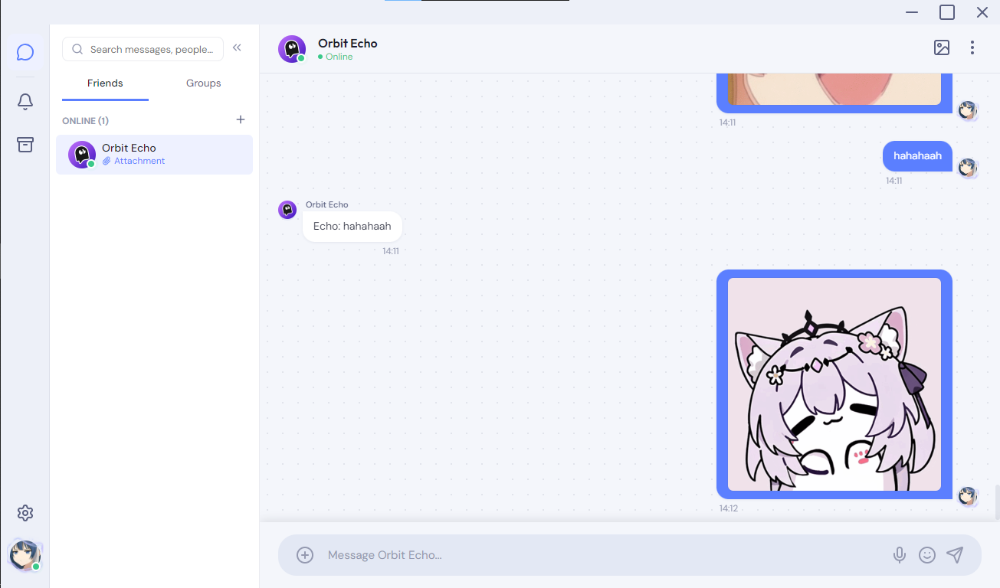<br>
  <em>Light mode</em>
</p>

<p align="center">
  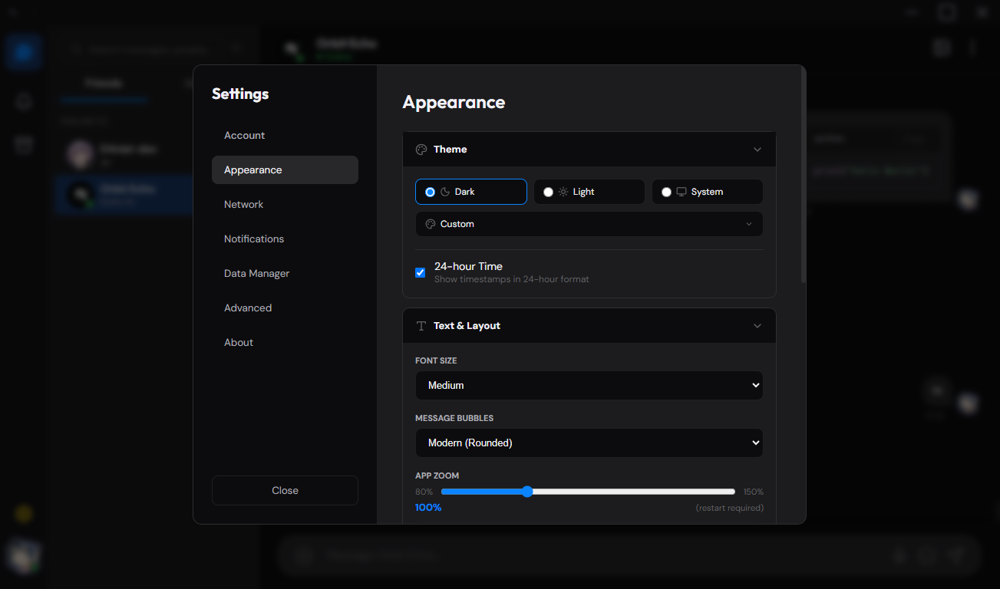
  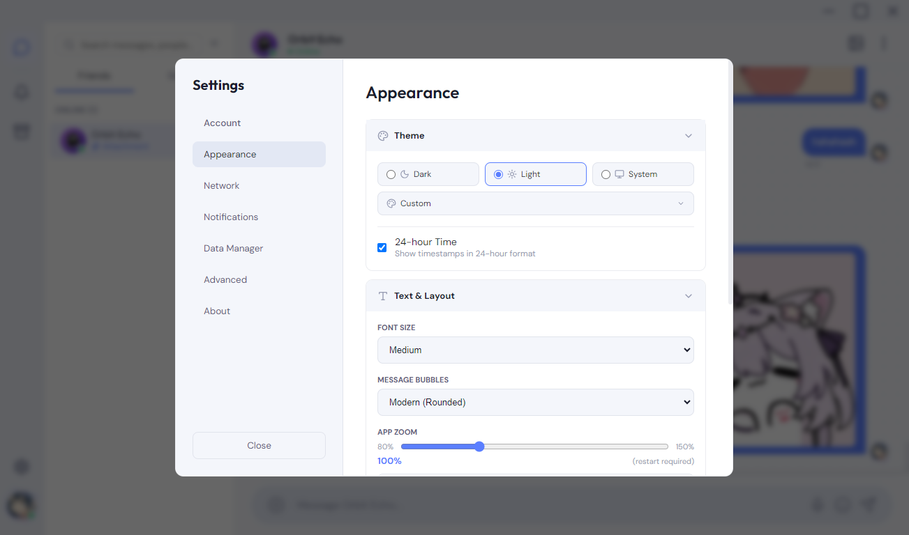<br>
  <em>Settings</em>
</p>

<p align="center">
  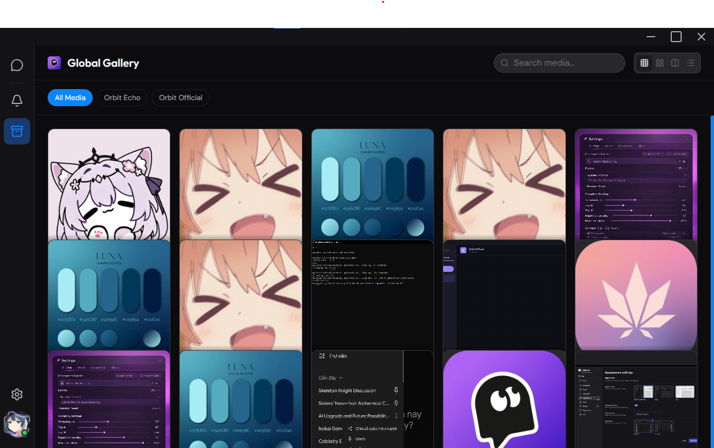
  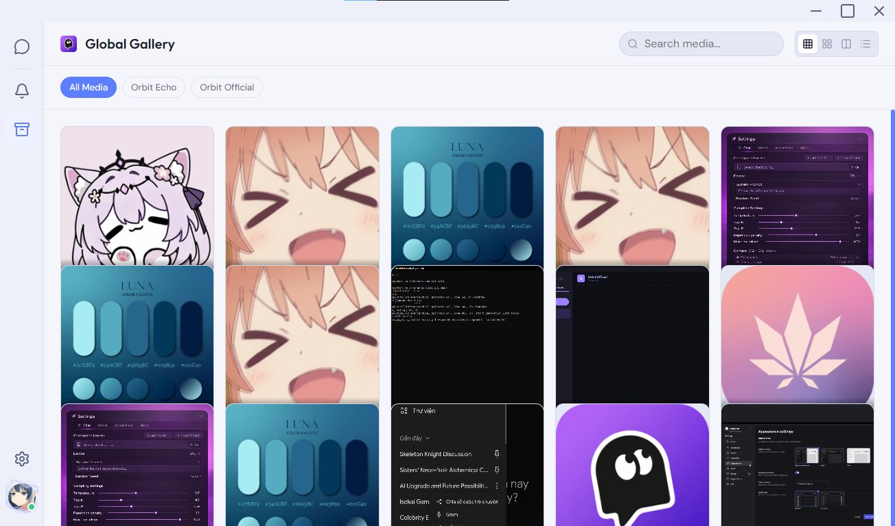<br>
  <em>Gallery \\\&amp; file sharing</em>
</p>

<p align="center">
  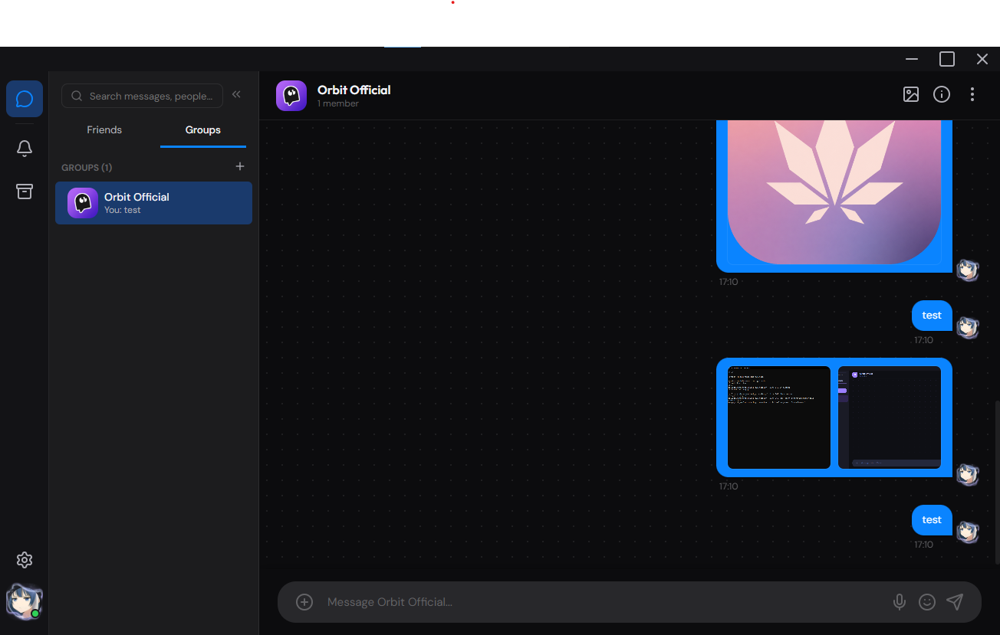
  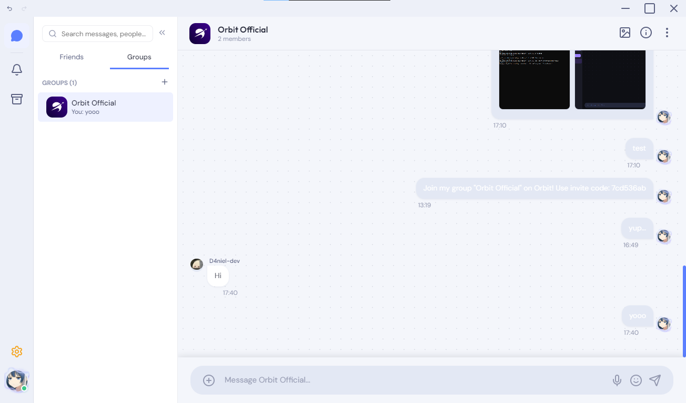<br>
  <em>Group chat</em>
</p>

## Mobile Preview

<p align="center">
  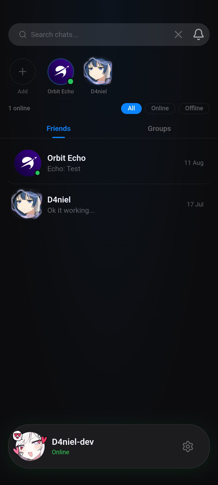
  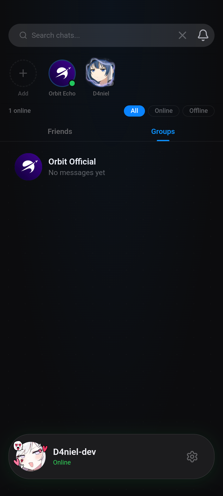
  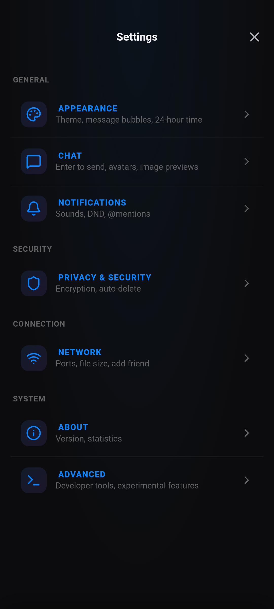
  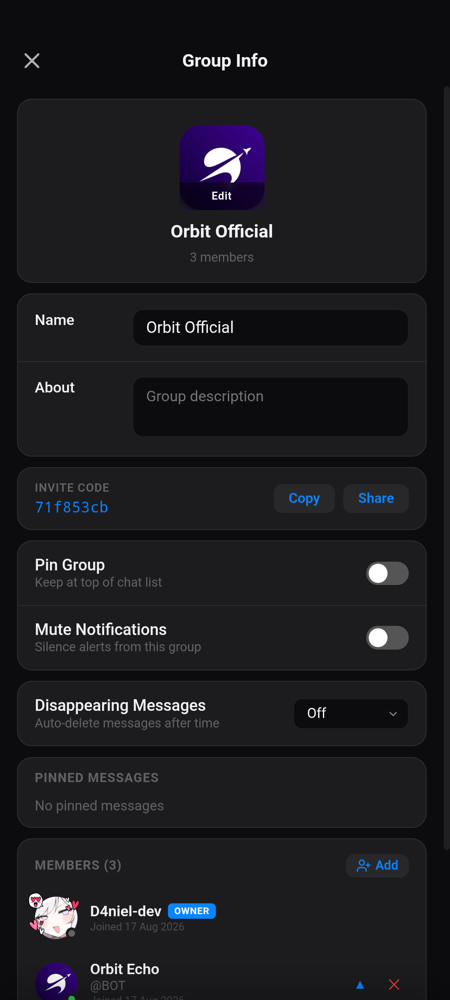<br>
  <em>Android app — chat, friends, settings, group info</em>
</p>

## Why Orbit?

Orbit exists for people who want **real-time communication without handing their conversations to a cloud vendor**.

Whether you are sharing files at home, coordinating in a small office, or experimenting with local-first software as a developer, Orbit keeps traffic **on your network** — peer-to-peer, discoverable, and under your control.

|Principle|What it means|
|-|-|
|**Local-first**|Messages and media stay on devices you own, not a remote account you rent.|
|**Peer-to-peer**|Clients talk directly over LAN sockets — no mandatory relay or signup server.|
|**LAN-first**|Auto-discovery finds nearby Orbit clients on the same network.|
|**No cloud lock-in**|No required SaaS backend, no vendor account, no subscription gate.|
|**Open \& approachable**|MIT-licensed, readable stack (Electron + SQLite), built for transparency.|

Orbit is a **beta-stage app for desktop and Android** aimed at trusted private networks — not a replacement for hardened internet-scale messengers yet, but a serious step toward practical local messaging.

## Highlights (v0.5.2-beta)

* **Cross-Platform E2EE** — Desktop now speaks the same encryption scheme as Android, so encrypted DMs work in both directions. Key encoding (SPKI), derivation (HKDF-SHA256) and envelope layout are unified; the peer's advertised key format is the capability signal, so mixed-version networks still work and old builds fall back to the legacy path. Retires the "E2EE key derivation incompatible" limitation that had been on the roadmap since v0.5.0.
* **QR Pairing v2** — A QR code is now a portable beacon: identity, every LAN address, the TCP port and the public key, validated as untrusted input (RFC1918/link-local addresses only, size, port and key-format checks, self-connect rejected). Desktop gains an image scanner (paste, drag-drop or pick a file); Android's camera scanner now produces and consumes the same payload.
* **In-App Update Notifications** — Orbit tells you when a newer version exists, shows what changed, and hands you the correct installer or APK in one click. Throttled to once per 6 hours, skippable per version, and switchable off entirely in Settings → About.
* **Silent E2EE Downgrade Eliminated** — Four code paths could previously send a message as plaintext while the UI still showed encryption as on, including one that left a message visible in the chat that was never actually sent. All four now block and explain instead.
* **Tabbed Add-a-Friend Modal (Desktop)** — Switch between entering an IP address and pairing by QR code, with the scanner inline.
* **Packaging Fix: `shared/` Was Never Shipped** — Every desktop installer to date was missing the shared modules, so the audio player, video player and image cropper 404'd in packaged builds. Fixed.
* **Crash and Robustness Fixes** — Local Vault no longer OOM-kills the Android renderer on large exports, mobile bottom sheets no longer open behind the soft keyboard, the chat header stops going stale on presence changes, and the image cropper now exports exactly what it previewed.

## Version History

<details>
<summary>v0.0.1-beta</summary>

* **P2P messaging** — Direct socket-based chat on your local network
* **File \& image sharing** — Send attachments peer-to-peer (configurable limit, default **500 MB**)
* **Auto-discovery** — Find other Orbit clients on the LAN without manual IP entry
* **Profiles \& themes** — Custom display name, avatar, light/dark/system UI
* **Gallery** — Browse shared images with WebP thumbnails for fast scrolling
* **System tray** — Minimize to tray instead of quitting

</details>
<details>
<summary>v0.0.2-beta</summary>

* **Persistent storage** — Messages and media archived in SQLite (`better-sqlite3`)
* **Privacy mode** — Optional session-only attachment storage
* **Integrity checks** — SHA-256 validation on file transfers

</details>
<details>
<summary>v0.0.3-beta</summary>

* **Group chat** — Multi-peer group messaging with member management, roles (Owner/Admin/Member), avatars, and invite codes
* **Message reactions** — Emoji reactions on messages
* **Markdown formatting** — Rich message formatting with headings, lists, code blocks, and more
* **Drag-and-drop uploads** — Drop files and images directly into the chat panel
* **Notification sounds** — Web Audio notification chime with per-user mute settings
* **Profile sidebar** — Click any avatar to view a detailed profile panel

</details>
<details>
<summary>v0.0.4-beta</summary>

* See [CHANGELOG.md](https://github.com/D4niel-dev/Orbit-beta/blob/main/CHANGELOG.md#v004-beta), section 4.

</details>
<details>
<summary>v0.0.5-beta (Stable)</summary>

* **End-to-end encryption** — ECDH key exchange + AES-256-GCM message encryption for DMs. Toggle in Settings → Data Manager.
* **Backup \& Restore** — Export/import full database as .orzip or .zip archives
* **Unread Badges \& Read Receipts** — Per-chat unread counts, @mention badges, and read indicators
* **Activity Center** — Unified view of recent messages across all chats
* **Customizable Sidebar** — Show/hide Activity Center, Gallery, and Storage buttons in the left sidebar

</details>
<details>
<summary>v0.0.6-beta</summary>

* **Custom Themes** — True Dark, Dark Purple, Midnight, Sunset, Nord, Seasonal auto-rotating themes
* **Custom Colors** — Live preview color editor for all UI categories
* **Profile Frames** *(experimental)* — 12 decorative frame overlays on avatars
* **Animated Avatars** *(experimental)* — Subtle pulse animation on avatars
* **Message Translate** *(experimental)* — Translate messages via MyMemory API
* **Compact Spacing** *(experimental)* — Tighter message layout option
* **App Zoom** — Zoom slider with preview and restart notification
* **Chat Settings** — Enter to Send, Show Avatars, Image Preview toggles

</details>
<details>
<summary>v0.0.7-beta</summary>

* **Project restructured** — Desktop and mobile code separated into `desktop/` and `mobile/`
* **Cross-platform abstraction** — `shared/` modules for database, network, protocol, crypto
* **Privacy mode fixed** — Thumbnails now generated, gallery sidebar works, backup/restore preserves temp files
* **Android build pipeline** — GitHub Actions builds `.apk` via Capacitor alongside desktop builds
* **Mobile UI shell** — Touch-friendly layout with bottom navigation bar

</details>
<details>
<summary>v0.0.8-beta</summary>

* **Rich Link Previews** — Open Graph metadata (title, description, image) fetched via Electron IPC; styled cards with left accent bar, hover/active link colors
* **Message Link Styling** — URLs in chat text now clickable with hover (dark blue) and active (green) states on both desktop and mobile
* **Cross-platform P2P** — Desktop ↔ Android LAN discovery and messaging via TCP/UDP
* **QR Code Fixes** — Both desktop and mobile QR generation fixed; mobile QR moved to Add Friend modal
* **Mobile Settings Wired** — All toggles now have real behavior (time format, avatars, images, notifications, debug tools, file size, auto-delete, experimental features)
* **Mobile Toast Overhaul** — Type-based accent bar, icons, slide-in animation, progress bar
* **Mobile Notification Sound** — Web Audio beep on incoming messages
* **Desktop Settings Tabs** — Notifications (volume/sound/test), Network (collapsibles), About (version info)
* **Chat Background Patterns** — Diagonal Stripes, Crosshatch, Circles
* **Desktop Bug Fixes** — MIME mapping, cache headers, media retry, attachment URLs

</details>
<details>
<summary>v0.0.9-beta</summary>

* **Android P2P Stability** — 8 Java plugin fixes (multicast lock, beacon gating, TCP buffer, connection tracking) + 4 JS bridge fixes for reliable Android discovery and messaging
* **Desktop P2P Stability** — 9 fixes including per-connection write queue, oversized frame guard, socket error handlers, self-beacon IP filter, transfer backpressure, and clean restart support
* **Mobile Group Info Panel** — Full panel: edit group name/description, change avatar, invite code with Copy/Share, pin/mute toggles, member list with roles (Owner/Admin) + join dates, promote/demote/remove members, leave/delete group
* **Cross-Platform Group Sync** — Group creation (GROUP\_CREATE) and leave (GROUP\_LEAVE) broadcast compatible between mobile and desktop
* **Pinned Messages** — Pin/unpin in message action bar; pinned messages section in group info; cross-platform sync via PIN\_MESSAGE/UNPIN\_MESSAGE protocol
* **Message Search** — Search bar filters messages in real-time on mobile chat header
* **Enhanced Message FX** — Particle confetti system on sent messages (both platforms); safe CSS for Android WebView compatibility
* **Mobile Settings Added** — Font Size (Small/Medium/Large), Message Animation (Slide/Fade), Auto-Reconnect toggle, Connection Timeout (5/10/30/60s)
* **Mobile DB Fix** — Critical fix: migration now runs after user data loads to prevent identity corruption on restart
* **Add Friend on Android** — No more "P2P Preview" gating; `android:usesCleartextTraffic` flag; plugin retry mechanism for reliable friend addition

</details>
<details>
<summary>v0.0.9.2-beta</summary>

* **Mobile initP2P Logging** — Detailed debug logs throughout P2P initialization and lifecycle
* **Dev Mode DevTools** — Toggling Developer Mode loads eruda on-device inspector panel
* **Debug Log Buffer** — Scrollable log overlay when dev mode is active

</details>
<details>
<summary>v0.0.9.3-beta</summary>

* **Group Info Panel Overhaul** — Redesigned with Add Member (friend picker), Leave Group, Transfer Ownership, member search bar, created date, online/total count
* **GROUP\_MEMBER\_ADDED / GROUP\_OWNER\_TRANSFER** — New protocol types with cross-platform handlers
* **DM Context Menus** — Desktop right-click and mobile long-press: Pin/Unpin, Mute, View Profile, Copy ID, Close DM
* **Pinned DMs** — Pinned state sorted first in sidebar with pin icon
* **Close DM Removes Friend** — Full cleanup from DB; persists closedDMs; auto-reopens on new message
* **P2P Diagnostics Panel** — Modal with P2P status, discovery, connected peers, log buffer
* **Global Gallery Type Filters** — All/Images/Files toggle; non-image files render with Lucide icons
* **Gallery Sidebar Files Tab Fix** — Format.bytes→fileSize; download button replaces window.open
* **Create Group Modal Avatars** — Friend list shows actual avatars with profile frames
* **Context Menu \& P2P Fixes** — data-action rewrite, protocol type audit, TCP merge IP strip

</details>
<details>
<summary>v0.1.0-beta</summary>

* **Performance: Up to 5× Faster Startup \& Rendering** — Selective store subscriptions, setStateBatch microtask coalescing, insertAdjacentHTML, event delegation for all message actions
* **Startup: \~40% Faster (5s → 3s)** — Deferred init phases (setTimeout(0) + requestIdleCallback), batched store IPC (7+ calls → 1), lazy message loading (last 50 per chat, load on demand)
* **freezeGifImages** — Canvas cache via \_frozenCache Map; expanded selectors; global call on Reduce Motion toggle
* **Data Manager "Load All Stored Data"** — Double-confirmation button loads all messages from DB into memory on demand
* **Bug Fixes** — orbit-db://attachment/ 404, selective subscriber undefined changedState, message avatar click re-attached, loadFullChatMessages dropping existing messages

</details>
<details>
<summary>v0.1.1-beta (Stable)</summary>

* **Voice \& Video Calls (P2P WebRTC)** — Full call system with incoming notification, mute/speaker controls, timer, ICE candidate exchange over P2P network layer
* **Group Calls (Mesh)** — Each participant gets their own RTCPeerConnection; video grid or avatar circles for audio-only; start/join/leave group calls
* **Camera Toggle** — On/off during calls with deterministic HSL avatar placeholder when camera is off
* **Message Forwarding** — Forward messages with attachments to any chat via chat picker modal (desktop + mobile)
* **Block User** — Block/unblock from context menu and profile sidebar; P2P filter drops blocked packets
* **Search Within a Chat** — Scoped search with chatId filter, sender filter, date inputs, context-aware placeholders
* **Export Chat History** — JSON or TXT export with timestamped downloads via Data Manager
* **Save/Load Themes** — Export current theme as JSON; import via file picker in Appearance tab
* **Message Translate Unlocked** — Always-on translate button (no experimental gate), default enabled in Appearance tab
* **Mobile Reply fromName Fix** — fromName now set on ALL outgoing MESSAGE packets for cross-platform reply consistency
* **Lucide Icon Null Fix** — All querySelector('i') changed to querySelector('svg') after createIcons replaces i tags with svg
* **Online Status Improvements** — lastSeen on BEACON; 30s interval checks for stale connections (120s timeout)
* **Inline Code Blocks** — CSS styling for code and pre elements (both platforms)
* **Call Modal UI Polish** — Proper centering, audio wave bars, hover button effects, local video as full grid tile in groups

</details>
<details>
<summary>v0.1.2-beta</summary>

* **Manual Connect Bug Fixed** — Manual "Add a Friend" IP connect now correctly remaps the TCP socket to the peer's real userId; messages reuse the existing connection instead of creating a new one
* **Protocol Type Unification** — All 47 protocol types unified between `shared/` and `desktop/` protocol.js; cross-platform call, file transfer, and group compatibility guaranteed
* **Build Pipeline Overhaul** — Android `assembleRelease` replaces `assembleDebug`; `SHA256SUMS.txt` per platform; artifact verification fails on missing builds; build metadata (version, commit, date) and asset size table auto-injected into release notes

</details>
<details>
<summary>v0.1.3-beta</summary>

* **Performance Mode** — New Experimental toggle with two-step confirmation; kills all animations/transitions, freezes GIFs, skips link preview OG fetch, slows offline check to 60s, stops connection stats and dev overlay polling
* **Image Viewer Fix** — Clicking image thumbnails now reliably opens viewer after restart; hit-test fallback for DOM recreated mid-click; removed `'friends'` from store subscription to stop re-renders on friend status beacons
* **Forced Reflow Cascade Eliminated** — ResizeObserver disconnected before `innerHTML` in `renderChat`, reconnected after all DOM changes; throttled to 1s to prevent cascade from async image loads
* **Native Android Notifications** — Messages show as real system notifications when app is backgrounded via `@capacitor/local-notifications`
* **Desktop Notification Avatars** — Sender/group avatar shown as notification icon (previously static Orbit icon)
* **Connection Stats Panel** — Live P2P status overlay with peer count, uptime, sent/received counters
* **Video File Support** — Upload, render, and view video files in chat with play overlay and full-screen preview modal
* **Video Compression** — Large videos (>5MB) auto-compressed to 720p/500kbps before sending
* **P2P Discovery Optimized** — Beacon interval 5s→10s, stale threshold 120s→180s, exponential chunk retry backoff
* **image-viewer.js Null-Safety** — `openFromMessage` checks null store/messages with fallback; `close()` and `openVideo()` wrapped in try/catch; `init()` uses `readyState` guard
* **Compact Spacing \& Swipe-to-Reply** — Moved from Experimental to general chat settings

</details>
<details>
<summary>v0.1.4-beta</summary>

* **P2P Auto-Connection Stabilization** — PING/PONG keep-alive heartbeat, 8s connection timeout, exponential backoff reconnect (max 5 attempts), stale peer pruning (180s), network IP change detection, auto-connect duplicate protection
* **Desktop P2P Bugfix Audit (17 fixes)** — Socket 8s timeout disabled after connect, write-queue key collision fixed, reconnect .catch() + counter reset, GROUP\_CREATE publicKey enrichment, GROUP\_JOIN\_REQUEST fields, PIN/UNPIN/SYSTEM routing
* **Translation Engine Rewrite** — In-memory cache, request dedup, AbortController, inline retry link
* **Image Viewer Overhaul** — Quick-save button (File System Access API), keyboard navigation, swipe, download fix for custom protocol URLs, loading placeholder CSS
* **Voice Messages Stabilization** — Content-Type fix, onerror auto-retry, chunked transfer detection with MIME mapping
* **Performance Mode** — Two-step confirmation, CSS class on `<html>`, runtime guards in chat-panel and app.js
* **Mobile Protocol.js Synced** — 15+ missing types added (46 total, matching desktop)
* **Mobile Settings Parity** — 11 desktop defaults ported; logLevel filters debugLog; tcpPort/udpPort in beacon/P2P; netReconnectInterval in reconnect; netKeepAlive in heartbeat; netBandwidthLimit throttles FILE\_CHUNK
* **Mobile DB Migration Fixed** — Runs before MStore.load(); visible console output; reload safety net
* **Mobile profileFrame Clean-Up** — Helper function defends all 7 render locations; TCP beacon stores 0 correctly
* **Mobile Changelog** — What's New modal in About tab (v0.0.2 through v0.1.4)
* **Desktop group sync fixes** — GROUP\_OWNER\_TRANSFER, GROUP\_LEAVE cleanup, GROUP\_INVITE init
* **Desktop reconnect settings bridge** — preload forwards reconnectEnabled/reconnectIntervalMs to main process

</details>
<details>
<summary>v0.1.5-beta</summary>

* **Account Switcher (Experimental):** Right-click avatar → panel to add/switch/logout accounts. Logout quits app (accounts persist in DB). Last active user auto-loaded on launch. Gated behind Experimental Features toggle in Advanced settings.
* **PIN Lock Screen (2FA Experimental):** 4-8 digit numeric PIN with SHA-256 hashing (Node `crypto` on main process). Numpad UI, 5-attempt cooldown (30s), "Forgot PIN" reset (data intact). Only prompted on app launch (never on resume/sleep). Gated behind Experimental Features.
* **Settings Security Tab:** PIN setup, change, disable flows. Full modal re-render when Experimental Features toggled to show/hide tab.
* **Orbit Echo Welcome Sequence:** 4 welcome messages with 5-8s typing indicator delays. Fires only when echo chat is empty. Echo excepted from all offline checks.
* **Group Avatar Backfill:** Async fetch of `orbit-avatar://` for groups with `avatarPath` but no `avatarDataUrl` on store init + group info open. Non-blocking, errors silently caught.
* **SidebarLeft.renderAvatar crash before init:** Added `if (!this.container) return;` guard to prevent TypeError when called before `SidebarLeft.init()`.
* **Store.js syntax error:** Removed trailing commas between class methods that caused "Unexpected token ','".
* **`window.ChatPanel.showChat is not a function`:** Removed premature `ChatPanel.showChat()` call from `reloadDataForCurrentUser()`.
* **`require('crypto')` in renderer:** Changed to `window.crypto` for invite code generation.
* **Migration v11 robustness:** Column-existence checks before `ALTER TABLE`. Guard in `migrations.run()` handles non-transactional `user\\\_version` — if version ≥ 11 but columns missing, resets to 10 and re-runs.
* **Identity System:** `Identity.init()` loads from multi-user DB. `getAll()` returns all saved users. `switchTo(userId)` swaps identity and updates last active tracking. `saveUser` stores `profileFrame` with `!= null` guard.
* **Database Schema:** v10: `ALTER TABLE users ADD COLUMN profileFrame INTEGER DEFAULT 0`. v11: `accountOwnerId TEXT` on friends, groups, group\_members tables.
* **Network Restart:** Account switch calls `networkStop` (nullifies all instances) → `Identity.switchTo()` → `networkStart` (re-creates with new identity). All TCP connections drop and re-establish.
* **Migration Rollback Guard:** `db.pragma('user\\\_version')` is non-transactional. Added column-existence check at start of `migrations.run()` to detect partial migration state and recover.

</details>
<details>
<summary>v0.1.6-beta</summary>

* **Android Foreground Service (Background Execution):** P2P networking extracted into persistent Foreground Service with notification, WakeLock, START\_STICKY. BootReceiver restarts on device boot. Service survives Activity/WebView destruction.
* **P2P Connectivity Fixes:** Desktop auto-connect port fixed (was hardcoded 46000); reconnect now uses per-peer stored TCP port; mobile disconnect handler fixed (connectionId→friend lookup); mobile beacon handlers store tcpPort/connectionId/ip; mobile auto-reconnect uses peer's port.
* **Message Editing \& Reactions:** Desktop edit broadcast loop eliminated; mobile edits broadcast over P2P to DMs and groups; mobile reaction UI (6 emojis, toggle, P2P broadcast).
* **OrbitForegroundService:** Full P2P engine (TCP server, UDP multicast, connection map, thread pool) as Android Service. Plugin proxies via Binder. Event queue drained every 100ms.
* **Silent Bug Fixes:** 7 fixes from service audit — sendFailed/connectFailed events, serverSocket volatile, PeerConnection map leak, executor shutdown, eventQueue clear, SO\_REUSEADDR, Android 10+ joinGroup fix.

</details>
<details>
<summary>v0.1.7-beta</summary>

* **fMP4 Video Playback Fixed:** PIPELINE\_ERROR\_DECODE root cause fixed — Content-Type serving in main.js now correctly serves video files. Videos play continuously.
* **Re-render Guard:** Message re-renders blocked during video playback (except chat switches). Prevents player destruction from innerHTML re-renders.
* **Decode Error Retry:** On audio packet decode failure, source reloads and skips forward +2s (up to 3 attempts).
* **Larger Media Players:** Video 720×600, audio waveform 200px — rendered outside image grid as standalone blocks at full width.
* **Fullscreen Theme Blend:** Letterbox uses `var(--bg-surface)` — matches active UI theme.

</details>
<details>
<summary>v0.1.8-beta</summary>

* **Store Class Ported to Mobile:** Inline MStore (\~350 lines) extracted into dedicated `store.js` (760 lines) — full Store class with backward-compatible property-based access (532+ references) plus desktop-style getState()/setState()/subscribe().
* **Desktop Parity Features:** subscribe/notify, blockUser/unblockUser, pinMessage/unpinMessage, markAsRead, toggleMute, group management (addGroup/removeGroup/addMemberToGroup), DM management (closeDM/togglePinDM/reopenDM), E2EE key storage, transfer tracking, addOrUpdatePeer.
* **Bug Fixes:** addMessage() unread tracking fixed (counted every message as unread — removed); mutedChats aliased to settings.mutedChats for mobile read path; setState() now handles currentUser key.
* **CSP \& Prism.js Fixes:** Desktop CSP updated for Prism.js (cdnjs.cloudflare.com); Prism loaded before app.js on both platforms; language-\* class on pre elements for immediate syntax highlighting.

</details>
<details>
<summary>v0.1.8.1-beta</summary>

* **Media Persistence Fixed:** Received files (images, audio, video) no longer lost after app restart. \_dataUrl stored alongside blob URL for recovery; incoming MESSAGE attachments preserve \_dataUrl.
* **renderMessages No Longer Corrupts Store:** data:→blob URL conversion no longer mutates MStore.messages in-place — eliminates silent data loss from subsequent saves (reactions, edits, deletes).
* **.webm Misclassification Fixed:** Removed .webm from audioMatch regex — .webm videos no longer misclassified as audio. Video checked before audio in type detection.
* **Desktop isVideo Added:** Desktop file-received handler now classifies incoming videos as type 'video' with correct MIME instead of 'file' / application/octet-stream.
* **Mobile Video Aspect Ratio Fixed:** .ovp-video now has object-fit: contain, max-height: 50vh (was 300px), and #000 letterbox background — videos scale correctly to any aspect ratio.

</details>
<details>
<summary>v0.1.9-beta</summary>

* **CRITICAL: Mobile base64 Decode Corruption Fixed** — atob() on Android WebView corrupts bytes >127 — all 7 binary decode sites replaced with safe manual decoder.
* **CRITICAL: Desktop→Mobile Chunk Joining Fixed** — desktop btoa()'s each 64KB chunk independently; mobile chunks.join('') produced invalid base64. Per-chunk independent decode + ArrayBuffer concat.
* **CRITICAL: WriteStream Race Fixed** — mobile→desktop truncated files due to async stream.end(). stream.on('finish') wraps completion.
* **CRITICAL: P2P cleanup() Race Fixed** — Android stopService() async race skipped service restart on re-init. Java cleanup is now a no-op.
* **Mobile Video Type Override Fixed** — FILE\_TRANSFER\_END no longer overwrites video/audio type with extension regex.
* **Mobile Video Compression Dropped Audio Fixed** — disabled lossy compression; raw video with audio sent.
* **Group Chat File Routing Fixed** — chatId added to FILE\_TRANSFER\_START/END packets.
* **Mobile Metadata Preload** — muted=true + preload=metadata forces immediate duration display.
* **Unstable AV Transfer Warning Modal** — alert-triangle modal with "Don't show again" checkbox.
* **Auto-Discovery Diagnostic Logging** — \[AutoConnect] logs for firewall debugging.

</details>
<details>
<summary>v0.2.0-beta</summary>

* **CRITICAL: Mobile Background Notifications Fixed** — `document.hidden` unreliable in Capacitor WebView. Fixed: JS tracks background via `appStateChange`; Java plugin creates notifications directly via `NotificationManager`.
* **CRITICAL: Large File Persistence on Mobile** — Files >10MB in IndexedDB lost blob: URLs on restart. Added `BlobStoreDB` + `\\\_restoreAllBlobAttachments()`.
* **Mobile base64 Streaming Optimizations** — All 7 binary decode sites rewritten as single-pass streaming decoders (no intermediate strings).
* **Desktop AV Type Honor Fix** — Desktop honors sender's type classification; .webm audio no longer misrouted to video player.
* **`muted=true` Gated to Mobile Only** — Desktop players no longer start muted.
* **Blob MP4 Duration Parsing** — fetch(blob:) + Uint8Array byte access for duration detection on large blob URLs.

</details>
<details>
<summary>v0.2.1-beta</summary>

* CRITICAL: WriteStream race fixed (mobile→desktop truncated files)
* CRITICAL: Duplicate messages for large files fixed
* File transfer stability improvements

</details>
<details>
<summary>v0.2.2-beta</summary>

* Mobile metadata preload (muted=true forces immediate duration)
* Blob MP4 duration parsing via fetch(blob:)
* Mobile changelog modal

</details>
<details>
<summary>v0.2.3-beta</summary>

* Video player complete overhaul (MP4 duration parsing, multi-layered fallback)
* Audio player matching architecture

</details>
<details>
<summary>v0.2.4-beta</summary>

* Activity Center overhaul with Lucide icons, badges, duration/size
* Transfer UX progress display

</details>
<details>
<summary>v0.2.5-beta</summary>

* 4-layer fullscreen bg fix, manual fullscreen only
* Light mode flashbang prevention, theme transitions + easter egg, midnight sleep reminder
* Full undo/redo system (100-action stack, Ctrl+Z/Y, privacy mode)
* Avatar frame per-account fix, Konami code→dev mode

</details>
<details>
<summary>v0.2.6-beta</summary>

* File persistence investigation: root cause found (P2P chats invisible to \_restoreAllBlobAttachments at startup)
* Player file identity enforced (byte-identical across platforms)

</details>
<details>
<summary>v0.2.7-beta (Stable)</summary>

* Video duration: 4-layer fix (backward moov scan, max return priority, durationchange→knownDuration, dur() max safety net)
* Mobile A/V persistence: all-chat pre-loading, exponential backoff retry, local send path cleanup
* Status circle: PONG/MESSAGE/onPeerFound all update lastSeen properly
* Emoji reactions: packet.from routing fix, data-msg-id on reactions-row
* Overlay controls: touchstart handler, \_touchTap guard
* Code blocks: redesigned with Copy button + language badge
* Chat list: markdown-stripped previews

</details>
<details>
<summary>v0.2.8-beta</summary>

* **Settings Redesign** — Card-based items with Lucide icons, gradient containers, and search filtering across all 7 sections
* **Message Re-Animation Fix** — Granular `data-msg-anim` attribute only on new messages (cross-platform)
* **Auto-Scroll Fix** — Removed `scroll-behavior: smooth` from feed, deferred re-scroll for lazy-loaded media
* **Own Message Bubble Unified** — `var(--bg-surface)` with right-alignment instead of blue accent
* **Message Text Color Fixed** — `var(--text-primary)` on own messages instead of hardcoded `#fff`
* **Settings Search Bar** — Type to filter settings cards by keyword with empty state
* **Version Auto-Detection** — `version.js` generated from `package.json`, About section reads live value
* **Theme CSS Cache-Busting** — `?v=20260721` on all theme `<link>` tags (both platforms)

</details>
<details>
<summary>v0.2.9-beta</summary>

* **Mobile Settings Additions** — App Zoom slider (50–200%) in Appearance, Disable Light Mode Flashbang toggle, flashbang warning dialog on Light theme selection, GitHub Repository and Report an Issue links in About.
* **Desktop Global Gallery Layout Fix** — Scroll wrapper separated from inner layout container for grid/compact/masonry/list display modes — no more layout breaks with >10–20 items.
* **Experimental Card Icon Fixed** — `flask` renamed to `flask-conical` (Lucide v1.17.0 rename) so the icon renders correctly on mobile.
* **Version bumped to v0.2.9-beta** across all manifests. Android web assets synced via `npx cap sync android`.

</details>
<details>
<summary>v0.3.0-beta</summary>

* **Image Cropper (Desktop + Mobile)** — `shared/ui/image-cropper.js` with drag, zoom, rotate, mirror, reset. Avatar circular crop guide with three-level SVG mask. Integrated into desktop settings and mobile profile sheet.
* **Mobile Gallery A/V Playback Fixed** — `data:`→`blob:` URL conversion for native Android WebView playback.
* **Real-Time Profile Card Updates** — Beacon handlers on both platforms refresh profile overlays/cards instantly on friend changes.
* **Android Immersive Mode** — System bars auto-hide on full-screen content (Android 7+).
* **Desktop "Receiving Audio/Video..."** — Transfer progress now shows file-type-specific labels and Lucide icons.
* **Input Box Draft Saving (Both Platforms)** — Chat drafts persisted in `localStorage`, restored on chat switch, cleared on send.
* **Release Signing Infrastructure** — GitHub Actions release workflow, GPG-signed SHA256SUMS.txt, `SECURITY.md`, and release verification documentation.

</details>
<details>
<summary>v0.3.1-beta</summary>

* **Android Immersive Mode Fixed** — Taskbar now hides correctly across all Android versions. Capacitor SystemBars conflict resolved, lifecycle handlers added.
* **Real-Time Profile Card Updates Fixed** — Avatar/banner/bio/frame changes now propagate instantly to peers. BEACON broadcast added to both desktop and mobile save paths.
* **Image Cropper Redesigned** — Premium UI with Lucide icons, checkerboard preview, corner handles, rule-of-thirds grid. Smoother zoom with sub-pixel positioning and finer steps.
* **Mobile Performance** — Faster startup (lazy message loading, early-exit blob check, deferred cropper load).
* **DM Avatar Render Fix** — No more missing avatars during rapid chat switching.
* **Bottom Sheet Cleanup** — Removed safe-area padding (no longer needed with immersive mode).

</details>
<details>
<summary>v0.3.2-beta</summary>

* **Android Crash-on-Launch Fixed** — SplashScreen theme attributes, plugin lifecycle order fix, missing colors.xml created.
* **Profile Card Real-Time Updates (4 bugs fixed)** — Duplicate DOM IDs, cropper preview sync, avatar/banner misassignment, profile pill update wiring.
* **Frame Picker Redesigned (Mobile)** — Compact fixed-position bottom sheet with slideUp animation replaces full-screen backdrop overlay.
* **Frame Preview Fixed** — No longer clipped by circular avatar border. Flexbox-centered inside the 40×40 button.
* **Status Selection (Mobile)** — New dropdown with Online/Away/DND/Offline. Saves and broadcasts BEACON.
* **"Busy" Status Removed** — Cleaned up from both platforms.
* **Desktop Status Icons** — Changed to filled colored circles.
* **Status Text Color Fix** — Profile pill no longer gray on startup. Local `statusColors` map in home-screen.js.
* **Mobile Search Enhanced** — Categorized results (Chats/Friends/Messages), text highlighting, recent searches (max 5), empty-state prompt on focus.
* **Search CSS** — New `.search-results-\\\*` and `.recent-search-\\\*` styles in mobile.css.
* **Mobile Gallery Bug Fixes (7 bugs)** — Null guards on gallery button/close bindings; null checks in show/hide gallery; blob URL memory leak fixed (video/audio now revoked properly); filter index mismatch fixed; date-group visual order mismatch fixed (clicking media now opens correct item regardless of date sorting); missing scaleIn animation defined; lightbox close button respects safe-area-top.

</details>
<details>
<summary>v0.4.0-beta (Stable)</summary>

* **Message Long-Press Menu Fixed** — Press-and-hold on message bubbles opens the reactions + actions sheet again (wired into the live chat render path).
* **Message Effects Graduated** — Moved from Experimental to Chat settings with one-time migration.
* **Profile Frames Graduated** — Moved from Experimental to stable settings (Appearance on mobile, Account on desktop); on by default.
* **Profile Frame Leak Fixed** — 4 renderers gated so frames never appear when the setting is off.
* **Folders Gated Behind Experimental** — New `experimentalFolders` toggle (off by default); folder tab icons removed for clean text-only tabs.
* **Experimental Toggle Audit** — Value-based selectors fix Avatars/Frames/Perf Mode off-states; Compact Spacing attribute selector restored; FPS Monitor \& Dev Overlay resume on reload.
* **Profile Frame Icon Removed (Desktop)** — Account settings header shows title only.

</details>
<details>
<summary>v0.4.1-beta</summary>

* **Friend / Peer Avatars Not Loading Fixed** — UDP beacon now sends a 128×128 JPEG thumbnail and the Android receive buffer grew to 64KB, so discovery no longer truncates avatars.
* **Other-User Avatar in DM Tab Fixed** — DM records seed `avatar` on creation and sync it from the friend record when beacons arrive.
* **Orbit Echo Bot Avatar Restored** — Avatar sanitizer now allows relative app-asset paths while still blocking scheme-based vectors.
* **Image Compression Transparency + Hang Fixed** — JPEG compression fills a white background (no more black PNG avatars) and falls back gracefully on encode failure.
* **Stored XSS Paths Escaped** — All peer-controlled values rendered into HTML (avatars, previews, members, mentions, toasts) are escaped.

</details>
<details>
<summary>v0.4.2-beta</summary>

* **Chat Folders (Desktop, Experimental)** — New Folders rail in the sidebar: create/rename/delete folders, add/remove chats via context menu, dedicated folder view with an "Add Chats" picker. Per-device persistence (no sync yet).
* **Folder Tabs Polish (Mobile)** — Uniform tab width, centered Friends/Groups/folder trio with one folder, scrollable sub-rail with several; active-tab underline centered.
* **Delete Folder Crash Fixed (Desktop)** — Notification isolation, confirm-dialog close hardening, and safe reply-quote sender resolution eliminate the crash.
* **Sidebar Rail Buttons Fixed (Desktop)** — Folders/DMs/Settings/Profile buttons re-attach after settings re-renders.
* **Folder Picker Fixed (Desktop)** — Outside-click dismisses; interior clicks no longer navigate into the folder.

</details>
<details>
<summary>v0.5.0-beta (Stable)</summary>

* **Resumable File Transfers (Desktop)** — `FILE\\\_TRANSFER\\\_RESUME` protocol resumes partial chunked transfers from the last stored chunk (migration v13, partial-hash verification, auto-resume on reconnect, 24h stale-partial sweep).
* **Network Topology Visualizer (Desktop + Mobile)** — Live canvas map in Settings → Network: self node centered, peers orbiting by hash angle, RTT color-coded edges (green <150ms / yellow / red), transfer pulse badges, and activity flashes.
* **Message Threading (Desktop + Mobile)** — Replies persist across restart (migration v14 `messages.replyTo`); threaded chains render indented with connector lines, "N replies" chips on parents, and a View thread panel with click/tap-to-jump.
* **Local Vault (Mobile)** — Settings → Connection → Local Vault exports all `orbit\\\_\\\*` localStorage keys + IndexedDB blobs/partials to `OrbitVault-\\\*.json`, with optional PBKDF2 + AES-GCM encryption, restore picker with decrypt prompt, and auto-backup on background.
* **Group Slash Commands (19, Group-Only)** — `/help`, `/poll` (+ builder), `/me`, `/shrug`, `/tableflip`, `/unflip`, `/lenny`, `/roll`, `/flip`, `/spoiler`, `/clear`, `/invite`, `/members`, `/topic`, `/leave`, `/shout`, `/countdown`, `/nick`, `/kick` — DMs show a "group chats only" toast.
* **Voice-Note Type Stamps** — `type`/`mimeType` stamped in `FILE\\\_TRANSFER\\\_START`; receivers honor explicit stamps so voice clips (`\\\*.webm`) stay audio.
* **Voice Recorder Level Meter (Desktop)** — Live 32-bar AnalyserNode level meter (0–6kHz) in a floating bar above the chat input.
* **Android Mic Permissions** — `RECORD\\\_AUDIO` + `MODIFY\\\_AUDIO\\\_SETTINGS` for WebView `getUserMedia`.
* **Playwright E2E Suite + CI** — `desktop/tests/e2e/` (echo chat, folders, theme, settings, persistence, navigation) run on pull requests.
* **Mobile /help Fixed** — Hardened `window.OrbitSheet` reference + cache-bust restored slash help in mobile groups.
* **Desktop Slash Commands Added** — Full parity implementation matching the mobile command set.
* **Poll Builder \& Sheets Centering Fixed (Mobile)** — Poll/invite/members sheets centered; duplicate Cancel pill removed.
* **Invite Share Button Fixed (Both Platforms)** — Uses the system share sheet with clipboard fallback instead of posting the invite into whatever chat was open.
* **Music Player Seek Bar Harmonized (Desktop)** — Audio player duration line now matches video player styling.
* **Group-Create Friend Picker Fixed (Desktop)** — Capped height with internal scroll; footer pinned to the bottom.
* **Group E2EE Design Doc** — Shared-group-key scheme documented for group end-to-end encryption.

</details>
<details>
<summary>v0.5.1-beta</summary>

* **Stalled Mobile Transfers No Longer Lose Their Progress** — The 120s reaper deleted the persisted partial of an interrupted receive, leaving the sender streaming into a void (and a restarted sender unrecoverable). The checkpoint now survives reaps: late chunks/END lazily restore it and the transfer continues; restored partials also get a fresh grace window after app start.
* **Desktop Receive Robustness (Transfers)** — Receive-side write streams handle disk errors gracefully instead of risking the main process, and reconnect-resume verifies/truncates crash-lagged partials correctly so valid progress resumes instead of forcing a full re-send.
* **/help Fixed on Mobile Soft Keyboards** — IME guard (isComposing/keyCode 229), keyCode 13 fallback, and an insertLineBreak safety net so keyboard-Enter triggers slash commands just like the send button.
* **/h Shortcut** — Short alias for /help on both platforms.

</details>
<details open>
<summary>v0.5.2-beta</summary>

* **Cross-Platform E2EE Unified** — Desktop adopts mobile's encryption scheme end to end: SPKI key encoding, HKDF-SHA256 derivation (16-byte zero salt, `orbit-e2ee-v1` info) and the two-field envelope `{v:2, ciphertext, nonce}`. No handshake is needed — the peer's advertised key format is the capability signal, so SPKI peers use the unified path and legacy raw-hex peers keep the old SHA-256 + packed envelope. Existing desktop keypairs migrate in place with the private key preserved. Encrypted desktop↔Android DMs now work in both directions.
* **Silent E2EE Downgrade Eliminated (4 sites)** — A missing peer key or a failed encryption could previously send a message as plaintext while the UI still showed E2EE as on; one mobile path added the message locally *before* encryption resolved, so a failure left a message on screen that was never sent. Desktop now blocks the send and names the peer; mobile 1:1 has no plaintext path left; mobile groups skip keyless members instead of downgrading for them, and report who was skipped.
* **QR Pairing v2** — `shared/network/qr-pairing.js` builds a `{v:2, id, n, t, ips\\\[], port, pk, pkf}` payload carrying every LAN address (a locally-generated QR cannot use the UDP source-address trick discovery relies on) plus the peer's public key for TOFU pinning. The code is treated as untrusted input: size, id charset, IPv4 range (RFC1918 + link-local only — anything wider is a LAN SSRF primitive), port range and key format are validated, and self-connect is rejected. v1 codes still parse; v3+ reports "needs a newer version"; every failure now shows a toast instead of failing silently.
* **QR Scanning on Both Platforms** — Desktop gains an image scanner (paste with Ctrl+V, drag-drop, or file picker) since a desktop has no camera. Android enumerates its own LAN addresses so mobile QRs carry real addresses. Fixed a bug where mobile's own QR encoded a bare user id instead of the payload — mobile→mobile scanning could never have worked, and an empty `catch` hid it.
* **In-App Update Notifications** — New `shared/network/update-check.js` lists GitHub Releases and picks the newest by semver (GitHub's `/releases/latest` excludes prereleases, and the whole `v0.5.x` line is one). Highlights come from the release body, falling back to the `CHANGELOG.md` section at that tag — which is what actually works, since the CI release body carries only download/install boilerplate. Desktop shows a heads-up card plus a What's New dialog with a one-click download of the right installer; Android shows the same dialog with the APK. Throttled to 6 hours, skippable per version, and switchable off in Settings → About.
* **Tabbed Add-a-Friend Modal (Desktop)** — Switch between entering an IP address and pairing by QR code, with the image scanner mounted inline.
* **`shared/` Was Never Packaged Into Desktop Builds** — electron-builder's app directory is `desktop/`, and `files: "\\\*\\\*/\\\*"` cannot reach outside it, so every `../../shared/\\\*` reference resolved to a non-existent path in shipped installers. The audio player, video player and image cropper had been 404-ing in **every release**, and the main process could not have required the shared crypto spec. Fixed with `extraResources`.
* **Local Vault OOM Crash on Android** — The export assembled the whole blob store in memory with about four copies live at peak, and the store is unbounded while `maxFileSize` defaults to 500 MB. An Android WebView OOM is not catchable — it kills the renderer. Now a 32 MB export budget stops encoding once exceeded, the vault file records what was excluded and why, and auto-backup (which fires on app-background, exactly when Android is most likely to reclaim the process) attaches a real `.catch()` instead of a synchronous try/catch around an async call.
* **Mobile Bottom Sheets Opened Behind the Soft Keyboard** — `.bottom-sheet-overlay` is `position: fixed; top: 0; bottom: 0`, which resolves against the layout viewport — and Android does not shrink that when the keyboard opens. Every sheet-opening command (`/help`, the `/poll` builder, folder rename) was invisible on device while working fine in a desktop browser. Sheets now size to `visualViewport.height` and dismiss the keyboard.
* **Chat Header Went Stale on Presence and Frame Updates** — The header re-rendered only for a fixed set of state keys and `friends` was not among them, yet peer presence *and* profile frames both arrive as friends-only changes. Fixed with a header-only repaint, because a full re-render ends by force-scrolling the message feed and would yank the reader to the bottom on every status blip.
* **Chat Header Was Missing Its Profile Frame** — The one avatar surface in the app not applying the frame overlay.
* **Group Avatar Rendered the Literal Word "undefined"** — `var` hoisting meant the initial was read before assignment. The four places rendering group avatars had drifted into four different behaviours and are now one shared implementation (`group-avatar.js`) with a member-avatar grid.
* **Image Cropper Exported a Different Zoom Than It Previewed** — The preview sized with `Math.min` (contain) while the export composed with `Math.max` (cover), so a non-square photo in a square crop exported about a third more zoomed than the user had lined up. Both paths now use `Math.min`.
* **Group Image Upload** — The create-group modal can now set a group image (URL or upload, square crop, live preview).
* **Desktop Reported the Wrong App Version** — `preload.js` read `process.env.npm\\\_package\\\_version`, which is only set when Electron is started through an npm script; in a packaged build it fell back to a hardcoded `0.1.2-beta`, which Settings → About displayed.
* **Dead Code Removed** — 877 lines across 8 files (`fix-\\\*.js`, `trace.js`, `debug.js`, two `.bak`s) that `index.html` never loaded.
* **Test Suites** — Unit assertions grew 158 → **267** across four suites; the desktop Playwright E2E suite grew 9 → **34** specs. The interop suite exercises the real `desktop/e2ee.js` against a WebCrypto peer mirroring the mobile implementation, proving both directions, unicode round-trips, legacy-peer compatibility and keypair migration — and it caught three bugs before they shipped.

</details>

See [CHANGELOG.md](CHANGELOG.md) for the full version history.

## Quick Start

### Download (recommended)

Pre-built Windows installers are published on [GitHub Releases](https://github.com/D4niel-dev/Orbit-beta/releases).

|Release|Platform|Notes|
|-|-|-|
|[All releases](https://github.com/D4niel-dev/Orbit-beta/releases)|Win / Mac / Linux / Android|Most recent build first|
|[v0.5.2-beta](https://github.com/D4niel-dev/Orbit-beta/releases/tag/v0.5.2-beta)|Win / Mac / Linux / Android|Cross-platform E2EE, QR pairing v2, update notifications|
|[v0.0.2-beta](https://github.com/D4niel-dev/Orbit-beta/releases/tag/v0.0.2-beta)|Windows|SQLite storage, privacy mode, large file transfers|
|[v0.0.1-beta](https://github.com/D4niel-dev/Orbit-beta/releases/tag/v0.0.1-beta)|Windows|Original release|

> The \\\*\\\*Releases\\\*\\\* page is the source of truth — every current release is a prerelease (`-beta`), and GitHub's `releases/latest` shortcut deliberately skips prereleases, so it will not resolve to an Orbit build.

> Windows may show SmartScreen for unsigned builds. Choose \\\*\\\*More info → Run anyway\\\*\\\* if you trust the source.
> macOS users may need to right-click → \\\*\\\*Open\\\*\\\* on first launch for unsigned apps.

### Run from source

**Requirements:** [Node.js](https://nodejs.org/) 18+ (LTS recommended), npm.

#### Desktop (Electron)

```bash
git clone https://github.com/D4niel-dev/Orbit-beta.git
cd Orbit-beta-main
cd desktop
npm install
npm start
```

Peers on the same LAN are discovered automatically. Open Orbit on another machine to start chatting.

#### Android

```bash
# From repo root
cd mobile
npm install
npm run shared:sync    # copy cross-platform shared modules
npx cap sync android   # sync Capacitor Android project
npx cap open android   # open in Android Studio for building
```

Or let GitHub Actions build it automatically — push a `v\\\*` tag or trigger the workflow manually.

## Tech Stack

|Layer|Technology|
|-|-|
|Desktop shell|[Electron](https://www.electronjs.org/) 32|
|Mobile shell|[Capacitor](https://capacitorjs.com/) 8 (Android)|
|Runtime|[Node.js](https://nodejs.org/) (desktop), WebView (mobile)|
|UI|HTML, CSS, JavaScript|
|Storage|[better-sqlite3](https://github.com/WiseLibs/better-sqlite3) (desktop) · IndexedDB + localStorage (mobile)|
|Networking|Raw TCP P2P sockets, LAN multicast discovery|
|Media|[sharp](https://sharp.pixelplumbing.com/) (WebP thumbnails)|
|QR codes|[qrcode-generator](https://github.com/kazuhikoarase/qrcode-generator) (encode) + [jsQR](https://github.com/cozmo/jsQR) (decode) — vendored on mobile, bundled on desktop so pairing works with no internet|
|Testing|[Playwright](https://playwright.dev/) E2E (desktop, drives the app's own Electron binary) + plain Node unit suites|
|Desktop packaging|[electron-builder](https://www.electron.build/) (Windows NSIS, macOS DMG, Linux AppImage/deb)|
|Mobile packaging|[Gradle](https://gradle.org/) (Android APK/AAB)|

## How it works

Orbit is peer-to-peer: clients connect directly over your local network with no central server.

```
┌──────────────────────────┐        ┌──────────────────────────┐
│      Desktop Orbit       │        │      Android Orbit       │
│       (Electron)         │        │       (Capacitor)        │
└────────────┬─────────────┘        └────────────┬─────────────┘
             │                                   │
             │        TCP P2P · E2EE             │
             ├───────────────────────────────────┤
             │                                   │
             │     UDP Discovery · multicast     │
             │                                   │
             └────────────────┬──────────────────┘
                              │
                      ┌───────┴───────┐
                      │ Local Network │
                      └───────────────┘
```

Orbit runs on two platforms with a shared cross-platform core:

|Layer|Desktop|Mobile|
|-|-|-|
|**Main process**|Electron (`main.js`) — owns networking, DB, E2EE, IPC|Native Java plugin (OrbitP2PPlugin) — networking \& beacon, bridged via Capacitor|
|**Preload**|Context-bridge (`preload.js`) — typed IPC surface|N/A (uses Web APIs instead)|
|**Renderer**|`desktop/src/` — HTML/CSS/JS chat UI via `<script>` tags|`mobile/src/` — same UI adapted for touch|
|**Shared core**|`shared/` — env detection, database factory, protocol, crypto|Same `shared/` modules, mobile backends|

Mobile keeps a working copy of the shared core at `mobile/src/shared/`, refreshed automatically by `npm run shared:sync` before every `cap sync`/build — so `shared/` is always the single source of truth.

Security defaults (desktop): `nodeIntegration: false`, `contextIsolation: true`.

```
Orbit-beta/
├── package.json                 # Workspace root — desktop/mobile build scripts
├── CHANGELOG.md                 # Release notes
├── README.md                    # This file
├── SECURITY.md                  # Security policy
│
├── desktop/                     # Electron desktop app (Windows / macOS / Linux)
│   ├── main.js                  #   Main process — networking, DB, IPC, window/tray
│   ├── e2ee.js                  #   E2EE (SPKI keys, HKDF-SHA256, v1+v2 envelopes)
│   ├── preload.js               #   Context-isolated IPC bridge (orbitAPI)
│   ├── electron-builder.yml     #   Packaging (NSIS / DMG / AppImage+deb)
│   ├── package.json
│   ├── tests/e2e/               #   Playwright E2E specs + shared launch helpers
│   └── src/
│       ├── index.html           #   App shell
│       ├── js/
│       │   ├── app.js           #   Renderer entry — UI wiring, message rendering
│       │   ├── store.js         #   Renderer state store
│       │   ├── identity.js      #   Local identity \\\& account switching
│       │   ├── components/      #   Toasts, modals, profile-card, emoji-picker,
│       │   │                    #     webrtc-call, image-viewer, context-menu,
│       │   │                    #     qr-scanner, update-notice, group-avatar, ...
│       │   ├── views/           #   Chat panel, settings modal, sidebars, gallery
│       │   ├── network/         #   socket.js, discovery.js, protocol.js, transfer.js
│       │   ├── database/        #   SQLite wrapper + schema migrations
│       │   └── utils/           #   format, sanitize, profanity, storage
│       ├── styles/              #   base, layout, components, animations, themes/
│       └── icons/               #   App icons \\\& screenshots
│
├── mobile/                      # Capacitor Android app
│   ├── capacitor.config.json
│   ├── build-android.ps1        #   APK build script
│   ├── icons/                   #   PWA-style icons (48–512px)
│   ├── android/                 #   Native Android project (Gradle)
│   ├── package.json
│   └── src/                     #   Mobile web UI (runs in WebView)
│       ├── index.html
│       ├── js/
│       │   ├── app.js           #   Entry — UI wiring, message rendering
│       │   ├── store.js         #   State store + localStorage persistence
│       │   ├── version.js       #   Auto-generated APP\\\_VERSION
│       │   ├── components/      #   navigation, home-screen, chat-screen,
│       │   │                    #     bottom-sheet, update-notice
│       │   └── debug.js         #   Dev-mode helpers
│       ├── styles/              #   base, layout, mobile, components, animations, themes/
│       ├── lib/                 #   Vendored: lucide, qrcode, jsqr, emoji-picker-element
│       ├── shared/              #   Auto-synced copy of ../shared (shared:sync)
│       └── icons/               #   In-app icons (frames, status dots, ...)
│
├── shared/                      # Cross-platform modules (desktop + mobile)
│   ├── core/env.js              #   Runtime detection
│   ├── database/                #   index.js factory + sqlite-desktop / sqlite-mobile
│   ├── network/                 #   protocol.js packet defs, qr-pairing.js,
│   │                            #     update-check.js, p2p-mobile.js
│   ├── crypto/                  #   e2ee-key.js (shared key/envelope spec),
│   │                            #     e2ee-desktop / e2ee-mobile
│   ├── ui/                      #   audio-player, video-player, image-cropper
│   └── utils/                   #   format.js, sanitize.js
│
├── tests/unit/                  # Node unit tests (npm run test:unit)
├── docs/                        # Landing / documentation page
├── security/                    # Release signing keys \\\& docs
├── plans/                       # Planning notes
└── .github/                     # CI/CD workflows
```

### Message flow at a glance

1. **Discovery** — Clients announce themselves over UDP multicast on the LAN (`discovery.js` / `OrbitP2PPlugin` beacon) and answer peer pings.
2. **Connect** — Two peers open a direct TCP socket and exchange identity + E2EE public keys.
3. **Send** — The UI calls `store` → the platform backend encrypts (AES-256-GCM) and frames the packet (`protocol.js`) → writes it to the socket.
4. **Receive** — The socket handler validates the frame, decrypts, and dispatches the event to the store → the renderer updates the chat in place.

### Custom protocols

Orbit serves **local resources** through privileged custom schemes instead of exposing raw filesystem paths to the renderer:

|Protocol|Purpose|
|-|-|
|`orbit-db://`|Serves attachment BLOBs and thumbnails from SQLite through the main process — stable URLs that survive app restarts.|
|`orbit-file://`|Serves ephemeral files (e.g. privacy-mode temp storage or in-flight transfers) without granting the UI direct disk access.|

This keeps the renderer sandboxed while still allowing rich media in chat and the gallery sidebar.

## Release Verification

Every Orbit release since v0.3.0-beta includes cryptographic signatures so you can verify the authenticity and integrity of your download.

### Why verify?

* **Provenance** — confirms the release was created by the official Orbit repository, not an impostor
* **Integrity** — guarantees the file hasn't been tampered with in transit
* **Trust** — builds confidence in the software supply chain

### How to verify

```bash
# 1. Import the Orbit Release public key
curl -O https://raw.githubusercontent.com/D4niel-dev/Orbit-beta/main/security/public-key.asc
gpg --import public-key.asc

# 2. Download your release assets (Orbit-v0.4.0-setup.exe, SHA256SUMS.txt, SHA256SUMS.txt.sig)

# 3. Verify the signature on the checksums file
gpg --verify SHA256SUMS.txt.sig SHA256SUMS.txt

# 4. Verify your downloaded file matches the published checksum
sha256sum --check SHA256SUMS.txt --ignore-missing
```

The `--ignore-missing` flag skips checks for files you didn't download, so you can verify a single artifact without downloading everything.

The public key is also available in the [security/](security/) directory of this repository.

## Configuration

Orbit stores settings and the database under your OS user data directory (Electron `userData`). There is no `.env` required for normal use.

Notable settings (in-app **Settings**):

|Setting|Description|
|-|-|
|**Attachment storage**|Persistent (default) or privacy mode (temp files cleared on exit)|
|**Clear saved attachments**|Remove attachment BLOBs from the database|
|**Theme / profile**|Display name, avatar, light or dark theme|
|**Profile frame**|Decorative frame overlaid on your avatar, shown to peers|
|**Automatic update checks**|Whether the app asks GitHub for a newer version (Settings → About; the manual "Check for updates" button always works)|
|**Sidebar buttons**|Choose which buttons appear in the left sidebar (Appearance → Text \& Layout)|

## Known Limitations

Transparency matters in beta. Current constraints include:

|Limitation|Details|
|-|-|
|**LAN-focused**|Peers must be reachable on the local network. NAT traversal is not implemented.|
|**E2EE needs both peers on v0.5.2-beta or newer**|The unified scheme shipped in v0.5.2-beta. A peer running an older build still advertises the legacy key format, so encrypted DMs fall back to the legacy path — desktop↔Android encryption only works once **both** sides are updated.|
|**Unsigned builds**|Installers are not code-signed; Windows SmartScreen warnings are expected.|
|**Update checks contact GitHub**|At most once every 6 hours the app asks `api.github.com` for the newest release and, if the release body has no notes, reads `CHANGELOG.md` from `raw.githubusercontent.com`. Nothing about you, your identity or your chats is sent, and the check can be turned off in Settings → About.|
|**Third-party data egress**|Message Translate sends the message text to MyMemory (`api.mymemory.translated.net`); GIF search queries Giphy. Both are user-initiated and optional, but **neither is covered by Orbit's E2EE** — that content leaves your device in plaintext.|
|**No iOS support**|Android is the only mobile platform — iOS/iPadOS is not planned.|

## Known Issues

* Large file transfers between Desktop and Android are under active development
* Mobile UI redesign planned
* Discovery reliability depends on local network configuration
* Beta stability: occasional UI quirks and forced reflow warnings in DevTools

## Roadmap

### Shipped (v0.5.2-beta)

* **Cross-Platform E2EE** — Desktop and Android now share one encryption scheme (SPKI keys, HKDF-SHA256, two-field envelope); legacy peers fall back per-peer
* **QR Pairing v2** — Multi-address, key-pinned QR payload with full validation; image scanner on desktop, camera scanner on Android
* **In-App Update Notifications** — Heads-up when a new version exists, with release highlights and a one-click download for your platform
* **Tabbed Add-a-Friend Modal (Desktop)** — IP address or QR code, with the scanner inline
* **Silent E2EE Downgrade Eliminated** — Four paths that could send plaintext while showing encryption as on now block and explain
* **Packaging Fix** — `shared/` is finally included in desktop installers; the media players and image cropper had been 404-ing in every shipped build
* **Robustness** — Local Vault export budget (no more Android OOM), bottom sheets visible above the soft keyboard, chat header keeps up with presence, WYSIWYG image cropper

### Shipped (v0.5.0-beta)

* **Resumable File Transfers (Desktop)** — Interrupted transfers resume from the last chunk; auto-resume on reconnect
* **Network Topology Visualizer (Desktop + Mobile)** — Live peer map with RTT-colored links and transfer pulses
* **Message Threading (Desktop + Mobile)** — Persistent reply chains with thread panels
* **Local Vault (Mobile)** — Full-data export/restore with optional encryption and auto-backup
* **Group Slash Commands (19)** — Polls, invites, member/topic management, and more (group chats only)
* **Chat Folders (Desktop)** — Experimental folders rail, view, context-menu assignment, and Add Chats picker
* **Folder Tabs Polish (Mobile)** — Centered trio / scrollable sub-rail layout, fixed underline
* **Desktop Stability Fixes** — Delete-folder crash eliminated, sidebar rail buttons re-wired, folder picker dismiss fixed
* **Mobile Avatar Reliability (v0.4.1)** — UDP beacon thumbnails, DM avatar seeding, Echo bot avatar restored

### In Progress / Planned

* **Mobile Account Switcher** — Multi-account support on Android (desktop done in v0.1.5-beta)
* **Group E2EE** — Extend end-to-end encryption to group chats (currently DM-only); membership changes will need re-keying
* **Signed builds** — Code signing for Windows and macOS, which is also the prerequisite for true silent auto-update
* **Large file transfer stability** — Cross-platform transfer hardening
* **Custom notification sounds** — Per-chat and per-contact sound profiles

### Experimental

* **WebRTC fallback** — Partial connectivity path for difficult network conditions
* **WebRTC-based NAT traversal** — Connect across subnets
* **Plugin system** — Community extensions API

> Roadmap items are intentions, not commitments. See \\\[GitHub Issues](https://github.com/D4niel-dev/Orbit-beta/issues) for tracking and discussion.

## Development

### Desktop (Electron)

```bash
# In the app folder
cd desktop
npm install		  # Install requirements
npm start                 # Launch Electron
npm run build:win         # Build Windows installer
npm run build:mac         # Build macOS .dmg (macOS host required)
npm run build:linux       # Build Linux .AppImage + .deb
npm test                  # Playwright E2E suite (drives the app's own Electron binary)
npm run test:sharded      # Same suite split in two — use this if a single run stalls
```

### Android (Capacitor)

```bash
# In the app folder
cd mobile
npm install		  # Install requirements
npm run shared:sync       # Copy shared modules into mobile/src/
npx cap sync android      # Sync Capacitor Android project
npx cap open android      # Open in Android Studio
```

Or use the pre-made build script:

```bash
# In the app folder
cd mobile
powershell -File build-android.ps1   # Full build → APK
```

### From repo root

|Command|Description|
|-|-|
|`npm start`|Launch desktop Electron app|
|`npm run test:unit`|Run the Node unit suites for the shared modules (no browser needed)|
|`npm run desktop:build:win`|Build Windows installer|
|`npm run desktop:build:mac`|Build macOS .dmg|
|`npm run desktop:build:linux`|Build Linux packages|
|`npm run mobile:sync`|Sync Android project|
|`npm run mobile:build`|Build Android APK|

Desktop build configuration lives in `desktop/electron-builder.yml`.
Mobile build configuration lives in `mobile/android/` (Gradle).
Built artifacts (`desktop/dist/`, `mobile/android/app/build/`) are gitignored — attach them to [GitHub Releases](https://github.com/D4niel-dev/Orbit-beta/releases) instead of committing binaries.

## Contributing

1. Fork the repository
2. Create a feature branch (`git checkout -b feature/my-change`)
3. Commit your changes and open a pull request!

Bug *reports* and *feature ideas* are welcome via [GitHub Issues](https://github.com/D4niel-dev/Orbit-beta/issues).

## License

[MIT](LICENSE) — Copyright (c) 2026 [D4niel-dev](https://github.com/D4niel-dev) \& Orbit Team. See [LICENSE](LICENSE) for the full text.

\---

<p align="center">
  <strong>Orbit Team</strong> · Lead developer <a href="https://github.com/D4niel-dev">D4niel-dev</a><br>
  Local-first communication for private networks
</p>

